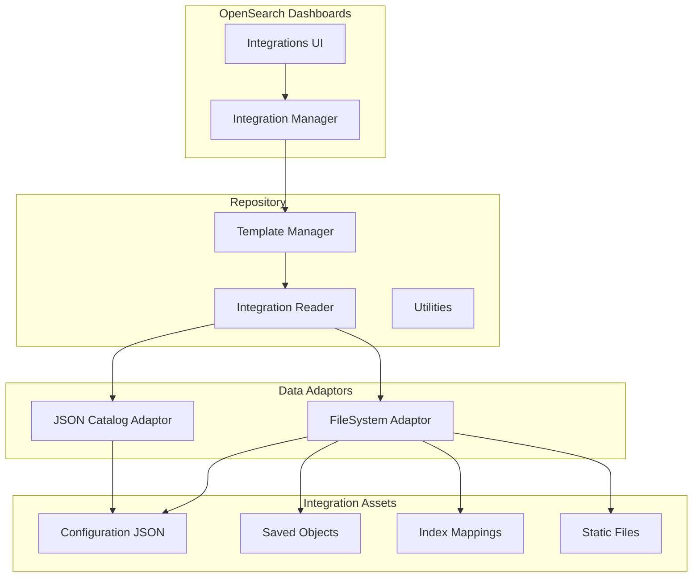
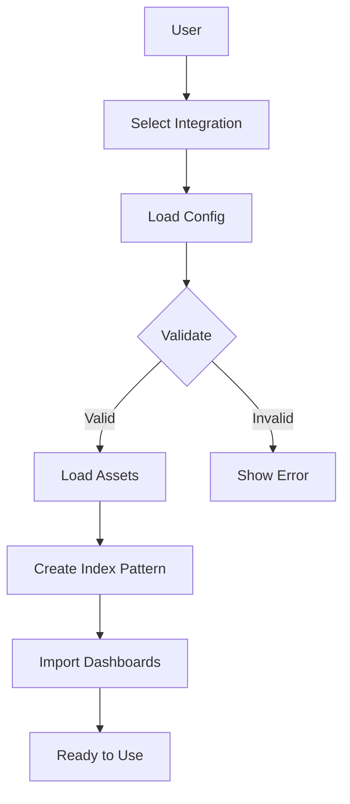

---
tags:
  - domain/observability
  - component/server
  - dashboards
  - indexing
  - observability
---
# Observability Integrations

## Summary

Integrations is a feature in OpenSearch Dashboards that provides pre-packaged data visualization, querying, and monitoring capabilities for various data sources. Integration assets bundle metadata, data mappings, and visualizations to streamline observability monitoring without redundant configuration.

## Details

### Architecture



### Data Flow



### Components

| Component | Description |
|-----------|-------------|
| `IntegrationReader` | Reads and parses integration configuration and assets |
| `TemplateManager` | Manages available integration templates |
| `FileSystemDataAdaptor` | Reads integrations from local filesystem |
| `JsonCatalogDataAdaptor` | Reads integrations from serialized JSON catalog |
| `deepCheck()` | Validates integration configuration and assets |
| `foldResults()` | Combines multiple Result objects into a single result |

### Configuration

Integration assets contain the following structure:

| Setting | Description | Required |
|---------|-------------|----------|
| `name` | Integration identifier | Yes |
| `version` | Semantic version | Yes |
| `description` | Human-readable description | Yes |
| `license` | License type | Yes |
| `type` | Integration type | Yes |
| `assets` | Array of asset definitions | Yes |
| `statics` | Static files (logos, screenshots) | No |
| `sampleData` | Sample data for testing | No |

### Usage Example

Installing an integration from the UI:

1. Navigate to **Integrations** > **Available**
2. Select an integration (e.g., Nginx, Amazon VPC)
3. Click **Add** to configure or **Try it** to test with sample data
4. View created dashboards and visualizations

Loading a custom integration:

```bash
# Download integration artifact
curl -O https://github.com/opensearch-project/opensearch-catalog/releases/download/v1.0.0/nginx.ndjson

# Import via Dashboards Management > Saved Objects > Import
```

## Limitations

- Integration assets must conform to the supported schema
- Custom integrations require manual import through Saved Objects
- Data must be ingested using compatible pipelines (Data Prepper, OpenTelemetry Collector, Fluent Bit)

## Change History

- **v3.4.0** (2026-01-14): Improved static file serving with image type validation and SVG sanitization
- **v3.0.0** (2025-05-06): Improved error handling and test result quality for integration configuration parsing

## Related Features
- [Observability (Dashboards)](../dashboards-observability/dashboards-observability-search-relevance-ci-tests.md)

## References

### Documentation
- [Integrations in OpenSearch Dashboards](https://docs.opensearch.org/3.0/dashboards/integrations/index/): Official documentation
- [OpenSearch Integrations Repository](https://github.com/opensearch-project/opensearch-catalog): Source code and integration assets
- [Simple Schema for Observability](https://github.com/opensearch-project/opensearch-catalog/tree/main/docs/schema/observability): Schema specification

### Pull Requests
| Version | PR | Description | Related Issue |
|---------|-----|-------------|---------------|
| v3.4.0 | [#2530](https://github.com/opensearch-project/dashboards-observability/pull/2530) | Clean up interface for integrations static serving |   |
| v3.0.0 | [#2387](https://github.com/opensearch-project/dashboards-observability/pull/2387) | Improve error handling when setting up and reading a new integration |   |
| v3.0.0 | [#2376](https://github.com/opensearch-project/dashboards-observability/pull/2376) | Improve the test results for Integrations internals |   |
