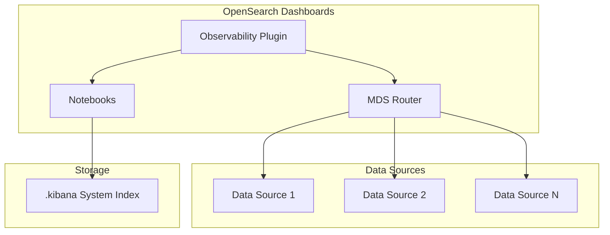

---
tags:
  - observability
---
# Observability MDS & System Index

## Summary

OpenSearch Dashboards Observability plugin provides Multi-Data Source (MDS) support and system index integration for improved data management across multiple OpenSearch clusters.

## Details

### Architecture

### Components

| Component | Description |
|-----------|-------------|
| MDS Router | Routes requests to appropriate data sources based on MDS ID |
| Notebooks | Interactive notebooks stored in system index |
| Data Connections | Manages connections to external data sources (S3, etc.) |

### Configuration

The Observability plugin leverages the Multi-Data Source feature in OpenSearch Dashboards. Configuration is managed through:

| Setting | Description | Default |
|---------|-------------|---------|
| `data_source.enabled` | Enable multiple data sources | `false` |
| Notebooks storage | Location for notebook data | `.kibana` system index |

### Usage Example

When using MDS with Observability:

1. Configure data sources in **Dashboards Management** > **Data sources**
2. Select the target data source when creating notebooks or visualizations
3. The MDS router automatically directs queries to the appropriate cluster

## Limitations

- MDS must be enabled in OpenSearch Dashboards configuration
- Cross-cluster queries require proper network connectivity
- Notebooks migration may be required when upgrading from earlier versions

## Change History

- **v2.16.0** (2024-08-06): Added MDS support for routers, migrated notebooks to `.kibana` system index, improved S3 datasource UI

## References

### Documentation
- [Configuring and using multiple data sources](https://docs.opensearch.org/latest/dashboards/management/multi-data-sources/)
- [Observability](https://docs.opensearch.org/latest/observing-your-data/)
- [Notebooks](https://docs.opensearch.org/latest/observing-your-data/notebooks/)

### Pull Requests
| Version | PR | Description |
|---------|-----|-------------|
| v2.16.0 | [#1942](https://github.com/opensearch-project/dashboards-observability/pull/1942) | Add MDS support for routers |
| v2.16.0 | [#1937](https://github.com/opensearch-project/dashboards-observability/pull/1937) | Move notebooks to .kibana system index |
| v2.16.0 | [#1915](https://github.com/opensearch-project/dashboards-observability/pull/1915) | Remove duplicate S3 datasource description |
