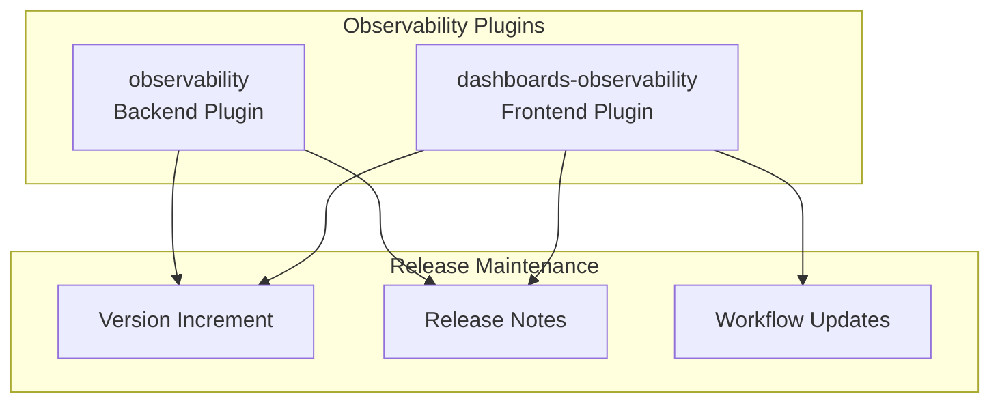

# Observability Release Maintenance

## Summary

This feature tracks the release maintenance activities for the OpenSearch Observability plugins, including version increments, release notes, and routine maintenance tasks across both the backend plugin (observability) and frontend plugin (dashboards-observability).

## Details

### Architecture

### Components

| Component | Repository | Description |
|-----------|------------|-------------|
| observability | opensearch-project/observability | Backend plugin for observability features |
| dashboards-observability | opensearch-project/dashboards-observability | Frontend plugin for observability UI |

### Release Process

The release maintenance process includes:

1. **Version Increment**: Automated version bumps via trigger bot
2. **Release Notes**: Manual creation of release notes documenting changes
3. **Workflow Updates**: CI/CD workflow version updates

## Limitations

- Release maintenance PRs are routine and do not introduce new functionality
- Version increments are typically automated

## Change History

- **v3.1.0** (2025-06-13): Version increment and release notes for both plugins

## References

### Documentation
- [observability repository](https://github.com/opensearch-project/observability)
- [dashboards-observability repository](https://github.com/opensearch-project/dashboards-observability)

### Pull Requests
| Version | PR | Repository | Description |
|---------|-----|------------|-------------|
| v3.1.0 | [#1922](https://github.com/opensearch-project/observability/pull/1922) | observability | Increment version to 3.1.0-SNAPSHOT |
| v3.1.0 | [#1929](https://github.com/opensearch-project/observability/pull/1929) | observability | Adding release notes for 3.1.0 |
| v3.1.0 | [#2443](https://github.com/opensearch-project/dashboards-observability/pull/2443) | dashboards-observability | Increment version to 3.1.0.0 |
| v3.1.0 | [#2464](https://github.com/opensearch-project/dashboards-observability/pull/2464) | dashboards-observability | Adding release notes for 3.1.0 |
