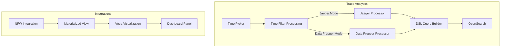
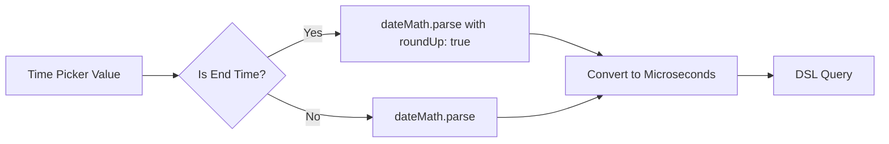

# Trace Analytics Bug Fixes

## Summary

This feature tracks bug fixes for the Trace Analytics functionality in OpenSearch Dashboards Observability plugin, including time filter processing for Jaeger trace data and visualization warning handling for integrations.

## Details

### Architecture



### Components

| Component | Description |
|-----------|-------------|
| `processTimeStamp()` | Converts time picker values to appropriate format for Jaeger (microseconds) or Data Prepper |
| `dateMath.parse()` | OpenSearch date math parser with optional `roundUp` for end times |
| Vega Configuration | Visualization config supporting `hideWarnings` option |
| NFW MV SQL | Materialized view creation SQL with `COALESCE()` defaults |

### Configuration

| Setting | Description | Default |
|---------|-------------|---------|
| `kibana.hideWarnings` | Suppress Vega visualization warnings | `false` |
| `roundUp` (dateMath) | Round parsed time to end of period | `false` |

### Time Processing Flow



### Usage Example

**Jaeger Time Filter** (automatic):
```typescript
// Start time - rounds down to beginning of period
processTimeStamp('now/d', 'jaeger', false)

// End time - rounds up to end of period  
processTimeStamp('now/d', 'jaeger', true)
```

**Vega Warning Suppression**:
```json
{
  "$schema": "https://vega.github.io/schema/vega-lite/v5.json",
  "config": {
    "kibana": {
      "hideWarnings": true
    }
  }
}
```

## Limitations

- Jaeger time fix only applies to Jaeger mode trace analytics
- NFW default values are placeholders indicating missing data
- Warning suppression hides all Vega warnings, not just empty data warnings

## Related PRs

| Version | PR | Description |
|---------|-----|-------------|
| v3.1.0 | [#2460](https://github.com/opensearch-project/dashboards-observability/pull/2460) | Fix Jaeger end time processing |
| v3.1.0 | [#2452](https://github.com/opensearch-project/dashboards-observability/pull/2452) | NFW Integration Vega Vis Warning Msg Fix |

## References

- [Analyzing Jaeger trace data](https://docs.opensearch.org/3.1/observing-your-data/trace/trace-analytics-jaeger/): Official Jaeger trace analytics documentation
- [Trace Analytics](https://docs.opensearch.org/3.1/observing-your-data/trace/index/): Trace Analytics overview

## Change History

- **v3.1.0** (2025-06-13): Fix Jaeger end time processing for "Today/This month/This year/This day" time picker options; Fix NFW integration Vega visualization warnings with empty MV indexes
