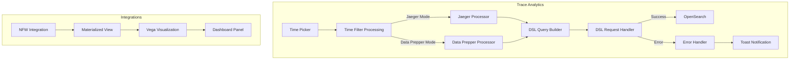
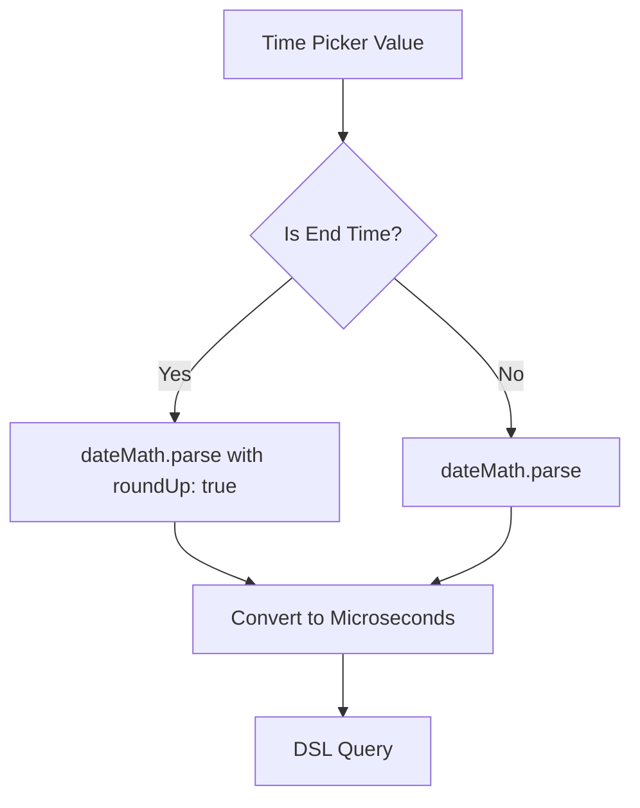
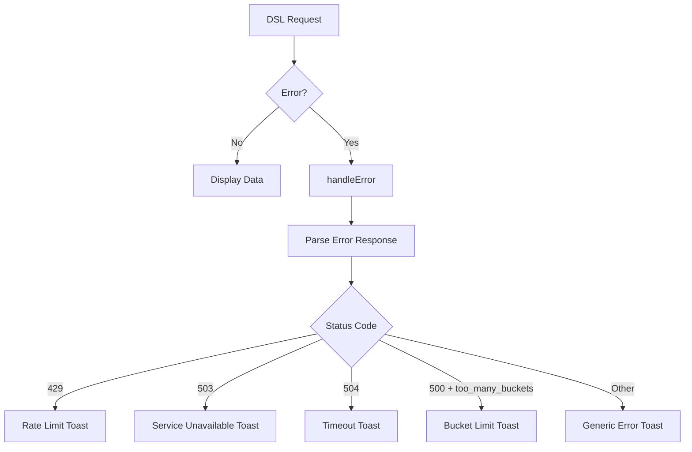

# Trace Analytics Bug Fixes

## Summary

This feature tracks bug fixes for the Trace Analytics functionality in OpenSearch Dashboards Observability plugin, including error handling improvements, time filter processing for Jaeger trace data, visualization warning handling, and test infrastructure fixes.

## Details

### Architecture



### Components

| Component | Description |
|-----------|-------------|
| `processTimeStamp()` | Converts time picker values to appropriate format for Jaeger (microseconds) or Data Prepper |
| `dateMath.parse()` | OpenSearch date math parser with optional `roundUp` for end times |
| `handleError()` | Centralized error handler that parses various error formats and displays appropriate toast messages |
| `safeJsonParse()` | Safe JSON parsing utility for error response bodies |
| Vega Configuration | Visualization config supporting `hideWarnings` option |
| NFW MV SQL | Materialized view creation SQL with `COALESCE()` defaults |
| Jest path mappings | Module resolution configuration for OpenSearch Dashboards core paths |

### Configuration

| Setting | Description | Default |
|---------|-------------|---------|
| `kibana.hideWarnings` | Suppress Vega visualization warnings | `false` |
| `roundUp` (dateMath) | Round parsed time to end of period | `false` |

### Time Processing Flow



### Error Handling Flow



### Usage Example

**Jaeger Time Filter** (automatic):
```typescript
// Start time - rounds down to beginning of period
processTimeStamp('now/d', 'jaeger', false)

// End time - rounds up to end of period  
processTimeStamp('now/d', 'jaeger', true)
```

**Vega Warning Suppression**:
```json
{
  "$schema": "https://vega.github.io/schema/vega-lite/v5.json",
  "config": {
    "kibana": {
      "hideWarnings": true
    }
  }
}
```

## Limitations

- Jaeger time fix only applies to Jaeger mode trace analytics
- NFW default values are placeholders indicating missing data
- Warning suppression hides all Vega warnings, not just empty data warnings
- Error messages are generic and may not provide specific troubleshooting steps for all error types
- The 25-second timeout toast is triggered independently of the actual request timeout

## Related PRs

| Version | PR | Description |
|---------|-----|-------------|
| v3.3.0 | [#2463](https://github.com/opensearch-project/dashboards-observability/pull/2463) | Toast Error handling - Improved error display for trace analytics |
| v3.3.0 | [#2492](https://github.com/opensearch-project/dashboards-observability/pull/2492) | Test fixes - Fixed Jest configuration for module resolution |
| v3.1.0 | [#2460](https://github.com/opensearch-project/dashboards-observability/pull/2460) | Fix Jaeger end time processing |
| v3.1.0 | [#2452](https://github.com/opensearch-project/dashboards-observability/pull/2452) | NFW Integration Vega Vis Warning Msg Fix |

## References

- [Analyzing Jaeger trace data](https://docs.opensearch.org/3.1/observing-your-data/trace/trace-analytics-jaeger/): Official Jaeger trace analytics documentation
- [Trace Analytics](https://docs.opensearch.org/3.1/observing-your-data/trace/index/): Trace Analytics overview
- [Trace Analytics plugin for OpenSearch Dashboards](https://docs.opensearch.org/3.3/observing-your-data/trace/ta-dashboards/): Dashboard plugin documentation

## Change History

- **v3.3.0** (2025-08-21): Improved toast error handling for trace analytics requests; Fixed Jest test configuration for OpenSearch Dashboards module resolution
- **v3.1.0** (2025-06-13): Fix Jaeger end time processing for "Today/This month/This year/This day" time picker options; Fix NFW integration Vega visualization warnings with empty MV indexes
