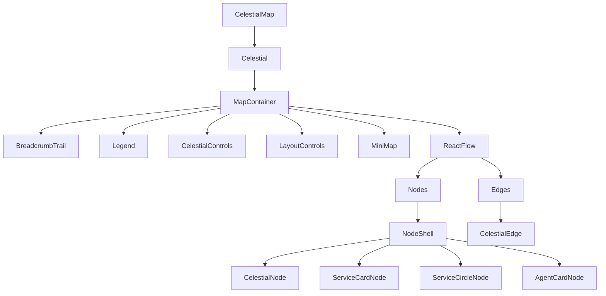
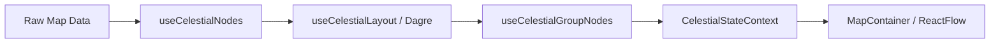

---
tags:
  - opensearch-dashboards
---
# APM & Observability

## Summary

The `@osd/apm-topology` package is a React component library within OpenSearch Dashboards for rendering interactive APM service topology maps and GenAI agent trace visualizations. Built on ReactFlow (`@xyflow/react`) with automatic Dagre-based hierarchical layout, it provides multiple node types, styled edges with animations, health indicators, breadcrumb navigation, and full dark-mode support.

## Details

### Architecture



### Data Flow



### Components

| Component | Description |
|-----------|-------------|
| `CelestialMap` | Top-level entry component; wraps ReactFlowProvider and state providers |
| `Celestial` | Main component handling layout, state, and dark mode detection |
| `MapContainer` | ReactFlow wrapper with breadcrumbs, legend, controls, and minimap |
| `NodeShell` | Shared node wrapper providing glow, selection, keyboard accessibility, and 8 connection handles |
| `CelestialNode` | Default APM card with health donut, SLI status, request metrics |
| `ServiceCardNode` | Modern APM card with TypeBadge, MetricBar, custom action button |
| `ServiceCircleNode` | Compact circle with HealthArc segments and center icon |
| `AgentCardNode` | GenAI trace card with 7 node kinds, provider icons, metric bars |
| `CelestialEdge` | Custom styled edge with animations, stroke patterns, and labels |
| `BreadcrumbTrail` | Horizontal breadcrumbs with health donut icons |
| `Legend` | Toggle button + portal-rendered legend panel |

### Node Types

#### CelestialNode (Default APM Card)

The default node type (`type: 'celestialNode'`). Displays a health donut chart showing the proportion of faults (5xx), errors (4xx), and OK requests. Shows SLI status (breached/recovered), request count, and a "View insights" action button. Supports group expand/collapse and node stacking.

#### ServiceCardNode

A modernized card layout (`type: 'serviceCard'`). Features a TypeBadge pill, title/subtitle row, optional health donut, MetricBar showing error rate, and a custom action button.

#### ServiceCircleNode

A compact circular representation (`type: 'serviceCircle'`). Renders a HealthArc with colored segments proportional to faults/errors/ok. Center displays the service icon overlaid with the formatted request count.

#### AgentCardNode

Purpose-built for GenAI/LLM agent trace visualization (`type: 'agentCard'`). Supports 7 node kinds:

| Kind | Label | Color | OTel Mapping |
|------|-------|-------|-------------|
| `agent` | Agent | #54B399 (teal) | `create_agent`, `execute_agent`, `invoke_agent` |
| `llm` | LLM | #DD0A73 (pink) | `chat`, `text_completion`, `generate_content` |
| `tool` | Tool | #E7664C (coral) | `execute_tool` |
| `retrieval` | Retrieval | #B9A888 (tan) | `retrieval` |
| `embeddings` | Embeddings | #6092C0 (steel blue) | `embeddings` |
| `content` | Content | #D6BF57 (amber) | Document/knowledge-base operations |
| `other` | Other | #98A2B3 (gray) | Unknown operations |

Provider icon resolution supports: OpenAI, Anthropic, AWS Bedrock, Azure AI, Google Vertex AI, Cohere, Mistral, Meta.

### Edge Styling

| Property | Type | Default | Description |
|----------|------|---------|-------------|
| `type` | `'solid' \| 'dashed' \| 'dotted'` | `'solid'` | Stroke pattern |
| `animationType` | `'none' \| 'flow' \| 'pulse'` | `'none'` | Animation effect |
| `marker` | `'arrow' \| 'arrowClosed' \| 'none'` | `'arrowClosed'` | Arrowhead marker |
| `color` | `string` | theme default | Stroke color |
| `strokeWidth` | `number` | `2` | Stroke width (px) |
| `label` | `string` | — | Mid-edge text label |

### Configuration

| Setting | Description | Default |
|---------|-------------|---------|
| `layoutOptions.direction` | Layout direction | `'LR'` |
| `layoutOptions.nodeWidth` | Node width for layout | `272` |
| `layoutOptions.nodeHeight` | Node height for layout | `156` |
| `layoutOptions.rankSeparation` | Space between ranks | `200` |
| `layoutOptions.nodeSeparation` | Space between nodes in same rank | `100` |
| `showMinimap` | Show ReactFlow minimap | `false` |
| `showSliSlo` | Show SLI/SLO indicators | `false` |
| `nodesDraggable` | Allow interactive node dragging | `false` |
| `onNodeClickZoom` | Camera behavior on node click | `'none'` |
| `onEdgeClickZoom` | Camera behavior on edge click | `'none'` |

### Usage Example

```tsx
import { CelestialMap, getIcon } from '@osd/apm-topology';

const nodes = [
  {
    id: '1',
    type: 'celestialNode',
    position: { x: 0, y: 0 },
    data: {
      id: '1',
      title: 'API Gateway',
      subtitle: 'AWS::APIGateway',
      icon: getIcon('AWS::APIGateway'),
      isGroup: false,
      keyAttributes: {},
      metrics: { requests: 5000, faults5xx: 25, errors4xx: 100 },
      health: { status: 'ok', breached: 0, recovered: 0, total: 0 },
    },
  },
];

const edges = [{ id: 'e1', source: '1', target: '2' }];

<CelestialMap
  map={{ root: { nodes, edges } }}
  onDashboardClick={(node) => navigateToServiceDetails(node)}
  showMinimap
/>;
```

### Technology Stack

- React 18
- `@xyflow/react` 12 (ReactFlow)
- `@dagrejs/dagre` for hierarchical layout
- Tailwind CSS v4 with `osd:` prefix
- Ramda for functional utilities

## Limitations

- Performance with large graphs (1000+ nodes) is not yet optimized
- No built-in search/filter within the topology view
- Timeline/replay mode for traces is a planned future enhancement
- Accessibility improvements (screen reader navigation) are planned

## Change History

- **v3.6.0**: Initial introduction of `@osd/apm-topology` package with 4 node types (CelestialNode, ServiceCardNode, ServiceCircleNode, AgentCardNode), styled edges with flow/pulse animations, Dagre-based layout, breadcrumb navigation, minimap, legend, dark mode support, and example plugin

## References

### Pull Requests

| Version | PR | Description |
|---------|-----|-------------|
| v3.6.0 | `https://github.com/opensearch-project/OpenSearch-Dashboards/pull/11394` | Add `@osd/apm-topology` package for APM service map, trace map, and GenAI agent trace visualization |

### Related Issues

| Issue | Description |
|-------|-------------|
| `https://github.com/opensearch-project/OpenSearch-Dashboards/issues/9898` | Original feature request |
