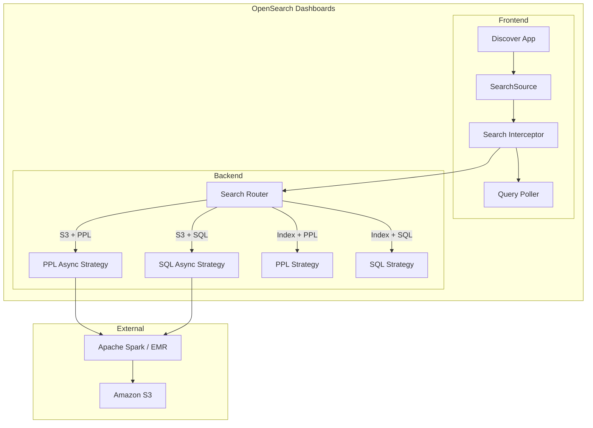
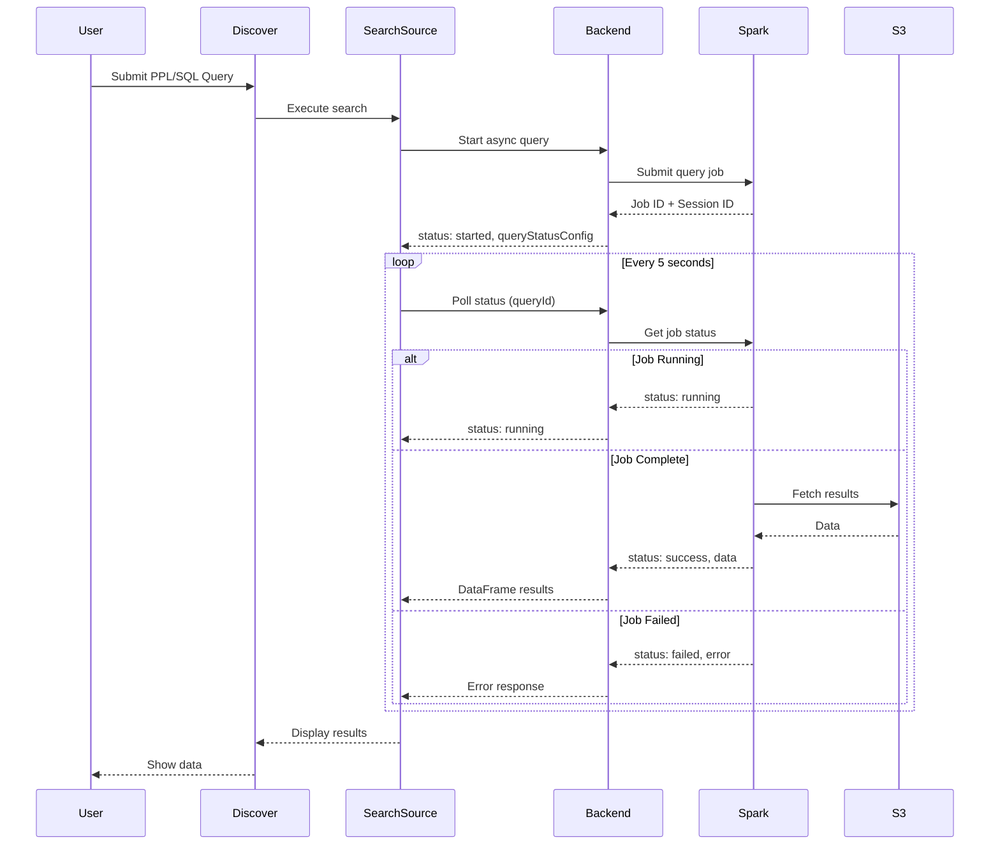

# Async Query

## Summary

Async Query is a feature in OpenSearch Dashboards that enables asynchronous execution of queries against external data sources like Amazon S3. It provides frontend polling mechanisms to handle long-running queries without timeout issues, supporting both SQL and PPL query languages for S3 datasets through Apache Spark integration.

## Details

### Architecture



### Data Flow



### Components

| Component | Location | Description |
|-----------|----------|-------------|
| `SearchSource` | `src/plugins/data/common/search/search_source/` | Core search execution with polling support |
| `handleQueryResults` | `src/plugins/data/common/utils/helpers.ts` | RxJS-based polling utility |
| `PPLSearchInterceptor` | `src/plugins/query_enhancements/public/search/` | Routes PPL queries to appropriate strategy |
| `SQLSearchInterceptor` | `src/plugins/query_enhancements/public/search/` | Routes SQL queries to appropriate strategy |
| `pplAsyncSearchStrategyProvider` | `src/plugins/query_enhancements/server/search/` | Server-side PPL async execution |
| `sqlAsyncSearchStrategyProvider` | `src/plugins/query_enhancements/server/search/` | Server-side SQL async execution |

### Configuration

| Setting | Description | Default |
|---------|-------------|---------|
| `plugins.query.executionengine.async_query.enabled` | Enable async query execution | `true` |
| `plugins.query.executionengine.async_query.external_scheduler.interval` | External scheduler check interval | `5 minutes` |

### Search Strategies

| Strategy | Identifier | Use Case |
|----------|------------|----------|
| PPL | `ppl` | Synchronous PPL for OpenSearch indexes |
| PPL Async | `pplasync` | Asynchronous PPL for S3 datasets |
| SQL | `sql` | Synchronous SQL for OpenSearch indexes |
| SQL Async | `sqlasync` | Asynchronous SQL for S3 datasets |

### Response Types

```typescript
// Polling response for async queries
interface IDataFramePollingResponse {
  type: DATA_FRAME_TYPES.POLLING;
  status: 'started' | 'running' | 'success' | 'failed';
  body?: IDataFrame | QueryStatusConfig | IDataFrameError;
}

// Query status configuration
interface QueryStatusConfig {
  queryId?: string;
  sessionId?: string;
}
```

### Usage Example

PPL query for S3 data:
```
source = my_s3_table | head 10
```

SQL query for S3 data:
```sql
SELECT * FROM my_s3_table LIMIT 10
```

The system automatically detects the dataset type and routes to the appropriate async strategy.

## Limitations

- Fixed 5-second polling interval (not configurable per query)
- Time filter support for async PPL is limited
- Requires Apache Spark / EMR Serverless for query execution
- S3 data source must be configured in OpenSearch Dashboards

## Change History

- **v2.18.0** (2024-11-05): Initial implementation with frontend polling and async PPL support for S3 datasets

## References

### Documentation
- [Scheduled Query Acceleration](https://docs.opensearch.org/latest/dashboards/management/scheduled-query-acceleration/): SQA documentation
- [Optimizing query performance using OpenSearch indexing](https://docs.opensearch.org/latest/dashboards/management/accelerate-external-data/): Index acceleration for external data
- [SQL and PPL](https://docs.opensearch.org/latest/search-plugins/sql/index/): SQL/PPL plugin documentation
- [Query Workbench](https://docs.opensearch.org/latest/dashboards/query-workbench/): Interactive query interface
- [Connecting Amazon S3 to OpenSearch](https://docs.opensearch.org/latest/dashboards/management/S3-data-source/): S3 data source setup

### Pull Requests
| Version | PR | Description | Related Issue |
|---------|-----|-------------|---------------|
| v2.18.0 | [#8481](https://github.com/opensearch-project/OpenSearch-Dashboards/pull/8481) | Add logic to poll for async query result |   |
| v2.18.0 | [#8706](https://github.com/opensearch-project/OpenSearch-Dashboards/pull/8706) | Add support for async PPL to Discover |   |
