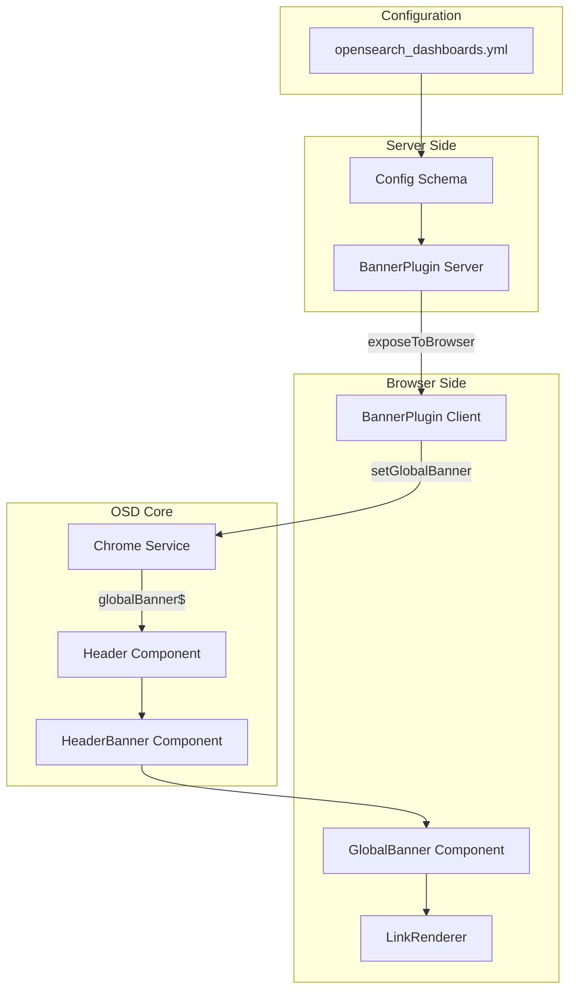
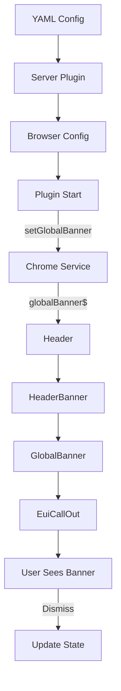

---
tags:
  - dashboards
---

# Banner Plugin

## Summary

The Banner Plugin provides a global, configurable header banner system for OpenSearch Dashboards. It enables administrators to display important announcements, notifications, or alerts to all users across the dashboard interface. Unlike the existing core banner service (OverlayBannersService), this plugin is dedicated to persistent top-of-page announcements with styling, markdown support, and dismissal capabilities.

## Details

### Architecture



### Data Flow



### Components

| Component | Location | Description |
|-----------|----------|-------------|
| `BannerPlugin` (server) | `src/plugins/banner/server/plugin.ts` | Reads configuration and exposes to browser |
| `BannerPlugin` (public) | `src/plugins/banner/public/plugin.ts` | Registers banner via Chrome Service |
| `GlobalBanner` | `src/plugins/banner/public/components/global_banner.tsx` | Main React component |
| `LinkRenderer` | `src/plugins/banner/public/components/link_renderer.tsx` | Markdown link renderer |
| `HeaderBanner` | `src/core/public/chrome/ui/header/header_banner.tsx` | Core component for banner rendering |
| `ChromeGlobalBanner` | `src/core/public/chrome/chrome_service.tsx` | Interface for global banner structure |

### Configuration

#### YAML Configuration (opensearch_dashboards.yml)

| Setting | Type | Description | Default |
|---------|------|-------------|---------|
| `banner.enabled` | boolean | Enable/disable the banner plugin | `false` |
| `banner.content` | string | Banner message (supports Markdown) | Default announcement |
| `banner.color` | enum | `primary`, `warning`, `danger` | `primary` |
| `banner.iconType` | string | EUI icon type | `iInCircle` |
| `banner.isVisible` | boolean | Initial visibility | `true` |
| `banner.useMarkdown` | boolean | Enable Markdown rendering | `true` |

#### UI Settings (Advanced Settings)

As of v3.2.0, banner settings can be configured via the Advanced Settings UI:

| Setting | Type | Description | Default |
|---------|------|-------------|---------|
| `banner:active` | boolean | Controls banner visibility | `true` |
| `banner:content` | markdown | Banner message content | `''` |
| `banner:color` | select | Color scheme: `primary`, `warning`, `danger` | `primary` |
| `banner:iconType` | select | Icon type for the banner | `iInCircle` |
| `banner:useMarkdown` | boolean | Enable Markdown rendering | `true` |

UI Settings take precedence over YAML configuration values.

### Usage Example

#### YAML Configuration

```yaml
# opensearch_dashboards.yml

# Enable the banner
banner.enabled: true

# Configure banner content
banner.content: |
  **Important:** System maintenance scheduled for Saturday 2AM-4AM UTC.
  [View details](https://status.example.com)
banner.color: warning
banner.iconType: alert
banner.isVisible: true
banner.useMarkdown: true
```

#### UI Settings Configuration (v3.2.0+)

1. Navigate to **Dashboards Management** > **Advanced Settings**
2. Search for `banner:` to find banner settings
3. Configure the following settings:
   - `banner:active`: Enable/disable the banner
   - `banner:content`: Enter your banner message (Markdown supported)
   - `banner:color`: Select color scheme
   - `banner:iconType`: Choose an icon
   - `banner:useMarkdown`: Enable/disable Markdown rendering
4. Save changes - banner updates after page reload

### CSS Variables

The plugin uses CSS variables for dynamic layout adjustment:

```scss
:root {
  --global-banner-height: 0;
}

.globalBanner {
  position: fixed;
  top: 0;
  left: 0;
  right: 0;
  z-index: 1100;
  min-height: var(--global-banner-height);
}

.expandedHeader {
  top: var(--global-banner-height) !important;
}

.primaryHeader:not(.newTopNavHeader) {
  top: calc(var(--global-banner-height) + $euiSizeXL + $euiSizeM) !important;
}
```

### Chrome Service API (v3.3.0+)

The banner plugin now integrates with the Chrome Service for cleaner extensibility:

| Method | Description |
|--------|-------------|
| `chrome.getGlobalBanner$()` | Returns an Observable of the current global banner state |
| `chrome.setGlobalBanner(banner?)` | Sets or clears the global banner component |

#### Custom Banner Example

```typescript
// In your plugin's start() method
public async start(core: CoreStart): Promise<MyPluginStart> {
  core.chrome.setGlobalBanner({
    component: React.createElement(MyCustomBanner, { 
      message: 'Important announcement' 
    }),
  });
  return {};
}
```

### Why a Separate Plugin?

The Banner Plugin was created as a standalone plugin rather than extending the existing `OverlayBannersService` for several reasons:

1. **Separation of Concerns**: The core banner service is tightly coupled with existing layout logic
2. **Widespread Usage**: Modifying the core service could cause regressions in dependent plugins
3. **Scope Differences**: Global banners need persistence and server-side configuration
4. **Ownership**: Independent lifecycle improves maintainability and versioning

## Limitations

- No server-side dynamic content fetching
- No role-based visibility
- No scheduled banners
- Single banner only (no stacking)
- UI Settings changes require page reload (v3.2.0)

## Change History

- **v3.3.0** (2025-08-08): Refactored extensibility model via Chrome Service, removed `injectedMetadata` dependency, added `setGlobalBanner`/`getGlobalBanner$` APIs
- **v3.2.0** (2026-01-10): Added UI Settings support for dynamic banner configuration via Advanced Settings
- **v3.2.0** (2026-01-10): Initial implementation with static banner, feature flag, markdown support, and dismissal functionality

## Related Features
- [OpenSearch Core](../opensearch/actionplugin-rest-handler-wrapper.md)

## References

### Pull Requests
| Version | PR | Description | Related Issue |
|---------|-----|-------------|---------------|
| v3.3.0 | [#10324](https://github.com/opensearch-project/OpenSearch-Dashboards/pull/10324) | Refactor Banner Extensibility Model via Chrome Service | [#10223](https://github.com/opensearch-project/OpenSearch-Dashboards/issues/10223) |
| v3.2.0 | [#10264](https://github.com/opensearch-project/OpenSearch-Dashboards/pull/10264) | Add global banner support via UI settings with live updates |   |
| v3.2.0 | [#9989](https://github.com/opensearch-project/OpenSearch-Dashboards/pull/9989) | Initial implementation with feature flag |   |
| v3.2.0 | [#10251](https://github.com/opensearch-project/OpenSearch-Dashboards/pull/10251) | Fix font size and center alignment |   |
| v3.2.0 | [#10254](https://github.com/opensearch-project/OpenSearch-Dashboards/pull/10254) | Reset lighthouse baseline |   |

### Issues (Design / RFC)
- [Issue #10223](https://github.com/opensearch-project/OpenSearch-Dashboards/issues/10223): Banner extensibility model refactor
- [Issue #9861](https://github.com/opensearch-project/OpenSearch-Dashboards/issues/9861): RFC - OpenSearch Dashboards Banner Plugin
- [Issue #9990](https://github.com/opensearch-project/OpenSearch-Dashboards/issues/9990): Meta issue tracking banner plugin development
