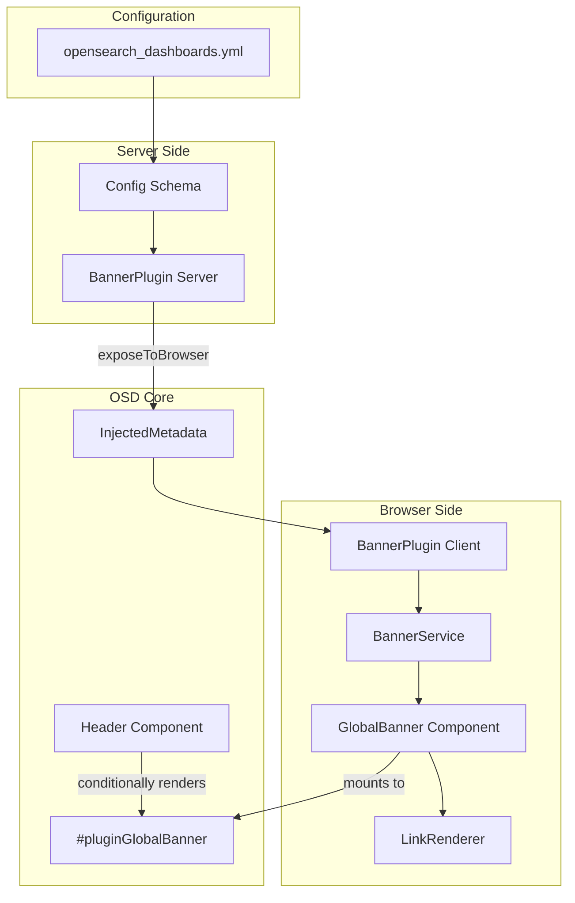
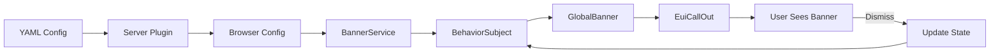

# Banner Plugin

## Summary

The Banner Plugin provides a global, configurable header banner system for OpenSearch Dashboards. It enables administrators to display important announcements, notifications, or alerts to all users across the dashboard interface. Unlike the existing core banner service (OverlayBannersService), this plugin is dedicated to persistent top-of-page announcements with styling, markdown support, and dismissal capabilities.

## Details

### Architecture



### Data Flow



### Components

| Component | Location | Description |
|-----------|----------|-------------|
| `BannerPlugin` (server) | `src/plugins/banner/server/plugin.ts` | Reads configuration and exposes to browser |
| `BannerPlugin` (public) | `src/plugins/banner/public/plugin.ts` | Initializes service and renders banner |
| `BannerService` | `src/plugins/banner/public/services/banner_service.ts` | Manages banner state with RxJS |
| `GlobalBanner` | `src/plugins/banner/public/components/global_banner.tsx` | Main React component |
| `LinkRenderer` | `src/plugins/banner/public/components/link_renderer.tsx` | Markdown link renderer |
| `render_banner` | `src/plugins/banner/public/services/render_banner.ts` | DOM mounting utilities |

### Configuration

| Setting | Type | Description | Default |
|---------|------|-------------|---------|
| `banner.enabled` | boolean | Enable/disable the banner plugin | `false` |
| `banner.text` | string | Banner message (supports Markdown) | Default announcement |
| `banner.color` | enum | `primary`, `success`, `warning` | `primary` |
| `banner.iconType` | string | EUI icon type | `iInCircle` |
| `banner.isVisible` | boolean | Initial visibility | `true` |
| `banner.useMarkdown` | boolean | Enable Markdown rendering | `true` |

### Usage Example

```yaml
# opensearch_dashboards.yml

# Enable the banner
banner.enabled: true

# Configure banner content
banner.text: |
  **Important:** System maintenance scheduled for Saturday 2AM-4AM UTC.
  [View details](https://status.example.com)
banner.color: warning
banner.iconType: alert
banner.isVisible: true
banner.useMarkdown: true
```

### CSS Variables

The plugin uses CSS variables for dynamic layout adjustment:

```scss
:root {
  --global-banner-height: 0;
}

#pluginGlobalBanner {
  position: fixed;
  top: 0;
  left: 0;
  right: 0;
  z-index: 1100;
  min-height: var(--global-banner-height);
}

.expandedHeader {
  top: var(--global-banner-height) !important;
}

.primaryHeader:not(.newTopNavHeader) {
  top: calc(var(--global-banner-height) + $euiSizeXL + $euiSizeM) !important;
}
```

### Why a Separate Plugin?

The Banner Plugin was created as a standalone plugin rather than extending the existing `OverlayBannersService` for several reasons:

1. **Separation of Concerns**: The core banner service is tightly coupled with existing layout logic
2. **Widespread Usage**: Modifying the core service could cause regressions in dependent plugins
3. **Scope Differences**: Global banners need persistence and server-side configuration
4. **Ownership**: Independent lifecycle improves maintainability and versioning

## Limitations

- Static configuration only (no runtime API to update banner)
- No server-side dynamic content fetching
- No role-based visibility
- No scheduled banners
- No Advanced Settings UI for customization
- Single banner only (no stacking)

## Related PRs

| Version | PR | Description |
|---------|-----|-------------|
| v3.2.0 | [#9989](https://github.com/opensearch-project/OpenSearch-Dashboards/pull/9989) | Initial implementation with feature flag |
| v3.2.0 | [#10251](https://github.com/opensearch-project/OpenSearch-Dashboards/pull/10251) | Fix font size and center alignment |
| v3.2.0 | [#10254](https://github.com/opensearch-project/OpenSearch-Dashboards/pull/10254) | Reset lighthouse baseline |

## References

- [Issue #9861](https://github.com/opensearch-project/OpenSearch-Dashboards/issues/9861): RFC - OpenSearch Dashboards Banner Plugin
- [Issue #9990](https://github.com/opensearch-project/OpenSearch-Dashboards/issues/9990): Meta issue tracking banner plugin development

## Change History

- **v3.2.0** (2026-01-10): Initial implementation with static banner, feature flag, markdown support, and dismissal functionality
