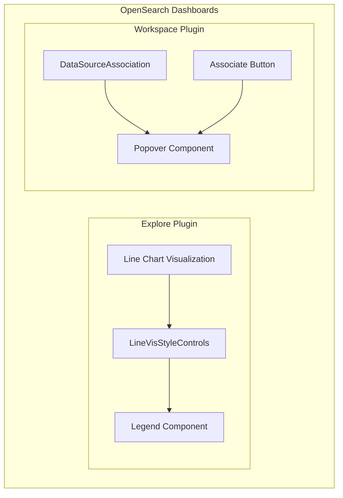

# Chart & Visualization Fixes

## Summary

OpenSearch Dashboards includes various bug fixes for chart and visualization components to improve user experience. This feature tracks fixes related to chart rendering, legend display, and interactive UI elements like popovers.

## Details

### Architecture

### Components

| Component | Description |
|-----------|-------------|
| LineVisStyleControls | Controls for line chart visualization styling including legend visibility |
| Legend Component | Displays series labels for multi-series charts |
| DataSourceAssociation | UI component for associating data sources with workspaces |
| Popover Component | Dropdown panel triggered by button click |

### Key Fixes

#### Line Chart Legend Display

The line chart visualization determines whether to show a legend based on the data structure:
- **Show legend**: When there are multiple metrics or categorical breakdowns
- **Hide legend**: When there's a single metric over a single date dimension (redundant)

The logic correctly identifies simple time-series charts where a legend adds no value.

#### Popover Toggle Behavior

Interactive popovers should follow standard toggle behavior:
- First click: Open popover
- Second click on same button: Close popover
- Click outside: Close popover

This ensures consistent UX across the application.

### Configuration

No configuration options are available for these fixes. They apply automatically to the affected components.

## Limitations

- Legend visibility logic is specific to the Explore plugin's line chart
- Popover fix applies only to the workspace data source association component
- Other popover implementations may have similar issues that need separate fixes

## Related PRs

| Version | PR | Description |
|---------|-----|-------------|
| v3.2.0 | [#9911](https://github.com/opensearch-project/OpenSearch-Dashboards/pull/9911) | Disable legend for line chart when it is 1 metric and 1 date |
| v3.2.0 | [#9993](https://github.com/opensearch-project/OpenSearch-Dashboards/pull/9993) | Fix popover not close if double click |

## References

- [PR #9911](https://github.com/opensearch-project/OpenSearch-Dashboards/pull/9911): Line chart legend fix implementation
- [PR #9993](https://github.com/opensearch-project/OpenSearch-Dashboards/pull/9993): Popover toggle fix implementation

## Change History

- **v3.2.0** (2026-01-10): Initial fixes for line chart legend display and popover toggle behavior
