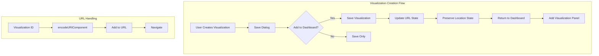
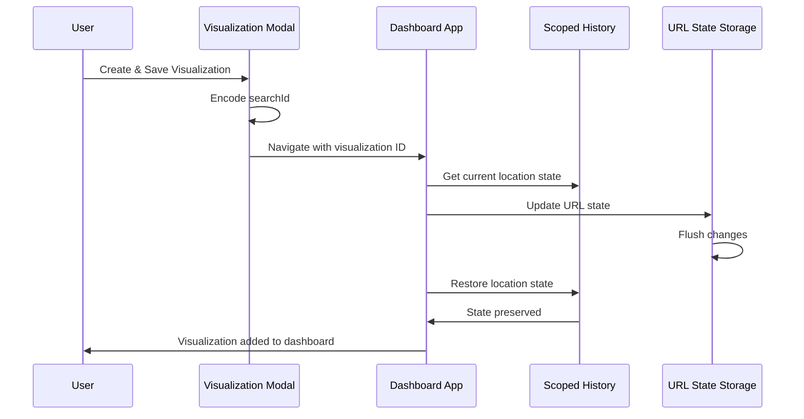

# Dashboard & Visualization Fixes

## Summary

This feature tracks bug fixes related to adding visualizations to dashboards in OpenSearch Dashboards. The fixes address issues with the "Add to Dashboards after saving" workflow and URL encoding problems that could prevent visualizations from being properly added or loaded.

## Details

### Architecture



### Components

| Component | Description |
|-----------|-------------|
| `create_dashboard_app_state.tsx` | Manages dashboard application state and URL synchronization |
| `use_dashboard_app_state.tsx` | React hook for dashboard state management |
| `new_vis_modal.tsx` | Modal component for creating new visualizations |
| `scopedHistory` | Browser history wrapper that maintains location state |

### Data Flow



### Bug Fixes

#### 1. Location State Preservation (v3.0.0)

**Problem:** When creating a visualization from a dashboard with "Add to Dashboards after saving" enabled, the visualization would not be added. This was especially reproducible when `storeInSessionStorage` was enabled.

**Root Cause:** The dashboard application state update at startup would modify the URL, causing the `scopedHistory` location state (containing the new visualization ID) to be lost.

**Solution:** The `updateStateUrl` function now preserves the previous location state after flushing URL changes:

```typescript
export const updateStateUrl = ({
  osdUrlStateStorage,
  state,
  scopedHistory,
  replace,
}: {
  osdUrlStateStorage: IOsdUrlStateStorage;
  state: DashboardAppState;
  scopedHistory: ScopedHistory;
  replace: boolean;
}) => {
  osdUrlStateStorage.set(APP_STATE_STORAGE_KEY, toUrlState(state), { replace });
  const previousState = scopedHistory.location.state;
  const changed = osdUrlStateStorage.flush({ replace });
  if (changed) {
    scopedHistory.replace({
      ...scopedHistory.location,
      state: previousState,
    });
  }
  return changed;
};
```

#### 2. Search ID URL Encoding (v3.0.0)

**Problem:** When adding a new visualization, the visualization ID would be decoded after being added to the URL, causing a "not found" error.

**Solution:** Properly encode the `searchId` before adding it to URL parameters:

```typescript
params = [`type=${encodeURIComponent(visType.name)}`];
searchId = encodeURIComponent(searchId || '');

if (searchType) {
  params.push(`${searchType === 'search' ? 'savedSearchId' : 'indexPattern'}=${searchId}`);
}
```

### Configuration

No additional configuration is required. These fixes work automatically with existing dashboard settings.

| Setting | Description | Default |
|---------|-------------|---------|
| `state:storeInSessionStorage` | Store URL state in session storage | `false` |

## Limitations

- The location state preservation fix is particularly relevant when `storeInSessionStorage` is enabled
- These fixes are specific to the visualization creation workflow from within a dashboard

## Related PRs

| Version | PR | Description |
|---------|-----|-------------|
| v3.0.0 | [#9072](https://github.com/opensearch-project/OpenSearch-Dashboards/pull/9072) | Preserve location state at dashboard app startup |
| v3.0.0 | [#8530](https://github.com/opensearch-project/OpenSearch-Dashboards/pull/8530) | Encode searchId in URL |

## References

- [Issue #7204](https://github.com/opensearch-project/OpenSearch-Dashboards/issues/7204): Original bug report
- [PR #8164](https://github.com/opensearch-project/OpenSearch-Dashboards/pull/8164): Related location state handling PR
- [Creating dashboards](https://docs.opensearch.org/3.0/dashboards/dashboard/index/): Official documentation

## Change History

- **v3.0.0** (2025-03-11): Fixed "Add to Dashboards after saving" and URL encoding issues
