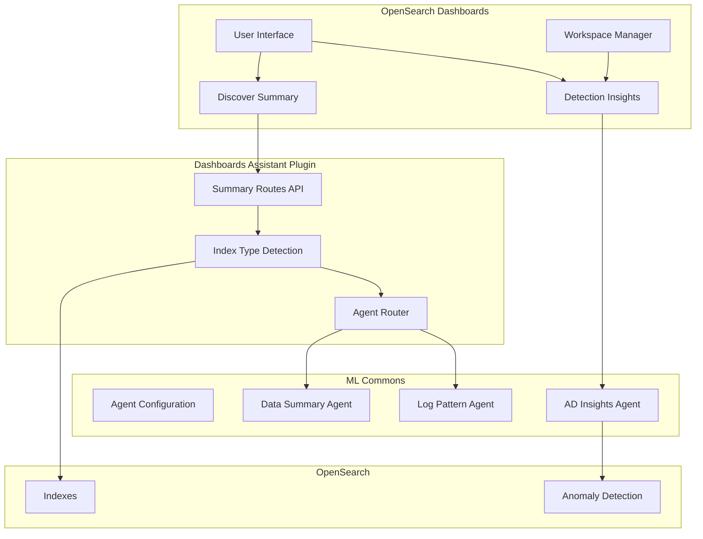
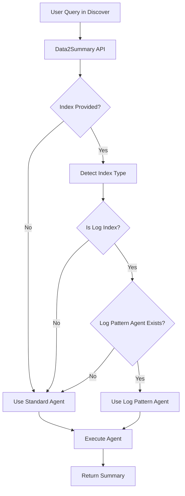

# Dashboards AI Insights

## Summary

Dashboards AI Insights is a collection of AI-powered features in OpenSearch Dashboards that leverage large language models (LLMs) to provide intelligent insights, summaries, and analysis of data stored in OpenSearch. These features include data summarization in Discover, anomaly detection insights, and specialized log pattern analysis.

## Details

### Architecture



### Data Flow



### Components

| Component | Description |
|-----------|-------------|
| Data Summary | Generates AI-powered summaries of query results in Discover |
| Detection Insights | Workspace category for anomaly detection AI insights |
| Log Pattern Agent | Specialized agent for analyzing log-type data |
| Index Type Detection | Determines if an index contains log data |
| Agent Router | Routes requests to appropriate ML agent based on data type |

### Configuration

| Setting | Description | Default |
|---------|-------------|---------|
| `queryEnhancements.queryAssist.summary.enabled` | Enable data summary feature | `false` |
| `assistant.chat.enabled` | Enable OpenSearch Assistant | `false` |
| `assistant.next.enabled` | Enable experimental assistant features | `false` |

### Agent Configuration IDs

| Config ID | Purpose |
|-----------|---------|
| `os_data2summary` | Standard data summarization agent |
| `os_data2summary_with_log_pattern` | Log pattern-aware summarization agent |
| `os_summary` | General summary agent |
| `os_summary_with_log_pattern` | Log pattern-aware general summary agent |

### Usage Example

#### Enabling Data Summary

```yaml
# opensearch_dashboards.yml
queryEnhancements.queryAssist.summary.enabled: true
assistant.chat.enabled: true
```

#### API Request with Log Pattern Support

```typescript
// POST /api/assistant/data2summary
{
  "sample_data": "[{\"timestamp\":\"2024-01-01T00:00:00Z\",\"level\":\"ERROR\",\"message\":\"Connection timeout\"}]",
  "sample_count": 10,
  "total_count": 1000,
  "question": "What errors are occurring?",
  "ppl": "source=application_logs | where level='ERROR'",
  "index": "application_logs"
}
```

#### Response

```json
{
  "summary": "Analysis of 1000 log entries shows connection timeout errors occurring frequently. The errors appear to be related to database connectivity issues..."
}
```

## Limitations

- Requires ML Commons agents to be properly configured
- Log pattern detection depends on index naming and structure
- Summary quality depends on the underlying LLM model
- Detection Insights requires anomaly detection to be configured
- Experimental features may change in future releases

## Change History

- **v3.4.0** (2026-01-12): Added Detection Insights workspace category and log pattern agent support in Discover summary

## References

### Documentation
- [OpenSearch Assistant Documentation](https://docs.opensearch.org/3.0/dashboards/dashboards-assistant/index/)
- [Data Summary Documentation](https://docs.opensearch.org/3.0/dashboards/dashboards-assistant/data-summary/)
- [Alert Insights Documentation](https://docs.opensearch.org/3.0/dashboards/dashboards-assistant/alert-insight/)
- [Log Pattern Tool](https://docs.opensearch.org/3.0/ml-commons-plugin/agents-tools/tools/log-pattern-tool/)
- [ML Commons Agents](https://docs.opensearch.org/3.0/ml-commons-plugin/agents-tools/agents/)

### Pull Requests
| Version | PR | Description | Related Issue |
|---------|-----|-------------|---------------|
| v3.4.0 | [#10848](https://github.com/opensearch-project/OpenSearch-Dashboards/pull/10848) | Add Detection Insights category for AD AI Insights | [#1234](https://github.com/opensearch-project/OpenSearch-Dashboards/issues/1234) |
| v3.4.0 | [#9693](https://github.com/opensearch-project/OpenSearch-Dashboards/pull/9693) | Support log pattern agent in discover summary | [#1234](https://github.com/opensearch-project/OpenSearch-Dashboards/issues/1234) |
| v3.4.0 | [#550](https://github.com/opensearch-project/dashboards-assistant/pull/550) | Support log pattern in discover summary |   |
