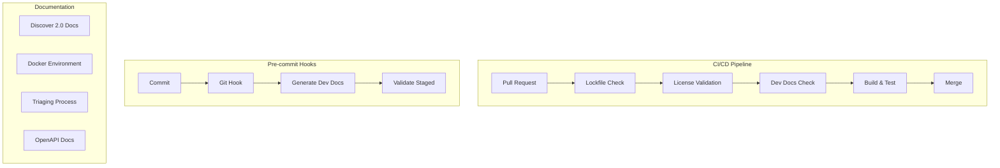

---
tags:
  - dashboards
---

# Dashboards CI/CD & Documentation

## Summary

OpenSearch Dashboards CI/CD & Documentation encompasses the continuous integration pipeline improvements, automated documentation generation, and developer documentation for the OpenSearch Dashboards project. These improvements ensure code quality through automated checks, maintain up-to-date developer documentation, and provide comprehensive guides for features like Discover 2.0.

## Details

### Architecture



### Components

| Component | Description |
|-----------|-------------|
| Lockfile Validation | CI check ensuring yarn.lock is synchronized with package.json |
| License Validation | Automated validation of dependency licenses during CI |
| Dev Docs Generator | Script to generate developer documentation sidebar |
| Pre-commit Hook | Git hook to ensure developer docs are always updated |
| Discover 2.0 Docs | Developer documentation for Discover 2.0 architecture and usage |
| Docker Dev Environment | Alternative Docker setup for Cypress testing |

### Configuration

| Setting | Description | Default |
|---------|-------------|---------|
| `yarn docs:generateDevDocs` | Command to generate developer documentation | N/A |
| Pre-commit hook | Automatically runs on git commit | Enabled |

### CI Checks

The CI pipeline includes the following validation steps:

1. **Lockfile Sync Check**: Ensures `yarn.lock` matches `package.json` dependencies
2. **License Validation**: Validates that all dependencies comply with allowed licenses
3. **Developer Docs Check**: Verifies developer documentation is current
4. **Build and Test**: Standard build and test workflows

### Usage Example

```bash
# Generate developer documentation
yarn docs:generateDevDocs

# The pre-commit hook automatically:
# 1. Runs docs:generateDevDocs
# 2. Checks if generated files are staged
# 3. Fails commit if unstaged changes exist

# To manually validate lockfile
yarn install --frozen-lockfile
```

### Docker Development Environment

For Cypress testing, an alternative Docker development environment is available:

```bash
# Follow DEVELOPER_GUIDE.md for Docker setup
# This environment supports:
# - Creating datasources
# - Populating test data
# - Running Cypress tests
```

## Limitations

- Pre-commit hooks require Node.js to be installed
- Docker development environment is optimized for Cypress testing scenarios
- License validation may require updates when adding new dependencies

## Change History

- **v3.0.0** (2025-05-06): CI/CD hardening, Discover 2.0 documentation, Docker development environment, pre-commit hooks for developer docs

## Related Features
- [OpenSearch Core](../opensearch/actionplugin-rest-handler-wrapper.md)

## References

### Documentation
- [OpenSearch Dashboards Repository](https://github.com/opensearch-project/OpenSearch-Dashboards)

### Pull Requests
| Version | PR | Description | Related Issue |
|---------|-----|-------------|---------------|
| v3.0.0 | [#9064](https://github.com/opensearch-project/OpenSearch-Dashboards/pull/9064) | CI hardening: lockfile, license validation, actions bump |   |
| v3.0.0 | [#8885](https://github.com/opensearch-project/OpenSearch-Dashboards/pull/8885) | Fix OpenAPI documentation |   |
| v3.0.0 | [#9291](https://github.com/opensearch-project/OpenSearch-Dashboards/pull/9291) | Add triaging process documentation |   |
| v3.0.0 | [#9325](https://github.com/opensearch-project/OpenSearch-Dashboards/pull/9325) | Add 2.19 Release Notes | [#1234](https://github.com/opensearch-project/OpenSearch-Dashboards/issues/1234) |
| v3.0.0 | [#9362](https://github.com/opensearch-project/OpenSearch-Dashboards/pull/9362) | Docker development environment for Cypress |   |
| v3.0.0 | [#9463](https://github.com/opensearch-project/OpenSearch-Dashboards/pull/9463) | Understanding Discover 2.0 documentation |   |
| v3.0.0 | [#9467](https://github.com/opensearch-project/OpenSearch-Dashboards/pull/9467) | Add Joey Liu as maintainer | [#295](https://github.com/opensearch-project/.github/issues/295) |
| v3.0.0 | [#9525](https://github.com/opensearch-project/OpenSearch-Dashboards/pull/9525) | Getting started with Discover 2.0 |   |
| v3.0.0 | [#6585](https://github.com/opensearch-project/OpenSearch-Dashboards/pull/6585) | Pre-commit hook for developer docs | [#1234](https://github.com/opensearch-project/OpenSearch-Dashboards/issues/1234) |
