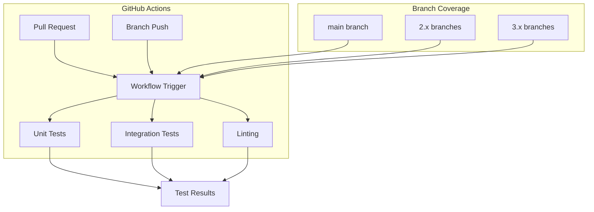

# Dashboards CI/Tests

## Summary

OpenSearch Dashboards CI/Tests encompasses the continuous integration and testing infrastructure that ensures code quality and reliability across all supported branches. The CI system runs automated unit tests, integration tests, and other quality checks on pull requests and branch pushes.

## Details

### Architecture



### Components

| Component | Description |
|-----------|-------------|
| Unit Test Workflow | Runs Jest unit tests for all packages and plugins |
| Integration Tests | Validates component interactions and API contracts |
| Linting | Enforces code style and quality standards |
| Branch Filters | Controls which branches trigger CI pipelines |

### Configuration

| Setting | Description | Default |
|---------|-------------|---------|
| Branch patterns | Glob patterns for triggering CI | `main`, `2.*`, `3.*` |
| Test runners | Number of parallel test runners | Platform dependent |
| Timeout | Maximum workflow execution time | 60 minutes |

### Usage Example

```yaml
# .github/workflows/build_and_test_workflow.yml
name: Build and Test

on:
  push:
    branches:
      - main
      - 2.*
      - 3.*
  pull_request:
    branches:
      - main
      - 2.*
      - 3.*

jobs:
  unit-tests:
    runs-on: ubuntu-latest
    steps:
      - uses: actions/checkout@v4
      - name: Setup Node.js
        uses: actions/setup-node@v4
      - name: Install dependencies
        run: yarn osd bootstrap
      - name: Run unit tests
        run: yarn test:jest
```

## Limitations

- CI execution time depends on GitHub Actions runner availability
- Some tests may be flaky due to timing-sensitive operations
- Resource-intensive tests may timeout on shared runners

## Related PRs

| Version | PR | Description |
|---------|-----|-------------|
| v3.4.0 | [#780](https://github.com/opensearch-project/OpenSearch-Dashboards/pull/780) | Update unit test workflow to include 3.* branch |

## References

- [OpenSearch Dashboards Repository](https://github.com/opensearch-project/OpenSearch-Dashboards)
- [GitHub Actions Documentation](https://docs.github.com/en/actions)
- [Jest Testing Framework](https://jestjs.io/)

## Change History

- **v3.4.0**: Added 3.* branch support to unit test workflow
