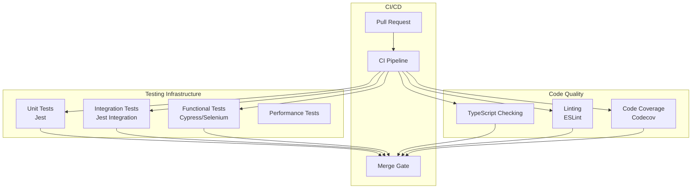

---
tags:
  - dashboards
  - performance
---

# Dashboards Code Quality & Testing

## Summary

OpenSearch Dashboards maintains code quality through comprehensive testing infrastructure, development guidelines, and TypeScript error management. This includes unit tests, integration tests, Cypress functional tests, and standardized approaches to handling TypeScript errors during development.

## Details

### Architecture



### Components

| Component | Description |
|-----------|-------------|
| Jest | Unit and integration test framework |
| Cypress | End-to-end functional testing |
| Selenium | Browser automation testing |
| ESLint | Code linting and style enforcement |
| TypeScript | Static type checking |
| Codecov | Code coverage tracking and enforcement |

### Testing Types

| Test Type | Command | Purpose |
|-----------|---------|---------|
| Unit Tests | `yarn test:jest` | Test individual components/functions |
| Integration Tests | `yarn test:jest_integration` | Test component interactions |
| Cypress Tests | `yarn cypress:run` | End-to-end UI testing |
| Type Check | `yarn typecheck` | TypeScript validation |

### TypeScript Error Handling

The project uses inline `// @ts-expect-error` comments instead of a centralized baseline file:

```typescript
// @ts-expect-error TS2345 TODO(ts-error): fixme
someFunction(incorrectType);
```

Benefits:
- No maintenance overhead when error lines shift
- Clear IDE indication of expected vs. new errors
- Workspace diagnostics show only new errors introduced by current changes
- Prevents accidentally ignoring new errors during baseline updates

### Cypress Test Coverage

The Explore feature has comprehensive Cypress test coverage:

| Test Area | Description |
|-----------|-------------|
| Default Visualizations | Line chart, bar chart, heatmap, scatterpoint, metric |
| Autocomplete | New autocomplete experience |
| Recent Queries | Query history functionality |
| AI Mode | AI-assisted query features |
| Filter Actions | Filter In/Filter Out operations |
| Saved Queries | Query persistence |
| PPL Validation | Query syntax validation |

### Usage Example

```bash
# Run all unit tests
yarn test:jest

# Run integration tests
yarn test:jest_integration

# Run specific Cypress tests
yarn cypress:run --spec "cypress/integration/explore/**/*.spec.ts"

# Type checking
yarn typecheck

# Linting
yarn lint
```

## Limitations

- TypeScript `@ts-expect-error` does not support expecting specific error codes
- Cypress tests require a running OpenSearch Dashboards instance
- Some tests may be flaky in CI environments

## Change History

- **v3.2.0** (2025-08): Added testing guidelines, replaced ts_error_baseline with @ts-expect-error, added Cypress tests for Explore, component refactoring

## Related Features
- [OpenSearch Core](../opensearch/actionplugin-rest-handler-wrapper.md)

## References

### Documentation
- [OpenSearch Dashboards Repository](https://github.com/opensearch-project/OpenSearch-Dashboards)

### Pull Requests
| Version | PR | Description | Related Issue |
|---------|-----|-------------|---------------|
| v3.2.0 | [#9922](https://github.com/opensearch-project/OpenSearch-Dashboards/pull/9922) | Add guidelines on testing and development |   |
| v3.2.0 | [#9931](https://github.com/opensearch-project/OpenSearch-Dashboards/pull/9931) | Use `// @ts-expect-error` instead of ts_error_baseline |   |
| v3.2.0 | [#9912](https://github.com/opensearch-project/OpenSearch-Dashboards/pull/9912) | Refactor TS types of explore visualization interfaces | [#1234](https://github.com/opensearch-project/OpenSearch-Dashboards/issues/1234) |
| v3.2.0 | [#10124](https://github.com/opensearch-project/OpenSearch-Dashboards/pull/10124) | Split page components into smaller container components | [#1234](https://github.com/opensearch-project/OpenSearch-Dashboards/issues/1234) |
| v3.2.0 | [#10263](https://github.com/opensearch-project/OpenSearch-Dashboards/pull/10263) | Add cypress test for default vis on rule matching | [#1234](https://github.com/opensearch-project/OpenSearch-Dashboards/issues/1234) |
| v3.2.0 | [#10288](https://github.com/opensearch-project/OpenSearch-Dashboards/pull/10288) | Add integ tests for New Autocomplete experience in Explore | [#1234](https://github.com/opensearch-project/OpenSearch-Dashboards/issues/1234) |
| v3.2.0 | [#10290](https://github.com/opensearch-project/OpenSearch-Dashboards/pull/10290) | Re-enable recent query cypress test for explore | [#1234](https://github.com/opensearch-project/OpenSearch-Dashboards/issues/1234) |
| v3.2.0 | [#10299](https://github.com/opensearch-project/OpenSearch-Dashboards/pull/10299) | Cypress tests for AI mode for explore |   |
| v3.2.0 | [#10302](https://github.com/opensearch-project/OpenSearch-Dashboards/pull/10302) | Add Tests for Filter In/Filter Out Actions in Explore | [#1234](https://github.com/opensearch-project/OpenSearch-Dashboards/issues/1234) |
| v3.2.0 | [#10307](https://github.com/opensearch-project/OpenSearch-Dashboards/pull/10307) | Unskip saved queries test for explore | [#1234](https://github.com/opensearch-project/OpenSearch-Dashboards/issues/1234) |
| v3.2.0 | [#10310](https://github.com/opensearch-project/OpenSearch-Dashboards/pull/10310) | Add Test to validate PPL query not starting with source | [#1234](https://github.com/opensearch-project/OpenSearch-Dashboards/issues/1234) |
| v3.2.0 | [#10328](https://github.com/opensearch-project/OpenSearch-Dashboards/pull/10328) | Fixed linting error and update caniuse version | [#1234](https://github.com/opensearch-project/OpenSearch-Dashboards/issues/1234) |
