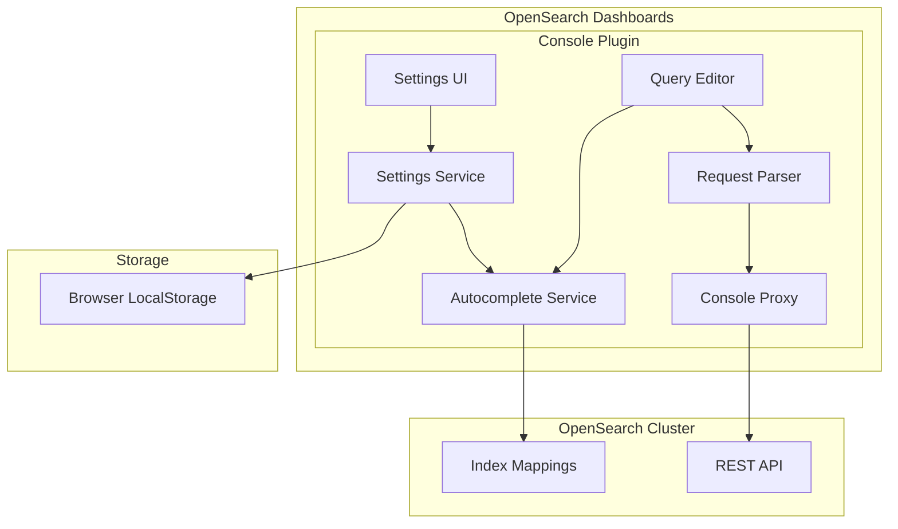

---
tags:
  - dashboards
  - indexing
  - search
---

# Dashboards Console (Dev Tools)

## Summary

The Dashboards Console is a development environment within OpenSearch Dashboards that allows users to interact with OpenSearch clusters by sending REST API requests. It provides features like autocomplete suggestions, request history, and syntax highlighting to help developers write and test queries efficiently. The console supports GET, POST, PUT, DELETE, HEAD, and PATCH HTTP methods.

## Details

### Architecture



### Components

| Component | Description |
|-----------|-------------|
| Settings Service | Manages console settings including autocomplete preferences |
| Autocomplete Service | Provides query suggestions based on cluster mappings |
| Query Editor | Monaco-based editor for writing OpenSearch queries |
| Settings UI | Modal dialog for configuring console behavior |
| Request Parser | Parses console input into HTTP requests (supports object and array bodies) |
| Console Proxy | Forwards requests to OpenSearch cluster |

### Supported HTTP Methods

| Method | Description | Body Type |
|--------|-------------|-----------|
| GET | Retrieve data | JSON object (optional) |
| POST | Create/search data | JSON object |
| PUT | Create/update data | JSON object |
| DELETE | Remove data | JSON object (optional) |
| HEAD | Check existence | None |
| PATCH | Partial update | JSON array (JSON Patch format) |

### Configuration

| Setting | Description | Default |
|---------|-------------|---------|
| `console_polling` | Automatically refresh autocomplete suggestions | `true` |
| `autocomplete.fields` | Enable field name suggestions | `true` |
| `autocomplete.indices` | Enable index name suggestions | `true` |
| `autocomplete.templates` | Enable template suggestions | `true` |

### Key Features

1. **Query Editor**: Write and execute REST API requests with syntax highlighting
2. **Autocomplete**: Get suggestions for indices, fields, query syntax, and HTTP methods
3. **Request History**: Access previously executed queries
4. **Auto-indent**: Format queries for readability
5. **cURL Import**: Convert cURL commands to console format
6. **PATCH Support**: Execute JSON Patch operations for Security plugin APIs

### Usage Examples

**Standard Query:**
```
GET _search
{
  "query": {
    "match": {
      "title": "OpenSearch"
    }
  }
}
```

**PATCH Request (JSON Patch format):**
```
PATCH _plugins/_security/api/internalusers/admin
[
  { "op": "replace", "path": "/attributes", "value": { "department": "engineering" } }
]
```

**PATCH with Multiple Operations:**
```
PATCH _plugins/_security/api/roles/my_role
[
  { "op": "replace", "path": "/index_permissions/0/fls", "value": ["field1", "field2"] },
  { "op": "remove", "path": "/index_permissions/0/dls" }
]
```

## Limitations

- Autocomplete refresh requires a valid data source connection
- Large clusters may experience slower autocomplete due to mapping retrieval
- PATCH requests require the request body to be a JSON array (JSON Patch format)

## Change History

- **v3.4.0** (2025-10-14): Added support for PATCH HTTP method with JSON array body parsing
- **v3.4.0** (2025-10-03): Fixed bug where `console_polling` setting could not be updated through the UI

## References

### Documentation
- [Dev Tools Documentation](https://docs.opensearch.org/3.0/dashboards/dev-tools/index-dev/): Dev Tools overview
- [Running Queries Documentation](https://docs.opensearch.org/3.0/dashboards/dev-tools/run-queries/): Running queries in the Dev Tools console
- [Security API Documentation](https://docs.opensearch.org/latest/security/access-control/api/): OpenSearch Security plugin PATCH APIs

### Pull Requests
| Version | PR | Description | Related Issue |
|---------|-----|-------------|---------------|
| v3.4.0 | [#10361](https://github.com/opensearch-project/OpenSearch-Dashboards/pull/10361) | Add support for PATCH method in dev tools | [#10105](https://github.com/opensearch-project/OpenSearch-Dashboards/issues/10105) |
| v3.4.0 | [#10595](https://github.com/opensearch-project/OpenSearch-Dashboards/pull/10595) | Fix: Allow updating of console_polling through the UI | [#10544](https://github.com/opensearch-project/OpenSearch-Dashboards/issues/10544) |

### Issues (Design / RFC)
- [Issue #10105](https://github.com/opensearch-project/OpenSearch-Dashboards/issues/10105): Bug report - PATCH API calls not supported in DevTools console
- [Issue #2343](https://github.com/opensearch-project/OpenSearch-Dashboards/issues/2343): Feature request - Dev Tools should support PATCH method
- [Issue #10544](https://github.com/opensearch-project/OpenSearch-Dashboards/issues/10544): Bug report - Cannot update console_polling value through UI
