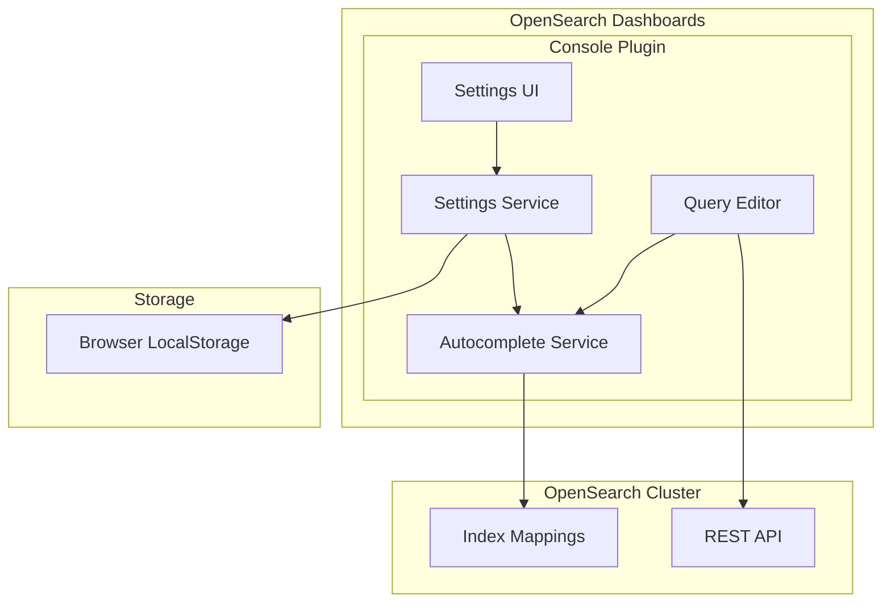

# Dashboards Console (Dev Tools)

## Summary

The Dashboards Console is a development environment within OpenSearch Dashboards that allows users to interact with OpenSearch clusters by sending REST API requests. It provides features like autocomplete suggestions, request history, and syntax highlighting to help developers write and test queries efficiently.

## Details

### Architecture



### Components

| Component | Description |
|-----------|-------------|
| Settings Service | Manages console settings including autocomplete preferences |
| Autocomplete Service | Provides query suggestions based on cluster mappings |
| Query Editor | Monaco-based editor for writing OpenSearch queries |
| Settings UI | Modal dialog for configuring console behavior |

### Configuration

| Setting | Description | Default |
|---------|-------------|---------|
| `console_polling` | Automatically refresh autocomplete suggestions | `true` |
| `autocomplete.fields` | Enable field name suggestions | `true` |
| `autocomplete.indices` | Enable index name suggestions | `true` |
| `autocomplete.templates` | Enable template suggestions | `true` |

### Key Features

1. **Query Editor**: Write and execute REST API requests with syntax highlighting
2. **Autocomplete**: Get suggestions for indices, fields, and query syntax
3. **Request History**: Access previously executed queries
4. **Auto-indent**: Format queries for readability
5. **cURL Import**: Convert cURL commands to console format

### Usage Example

```
GET _search
{
  "query": {
    "match": {
      "title": "OpenSearch"
    }
  }
}
```

## Limitations

- Autocomplete refresh requires a valid data source connection
- Large clusters may experience slower autocomplete due to mapping retrieval

## Related PRs

| Version | PR | Description |
|---------|-----|-------------|
| v3.4.0 | [#10595](https://github.com/opensearch-project/OpenSearch-Dashboards/pull/10595) | Fix: Allow updating of console_polling through the UI |

## References

- [Issue #10544](https://github.com/opensearch-project/OpenSearch-Dashboards/issues/10544): Bug report - Cannot update console_polling value through UI
- [Dev Tools Documentation](https://docs.opensearch.org/3.0/dashboards/dev-tools/index-dev/): Dev Tools overview
- [Running Queries Documentation](https://docs.opensearch.org/3.0/dashboards/dev-tools/run-queries/): Running queries in the Dev Tools console

## Change History

- **v3.4.0** (2025-10-03): Fixed bug where `console_polling` setting could not be updated through the UI
