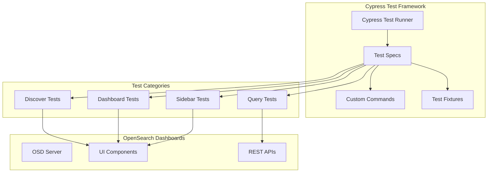

---
tags:
  - dashboards
  - search
---

# Dashboards Cypress Testing

## Summary

OpenSearch Dashboards uses Cypress for end-to-end integration testing. The Cypress test suite provides comprehensive coverage for key Dashboards functionality including Discover, saved searches, visualizations, and query features. These tests ensure UI functionality works correctly across different scenarios and help catch regressions early.

## Details

### Architecture



### Test Categories

| Category | Description | Key Tests |
|----------|-------------|----------|
| Discover | Discover page functionality | Sidebar, table canvas, inspect |
| Dashboard | Dashboard integration | Saved searches, visualizations |
| Query | Query features | Recent queries, query editor, auto-update |
| Sharing | Share functionality | Share menu, export |

### Components

| Component | Description |
|-----------|-------------|
| Test Specs | Individual test files (`.spec.js`) |
| Custom Commands | Reusable Cypress commands |
| Fixtures | Test data and configurations |
| Support Files | Setup and helper functions |

### Configuration

| Setting | Description | Default |
|---------|-------------|---------|
| `baseUrl` | OSD server URL | `http://localhost:5601` |
| `defaultCommandTimeout` | Command timeout | `10000` |
| `viewportWidth` | Browser viewport width | `1680` |
| `viewportHeight` | Browser viewport height | `900` |

### Usage Example

```bash
# Install dependencies
yarn install

# Start OpenSearch Dashboards
yarn start

# Open Cypress test runner (interactive mode)
yarn run cypress open

# Run all tests headlessly
yarn run cypress run

# Run specific test spec
yarn run cypress run --spec "cypress/integration/discover/sidebar.spec.js"
```

### Writing Tests

```javascript
// Example test spec
describe('Discover Sidebar', () => {
  before(() => {
    // Setup test data
    cy.setupTestData();
  });

  beforeEach(() => {
    cy.visit('/app/discover');
  });

  it('should filter fields by type', () => {
    cy.getElementByTestId('fieldFilterTypes')
      .click();
    cy.getElementByTestId('typeFilter-keyword')
      .click();
    cy.get('[data-test-subj="field-category"]')
      .should('be.visible');
  });

  after(() => {
    // Cleanup
    cy.cleanupTestData();
  });
});
```

## Limitations

- Tests require a running OpenSearch Dashboards instance
- Some tests may be flaky due to timing issues (mitigated with retry mechanisms)
- Test data setup may be required before running certain test suites
- Tests are primarily designed for Discover 2.0 features

## Change History

- **v3.0.0** (2025-05-06): Major expansion of Cypress test coverage for Discover 2.0, including sidebar tests, saved search tests, inspect functionality, query editor tests, and flaky test fixes (18 PRs)

## References

### Documentation
- [Cypress Documentation](https://docs.cypress.io/)
- [OpenSearch Dashboards Repository](https://github.com/opensearch-project/OpenSearch-Dashboards)

### Pull Requests
| Version | PR | Description | Related Issue |
|---------|-----|-------------|---------------|
| v3.0.0 | [#9154](https://github.com/opensearch-project/OpenSearch-Dashboards/pull/9154) | Refactor sidebar spec | [#8946](https://github.com/opensearch-project/OpenSearch-Dashboards/issues/8946) |
| v3.0.0 | [#9285](https://github.com/opensearch-project/OpenSearch-Dashboards/pull/9285) | Table canvas tests | [#8947](https://github.com/opensearch-project/OpenSearch-Dashboards/issues/8947) |
| v3.0.0 | [#9288](https://github.com/opensearch-project/OpenSearch-Dashboards/pull/9288) | Saved searches tests | [#8961](https://github.com/opensearch-project/OpenSearch-Dashboards/issues/8961) |
| v3.0.0 | [#9292](https://github.com/opensearch-project/OpenSearch-Dashboards/pull/9292) | Inspect functionality tests | [#8955](https://github.com/opensearch-project/OpenSearch-Dashboards/issues/8955) |
| v3.0.0 | [#9386](https://github.com/opensearch-project/OpenSearch-Dashboards/pull/9386) | Top values and filter tests | [#8946](https://github.com/opensearch-project/OpenSearch-Dashboards/issues/8946) |
| v3.0.0 | [#9433](https://github.com/opensearch-project/OpenSearch-Dashboards/pull/9433) | Fix flaky tests |   |

### Issues (Design / RFC)
- [Issue #8946](https://github.com/opensearch-project/OpenSearch-Dashboards/issues/8946): Discover 2.0 testing initiative
