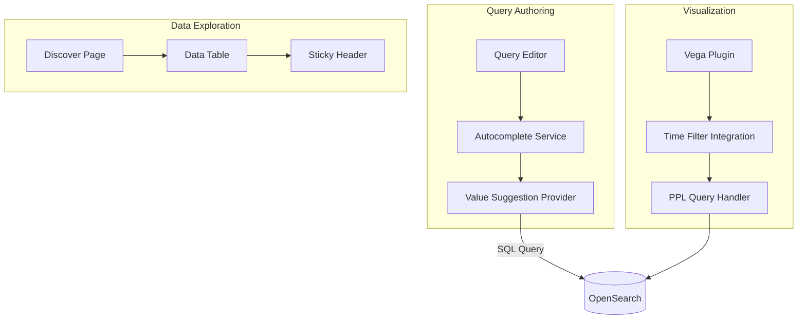

---
tags:
  - dashboards
  - performance
  - search
  - sql
---

# Dashboards Features

## Summary

OpenSearch Dashboards provides a collection of features that enhance the user experience for data exploration, visualization, and query authoring. Key capabilities include intelligent autocomplete for query languages, time-aware Vega visualizations, and optimized UI interactions for large datasets.

## Details

### Architecture



### Components

| Component | Description |
|-----------|-------------|
| Autocomplete Service | Provides intelligent suggestions for query languages |
| Value Suggestion Provider | Queries popular column values for autocomplete |
| Vega Plugin | Custom visualization using Vega/Vega-Lite grammar |
| Time Filter Integration | Connects dashboard time range to visualizations |
| Discover Data Table | Displays search results with optimized scrolling |

### Configuration

| Setting | Description | Default |
|---------|-------------|---------|
| `query:enhancements:suggestValues` | Enable value suggestions in autocomplete | `true` |
| `query:enhancements:suggestValuesLimit` | Maximum number of values to suggest | `200` |

### Usage Example

**Autocomplete Value Suggestion:**

When typing a PPL or SQL query with a comparison predicate, the autocomplete suggests popular values:

```sql
-- SQL example: typing after "=" triggers value suggestions
SELECT * FROM logs WHERE status = 
-- Suggestions: "200", "404", "500", etc.
```

```ppl
-- PPL example: typing after "=" triggers value suggestions  
source=logs | where status = 
-- Suggestions: "200", "404", "500", etc.
```

**Vega PPL with Time Field:**

```json
{
    "$schema": "https://vega.github.io/schema/vega-lite/v5.json",
    "data": {
        "url": {
            "%timefield%": "timestamp",
            "%type%": "ppl",
            "body": {
                "query": "source=opensearch_dashboards_sample_data_logs | stats count() as hits by span(timestamp, 1h)"
            }
        }
    },
    "mark": "line",
    "encoding": {
        "x": {"field": "timestamp", "type": "temporal"},
        "y": {"field": "hits", "type": "quantitative"}
    }
}
```

## Limitations

- Value suggestions only trigger in binary comparison predicates and IN-predicates
- Vega time field support requires explicit `%timefield%` parameter in the specification
- Field-level security and masking are applied to value suggestions

## Change History

- **v3.0.0** (2025-02): Added autocomplete value suggestions, Vega PPL time field support, dependency license validation, and Discover scrolling improvements

## Related Features
- [OpenSearch Core](../opensearch/actionplugin-rest-handler-wrapper.md)

## References

### Documentation
- [Vega Documentation](https://docs.opensearch.org/3.0/dashboards/visualize/vega/): Official Vega visualization docs

### Blog Posts
- [Improving ease of use in OpenSearch Dashboards with Vega visualizations](https://opensearch.org/blog/improving-dashboards-usability-with-vega/): Blog post

### Pull Requests
| Version | PR | Description | Related Issue |
|---------|-----|-------------|---------------|
| v3.0.0 | [#8275](https://github.com/opensearch-project/OpenSearch-Dashboards/pull/8275) | Autocomplete Value Suggestion | [#1234](https://github.com/opensearch-project/OpenSearch-Dashboards/issues/1234) |
| v3.0.0 | [#9064](https://github.com/opensearch-project/OpenSearch-Dashboards/pull/9064) | Dependency license validation |   |
| v3.0.0 | [#9152](https://github.com/opensearch-project/OpenSearch-Dashboards/pull/9152) | Vega PPL time field support | [#1234](https://github.com/opensearch-project/OpenSearch-Dashboards/issues/1234) |
| v3.0.0 | [#9298](https://github.com/opensearch-project/OpenSearch-Dashboards/pull/9298) | Discover scrolling improvements |   |

### Issues (Design / RFC)
- [Issue #9169](https://github.com/opensearch-project/OpenSearch-Dashboards/issues/9169): Vega PPL %timefield% feature request
