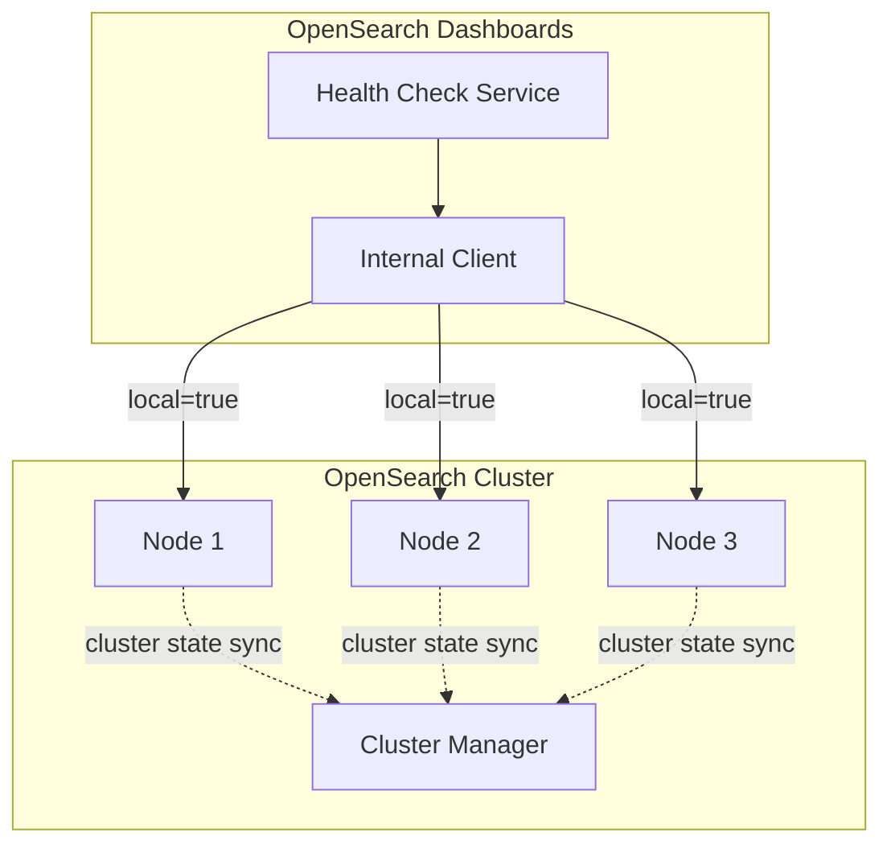
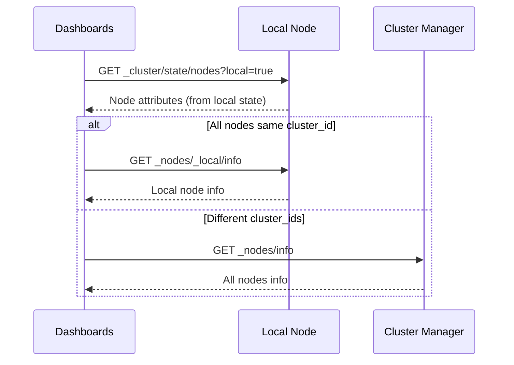

---
tags:
  - opensearch-dashboards
---
# Dashboards Health Checks

## Summary

OpenSearch Dashboards performs periodic health checks to verify version compatibility between Dashboards and OpenSearch nodes. The health check system supports optimized mode that reduces cluster load by querying only local nodes when all nodes share the same cluster ID.

## Details

### Architecture

### Components

| Component | Description |
|-----------|-------------|
| `ensure_opensearch_version.ts` | Core health check logic for version compatibility |
| `getNodeId()` | Determines which nodes to query based on cluster ID attributes |
| `pollOpenSearchNodesVersion()` | Periodic polling mechanism for version checks |

### Configuration

The optimized health check behavior is controlled by the `healthcheck` configuration:

| Setting | Description | Default |
|---------|-------------|---------|
| `healthcheck.id` | Node attribute name for cluster ID grouping | - |
| `healthcheck.filters` | Key-value pairs to filter out specific nodes | - |

### How It Works

1. **Node ID Resolution**: The `getNodeId()` function queries `_cluster/state/nodes` to retrieve cluster IDs
2. **Cluster ID Comparison**: If all nodes share the same cluster ID, returns `_local` for optimized queries
3. **Version Check**: Queries node info to verify OpenSearch version compatibility with Dashboards
4. **Periodic Polling**: Runs at configured intervals to detect cluster changes

### Optimized Health Check Flow

## Limitations

- Optimized health checks require `healthcheck.id` configuration
- Local cluster state may lag behind cluster manager state (nodes removed after 90s timeout)
- Filter configuration must match exact attribute values

## Change History

- **v2.19.0** (2024-11-18): Use local cluster state calls during health checks to reduce cluster manager load ([#8187](https://github.com/opensearch-project/OpenSearch-Dashboards/pull/8187))

## References

### Documentation
- [Cluster Health API](https://docs.opensearch.org/latest/api-reference/cluster-api/cluster-health/)

### Pull Requests
| Version | PR | Description |
|---------|-----|-------------|
| v2.19.0 | [#8187](https://github.com/opensearch-project/OpenSearch-Dashboards/pull/8187) | Use local clusterState call during healthchecks |
