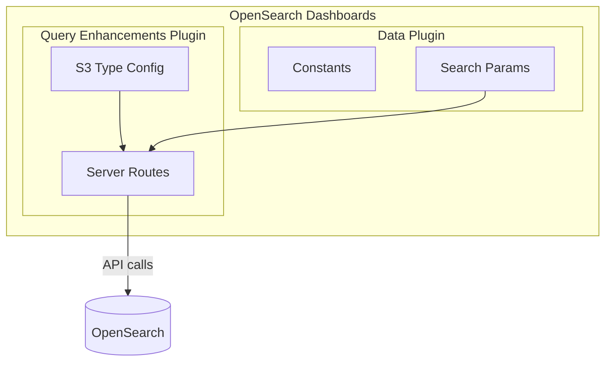

# Dashboards Maintenance

## Summary

Dashboards Maintenance encompasses routine maintenance tasks for OpenSearch Dashboards, including version bumps after releases, code cleanup, removal of deprecated APIs, and general housekeeping to keep the codebase clean and maintainable.

## Details

### Architecture

### Components

| Component | Description |
|-----------|-------------|
| Version Management | Package.json version updates after releases |
| API Routes | Server-side route definitions for data source connections |
| Search Parameters | Configuration for search request parameters |
| UI Constants | Display text and default values |

### Maintenance Activities

#### Version Bumps
After each release, the version in `package.json` is incremented to the next development version. This ensures proper version tracking during development cycles.

#### API Cleanup
Periodic cleanup of deprecated or unused APIs to reduce code complexity and maintenance burden:
- Removal of unused service classes
- Consolidation of API endpoints
- Simplification of request/response handling

#### Error Handling Improvements
Enhanced error handling for edge cases:
- Graceful handling of 404/400 responses
- Proper abort controller usage for cancellable requests

### Configuration

| Setting | Description | Default |
|---------|-------------|---------|
| `DEFAULT_DATA.SET_TYPES.LOCAL_DATASOURCE.title` | Display name for local cluster | "Default Cluster" |

## Limitations

- Maintenance changes are typically internal and don't add user-facing features
- API path changes may require updates to custom integrations

## Change History

- **v2.18.0** (2024-10-22): Version bump to 2.18.0, enhanced search API cleanup (removed ConnectionsService, deprecated routes, improved error handling)

## References

### Documentation
- [PR #8225](https://github.com/opensearch-project/OpenSearch-Dashboards/pull/8225): Version bump post 2.17 release
- [PR #8226](https://github.com/opensearch-project/OpenSearch-Dashboards/pull/8226): Enhanced search API cleanup

### Pull Requests
| Version | PR | Description |
|---------|-----|-------------|
| v2.18.0 | [#8225](https://github.com/opensearch-project/OpenSearch-Dashboards/pull/8225) | Post 2.17 version bump |
| v2.18.0 | [#8226](https://github.com/opensearch-project/OpenSearch-Dashboards/pull/8226) | Clean up enhanced search API |
