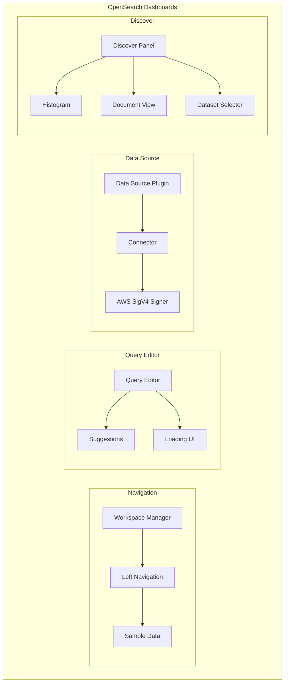

# Dashboards UI/UX Fixes

## Summary

OpenSearch Dashboards includes ongoing UI/UX improvements and bug fixes to enhance the user experience. This feature tracks various fixes across navigation, query editor, data source management, Discover panel, and dependency modernization efforts.

## Details

### Architecture

### Components

| Component | Description |
|-----------|-------------|
| Workspace Manager | Manages workspace state and navigation grouping |
| Left Navigation | Main navigation sidebar with category grouping |
| Query Editor | PPL/SQL query input with autocomplete |
| Suggestions | Query autocomplete suggestions popup |
| Data Source Connector | HTTP connector for external data sources |
| AWS SigV4 Signer | Signs requests for AWS-hosted OpenSearch |
| Discover Panel | Main data exploration interface |
| Dataset Selector | Dropdown for selecting data sources |
| Histogram | Time-based document count visualization |

### Key Fixes

#### Navigation Fixes
- **Nav Group Assignment**: Fixed visualization pages showing incorrect nav group when workspace is disabled
- **Sample Data Category**: Moved sample data from "Custom" to "Settings and Setup" category
- **Sidecar Compatibility**: Fixed navigation icon positioning when sidecar panel is docked to the left

#### Query Editor Fixes
- **Suggestions Popup**: Fixed suggestions not closing after pressing Enter to submit query
- **Loading UI**: Added immediate spinner, progress bar, and delayed time elapsed text

#### Data Source Connector Fixes
- **Content-Length Header**: Fixed type error where numeric Content-Length caused AWS SigV4 signature failure
- **Query Parameter Encoding**: Fixed special character encoding (`*`, `?`) per RFC3986 for proper signature matching
- **Request Properties**: Ensured essential properties are copied to generated requests

#### Discover Panel Fixes
- **Dataset Selector**: Fixed UI flashing by hiding Y scrollbar
- **Histogram Theme**: Made histogram colors match the current UI theme
- **Document View Padding**: Fixed content padding on single document view page

#### Dependency Updates
- Replaced `@elastic/filesaver` with `file-saver` library
- Replaced `formatNumWithCommas` with native `toLocaleString()`

#### Data Frame Fixes
- **Null/Undefined Handling**: Fixed TypeError when processing data frames with null or undefined values in nested object fields

## Limitations

- UI fixes are incremental improvements
- Some fixes are specific to workspace-disabled mode
- Theme matching may vary with custom themes

## Related PRs

| Version | PR | Description |
|---------|-----|-------------|
| v3.0.0 | [#9514](https://github.com/opensearch-project/OpenSearch-Dashboards/pull/9514) | Make nav icon style compatible with sidecar |
| v3.0.0 | [#9516](https://github.com/opensearch-project/OpenSearch-Dashboards/pull/9516) | Fix data frame null or undefined object conversion error |
| v3.0.0 | [#9665](https://github.com/opensearch-project/OpenSearch-Dashboards/pull/9665) | Fix workspace disabled navigation |
| v3.0.0 | [#9666](https://github.com/opensearch-project/OpenSearch-Dashboards/pull/9666) | Close suggestions after query submission |
| v3.0.0 | [#9668](https://github.com/opensearch-project/OpenSearch-Dashboards/pull/9668) | Fix dataset selector flashing |
| v3.0.0 | [#9674](https://github.com/opensearch-project/OpenSearch-Dashboards/pull/9674) | Copy essential property to generated request |
| v3.0.0 | [#9676](https://github.com/opensearch-project/OpenSearch-Dashboards/pull/9676) | Fix sample data to data source issue |
| v3.0.0 | [#9678](https://github.com/opensearch-project/OpenSearch-Dashboards/pull/9678) | Fix query params signer error |
| v3.0.0 | [#9344](https://github.com/opensearch-project/OpenSearch-Dashboards/pull/9344) | Update query editor loading UI |
| v3.0.0 | [#9382](https://github.com/opensearch-project/OpenSearch-Dashboards/pull/9382) | Fix single document page padding |
| v3.0.0 | [#9405](https://github.com/opensearch-project/OpenSearch-Dashboards/pull/9405) | Make histogram color match theme |
| v3.0.0 | [#9484](https://github.com/opensearch-project/OpenSearch-Dashboards/pull/9484) | Replace @elastic/filesaver |
| v3.0.0 | [#9488](https://github.com/opensearch-project/OpenSearch-Dashboards/pull/9488) | Replace formatNumWithCommas |
| v3.0.0 | [#9057](https://github.com/opensearch-project/OpenSearch-Dashboards/pull/9057) | Update data source details buttons |

## References

- [Issue #9474](https://github.com/opensearch-project/OpenSearch-Dashboards/issues/9474): Dataset selector flashing
- [Issue #9673](https://github.com/opensearch-project/OpenSearch-Dashboards/issues/9673): Essential property copy
- [Issue #9679](https://github.com/opensearch-project/OpenSearch-Dashboards/issues/9679): Query params signer error
- [Issue #9341](https://github.com/opensearch-project/OpenSearch-Dashboards/issues/9341): Remove @elastic/filesaver

## Change History

- **v3.0.0** (2025-05): Initial collection of UI/UX fixes including navigation, query editor, data source, and Discover improvements
