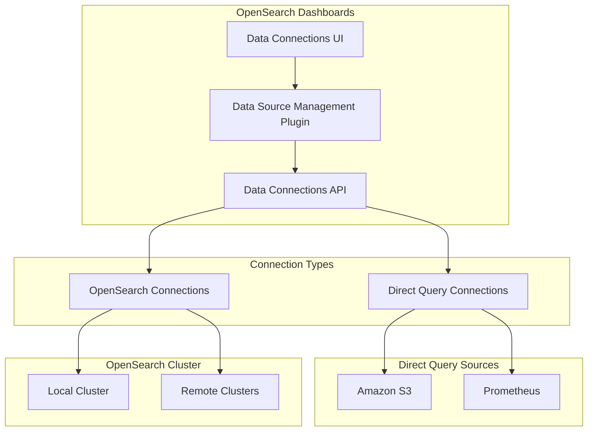
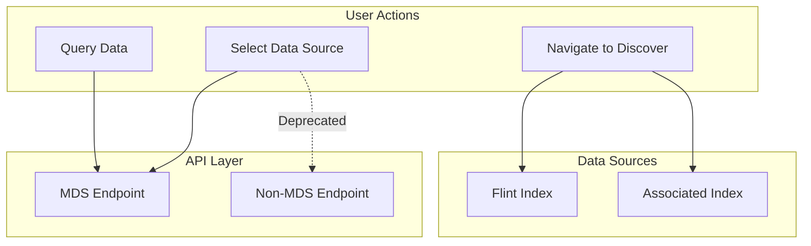

# Data Connections

## Summary

Data Connections in OpenSearch Dashboards provides a unified interface for managing connections to various data sources, including OpenSearch clusters and direct query data sources like Amazon S3 and Prometheus. The feature supports Multi-Data Source (MDS) environments, enabling users to query and visualize data from multiple sources within a single Dashboards instance.

## Details

### Architecture



### Data Flow



### Components

| Component | Description |
|-----------|-------------|
| Data Source Management Plugin | Core plugin for managing data source connections |
| Data Connections UI | Tabbed interface for OpenSearch and Direct Query connections |
| Data Connections API | REST API for CRUD operations on data connections |
| Value Suggestion API | Auto-complete API with MDS support |

### Configuration

| Setting | Description | Default |
|---------|-------------|---------|
| `data_source.enabled` | Enable Multi-Data Source feature | `false` |
| `data_source.hideLocalCluster` | Hide local cluster from data source selection | `false` |
| `query:enhancements:enabled` | Enable query enhancements for redirection | `true` |

### API Endpoints

| Endpoint | Description |
|----------|-------------|
| `/api/directquery/dataconnections/dataSourceMDSId={id}` | MDS-aware data connections endpoint |
| `/api/directquery/dataconnections` | Legacy non-MDS endpoint (deprecated when MDS enabled) |

### Usage Example

Accessing data connections in OpenSearch Dashboards:

1. Navigate to **Management > Dashboards Management > Data sources**
2. Use tabs to switch between:
   - **OpenSearch Connections**: Manage OpenSearch cluster connections
   - **Direct Query Connections**: Manage S3 and Prometheus connections

```yaml
# Example: Enabling MDS in opensearch_dashboards.yml
data_source:
  enabled: true
  hideLocalCluster: false
```

## Limitations

- When `query:enhancements:enabled` is disabled, redirection from data connections to Discover is disabled
- Direct query connections require the Observability plugin for full functionality
- The "Query data" card redirects to Discover without pre-selecting the datasource

## Related PRs

| Version | PR | Description |
|---------|-----|-------------|
| v2.18.0 | [#8460](https://github.com/opensearch-project/OpenSearch-Dashboards/pull/8460) | Replace segmented button with tabs |
| v2.18.0 | [#8492](https://github.com/opensearch-project/OpenSearch-Dashboards/pull/8492) | Add DataSource type display and Discover redirection |
| v2.18.0 | [#8503](https://github.com/opensearch-project/OpenSearch-Dashboards/pull/8503) | Fix hide local cluster flag in sample data page |
| v2.18.0 | [#8537](https://github.com/opensearch-project/OpenSearch-Dashboards/pull/8537) | Mute non-MDS endpoints when MDS enabled |
| v2.18.0 | [#8544](https://github.com/opensearch-project/OpenSearch-Dashboards/pull/8544) | Direct query connections fit and finish fixes |
| v2.18.0 | [#8713](https://github.com/opensearch-project/OpenSearch-Dashboards/pull/8713) | Add MDS support to auto-complete API |
| v2.16.0 | [#7143](https://github.com/opensearch-project/OpenSearch-Dashboards/pull/7143) | Initial migration of direct query data source to data source management |

## References

- [Issue #8256](https://github.com/opensearch-project/OpenSearch-Dashboards/issues/8256): Redirection issue for direct query datasource
- [Issue #8536](https://github.com/opensearch-project/OpenSearch-Dashboards/issues/8536): Deprecate non-MDS data connection endpoint
- [Data Sources Documentation](https://docs.opensearch.org/2.18/dashboards/management/data-sources/): Official documentation
- [Multi-Data Sources Documentation](https://docs.opensearch.org/2.18/dashboards/management/multi-data-sources/): Configuring multiple data sources

## Change History

- **v2.18.0** (2024-10-22): UI improvements (tabs navigation, type display), MDS endpoint unification, auto-complete MDS support, fit and finish fixes
- **v2.16.0**: Initial migration of direct query data source to data source management plugin
