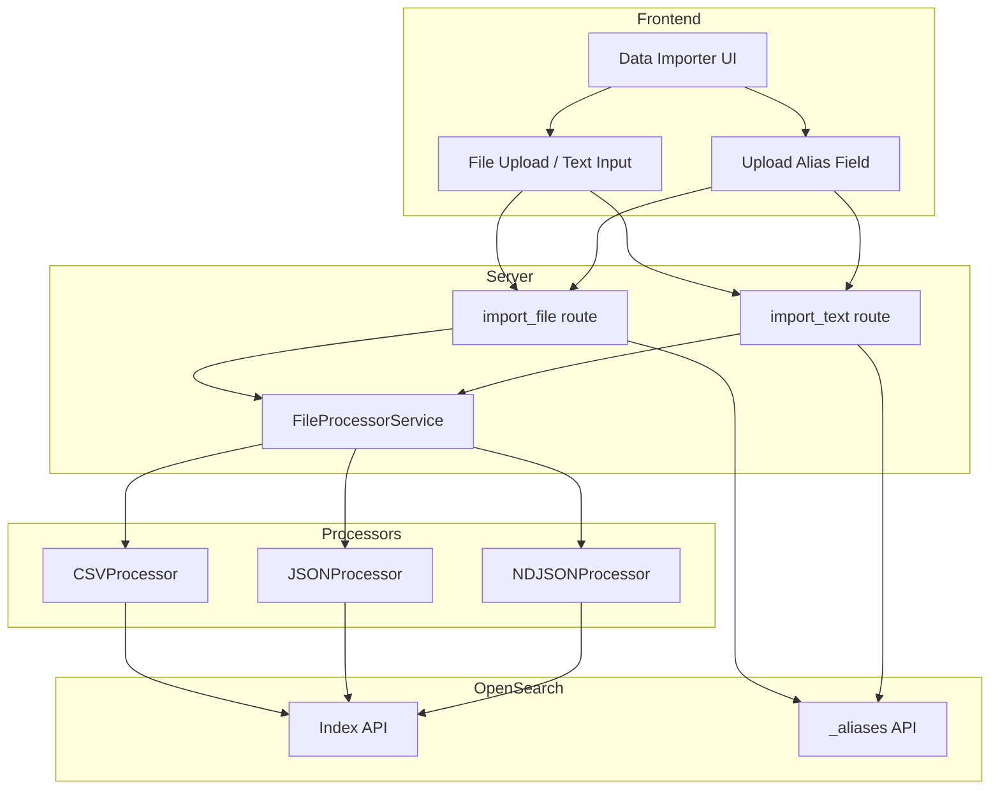

---
tags:
  - opensearch-dashboards
---
# Data Importer

## Summary

The Data Importer is an OpenSearch Dashboards plugin that enables users to ingest structured data files (CSV, JSON, NDJSON) directly into OpenSearch indices from the Dashboards UI. It supports creating new indices or appending to existing ones, data preview before import, multi-data-source (MDS) compatibility, and upload aliases for dimensional data enrichment.

## Details

### Architecture



### Components

| Component | Description |
|-----------|-------------|
| `DataImporterPluginApp` | Main React component with file/text import UI, index selection, and alias input |
| `FileProcessorService` | Server-side registry for file format processors |
| `CSVProcessor` | Parses and ingests CSV data with configurable delimiters |
| `JSONProcessor` | Parses and ingests single JSON documents |
| `NDJSONProcessor` | Parses and ingests newline-delimited JSON |
| `import_file` route | Server route for file upload ingestion (`/api/data_importer/_import_file`) |
| `import_text` route | Server route for text paste ingestion (`/api/data_importer/_import_text`) |

### Configuration

| Setting | Description | Default |
|---------|-------------|---------|
| `data_importer.enabled` | Enable/disable the Data Importer plugin | `false` |
| `data_importer.maxFileSizeBytes` | Maximum file size for uploads | `104857600` (100 MB) |
| `data_importer.maxTextCount` | Maximum character count for text input | `10000` |
| `data_importer.filePreviewDocumentsCount` | Number of rows to preview before import | `10` |
| `data_importer.enabledFileTypes` | Supported file types | `['json', 'csv', 'ndjson']` |

### Supported File Formats

| Format | Extension | Delimiter Support |
|--------|-----------|-------------------|
| CSV | `.csv` | Comma, tab, semicolon, pipe |
| JSON | `.json` | N/A |
| NDJSON | `.ndjson` | N/A |

### Upload Aliases (v3.6.0+)

When importing data, users can optionally specify an upload alias. This creates a filtered OpenSearch alias that scopes queries to the specific uploaded dataset using a `__lookup` discriminator field.

**How it works:**
1. User enters an alias name (alphanumeric, hyphens, underscores; starts with a letter)
2. Server generates a UUID as the lookup ID
3. A `__lookup` keyword field is added to the index mapping
4. Each document is injected with `{ "__lookup": "<uuid>" }`
5. A filtered alias is created: `alias → index WHERE __lookup = <uuid>`

This enables multiple datasets to share a single index while remaining individually queryable via their alias names — useful for PPL `lookup` command workflows.

### Usage Example

1. Navigate to Data Importer (Settings → Data Administration → Data Importer)
2. Select or create a target index
3. Optionally enter an upload alias name (e.g., `hosts`)
4. Upload a CSV file or paste text
5. Preview data and click Import
6. The alias `hosts` now points to the uploaded subset of data

From PPL, the uploaded data can be referenced:
```
source = logs | lookup hosts host_key append host_name, region
```

### Integration with Explore/Discover

The Data Importer can be launched as a modal from the Explore (Discover) page via the "Import data" widget button, enabling analysts to supplement their log data with dimension tables without leaving the query interface.

## Limitations

- Single file import only (no batch/multi-file uploads)
- File size limited to configured `maxFileSizeBytes`
- No editable table for resolving data inconsistencies before import
- Upload aliases only available when creating new indices
- `__lookup` field name is hardcoded (not configurable per-index)
- Alias only created when all rows succeed (zero failures)
- No UI for managing existing upload aliases post-creation

## Change History

- **v3.6.0**: Added upload alias support for dimensional data enrichment via filtered aliases and `__lookup` discriminator field
- **v3.5.0**: Integrated Data Importer as modal in Explore/Discover page; UI styling improvements; moved to Data Administration under Settings
- **v3.4.0**: Initial Data Importer plugin with CSV/JSON/NDJSON support, MDS compatibility, data preview, and error handling

## References

### Pull Requests
| Version | PR | Description |
|---------|-----|-------------|
| v3.6.0 | `https://github.com/opensearch-project/OpenSearch-Dashboards/pull/11303` | Add upload aliases to data importer |
| v3.5.0 | `https://github.com/opensearch-project/OpenSearch-Dashboards/pull/11180` | Integrate Data Importer in Explore/Discover |
| v3.5.0 | `https://github.com/opensearch-project/OpenSearch-Dashboards/pull/11241` | Address PR feedback for data importer integration |
| v3.5.0 | `https://github.com/opensearch-project/OpenSearch-Dashboards/pull/10961` | Data importer UI fixes |
| v3.5.0 | `https://github.com/opensearch-project/OpenSearch-Dashboards/pull/10478` | Move Data Importer to Data Administration |
| v3.4.0 | `https://github.com/opensearch-project/OpenSearch-Dashboards/pull/9602` | Initial Data Importer plugin |
