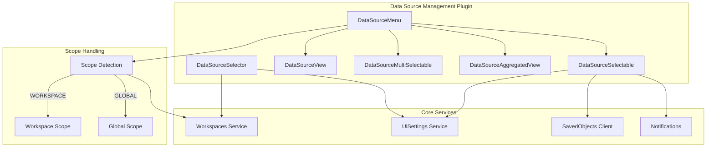
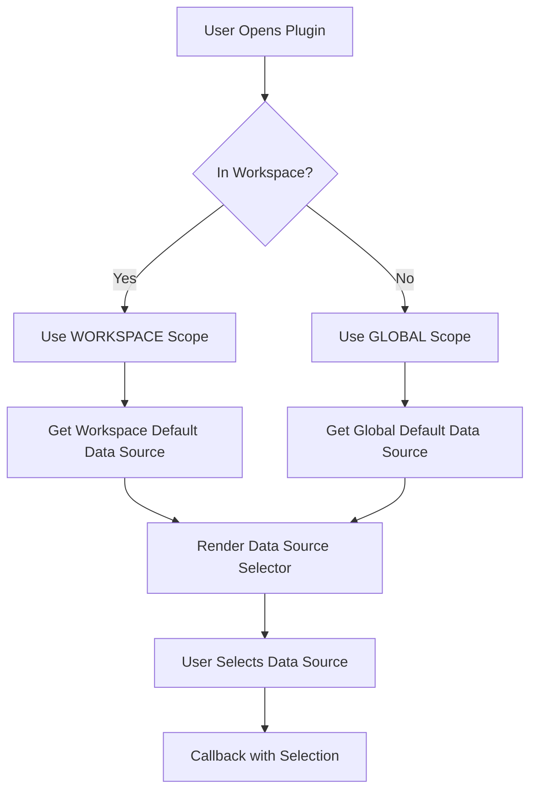

---
tags:
  - dashboards
---

# Data Source Selector

## Summary

The Data Source Selector is a UI component in OpenSearch Dashboards that allows users to select and manage data sources for their queries and visualizations. It provides a consistent interface across different plugins and supports workspace-aware scope handling to ensure users see the appropriate default data source based on their current context.

## Details

### Architecture



### Data Flow



### Components

| Component | Description |
|-----------|-------------|
| `DataSourceMenu` | Main entry point that renders the appropriate selector type based on configuration |
| `DataSourceSelectable` | Dropdown selector for choosing a single data source |
| `DataSourceView` | Read-only view of the currently selected data source |
| `DataSourceMultiSelectable` | Multi-select component for choosing multiple data sources |
| `DataSourceAggregatedView` | Aggregated view showing multiple data sources |
| `DataSourceSelector` | Legacy selector component (deprecated in favor of DataSourceMenu) |
| `DataSourceDropDownHeader` | Header component for the dropdown menu |
| `NoDataSource` | Empty state component when no data sources are available |

### Configuration

| Setting | Description | Default |
|---------|-------------|---------|
| `defaultDataSource` | The default data source ID | `null` |
| `hideLocalCluster` | Whether to hide the local cluster option | `false` |
| `data_source.enabled` | Enable multi-data-source feature | `false` |

### Usage Example

Using the data source menu in a plugin:

```tsx
import { DataSourceManagementPluginSetup } from 'src/plugins/data_source_management/public';

// Get the DataSourceMenu component
const DataSourceMenu = dataSourceManagement.ui.getDataSourceMenu<DataSourceSelectableConfig>();

// Render the component
<DataSourceMenu
  componentType={DataSourceComponentType.DataSourceSelectable}
  componentConfig={{
    fullWidth: true,
    savedObjects: savedObjectsClient,
    notifications: notifications,
    onSelectedDataSources: (dataSources) => {
      console.log('Selected:', dataSources);
    },
    activeOption: selectedDataSource ? [selectedDataSource] : undefined,
    dataSourceFilter: (ds) => ds.attributes.auth.type !== AuthType.NoAuth,
  }}
/>
```

Using the aggregated view:

```tsx
<DataSourceMenu
  componentType={DataSourceComponentType.DataSourceAggregatedView}
  componentConfig={{
    fullWidth: false,
    savedObjects: savedObjectsClient,
    notifications: notifications,
    displayAllCompatibleDataSources: true,
    activeDataSourceIds: ['ds1', 'ds2'],
  }}
/>
```

## Limitations

- The scope is determined at component mount time; dynamic workspace switching requires component remounting
- The legacy `DataSourceSelector` component requires manual scope handling
- Data source filtering is applied client-side after fetching all data sources

## Change History

- **v3.2.0** (2026-01-10): Added workspace-aware scope support for default data source retrieval

## References

### Documentation
- [Workspace Documentation](https://docs.opensearch.org/3.0/dashboards/workspace/workspace/): Official workspace documentation
- [Data Sources Documentation](https://docs.opensearch.org/3.0/dashboards/management/data-sources/): Data source management guide
- [Manage Workspaces](https://docs.opensearch.org/3.0/dashboards/workspace/manage-workspace/): Workspace management including data source associations

### Pull Requests
| Version | PR | Description | Related Issue |
|---------|-----|-------------|---------------|
| v3.2.0 | [#9832](https://github.com/opensearch-project/OpenSearch-Dashboards/pull/9832) | Support scope in data source selector |   |
