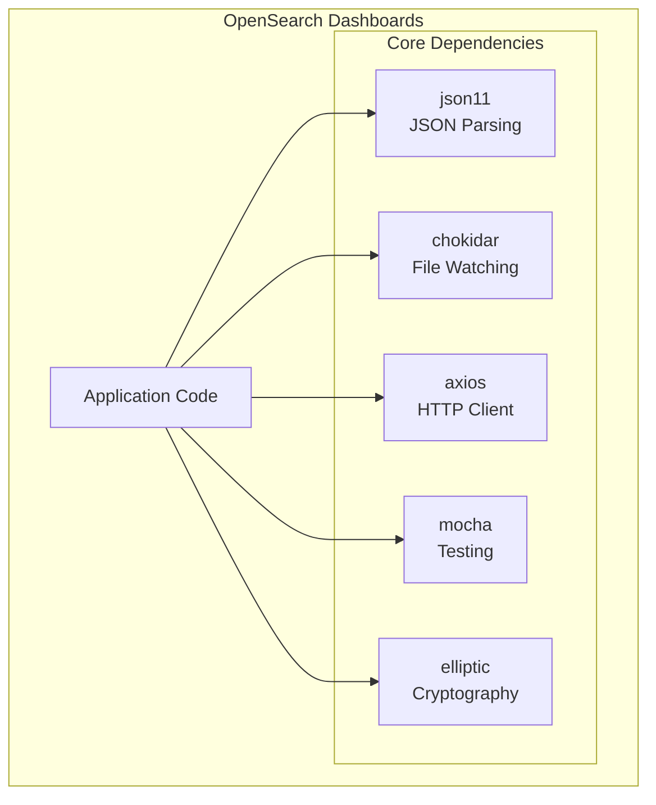

# Dependency Updates (OpenSearch Dashboards)

## Summary

OpenSearch Dashboards maintains a set of core dependencies that are regularly updated to address security vulnerabilities, improve performance, and ensure compatibility. This feature tracks significant dependency updates that impact the stability and security of the Dashboards application.

## Details

### Architecture



### Key Dependencies

| Dependency | Purpose | Security Impact |
|------------|---------|-----------------|
| json11 | JSON parsing with extended features | UTF-8 safety in JSON stringification |
| chokidar | File system watching for development | Development tooling |
| axios | HTTP client for API requests | CVE-2024-39338 |
| mocha | Test framework | SNYK-JS-MOCHA-2863123 |
| elliptic | Elliptic curve cryptography | CVE-2024-42459, CVE-2024-42460, CVE-2024-42461 |

### Configuration

Dependencies are managed through:

| File | Purpose |
|------|---------|
| `package.json` | Direct dependency declarations |
| `yarn.lock` | Locked dependency versions |
| `packages/*/package.json` | Package-specific dependencies |

### Usage Example

Dependencies are automatically resolved during installation:

```bash
# Install all dependencies
yarn install

# Update a specific dependency
yarn upgrade json11@^2.0.0
```

## Limitations

- Dependency updates may introduce breaking changes requiring code modifications
- Security patches should be applied promptly but require testing
- Some dependencies are pinned to specific versions for compatibility

## Related PRs

| Version | PR | Description |
|---------|-----|-------------|
| v2.18.0 | [#8603](https://github.com/opensearch-project/OpenSearch-Dashboards/pull/8603) | Upgrade JSON11 from 1.1.2 to 2.0.0 |
| v2.18.0 | [#8490](https://github.com/opensearch-project/OpenSearch-Dashboards/pull/8490) | Bump chokidar from 3.5.3 to 3.6.0 |

## References

- [Issue #7367](https://github.com/opensearch-project/OpenSearch-Dashboards/issues/7367): JSON.parse bad escaped character bug
- [OpenSearch Forum](https://forum.opensearch.org/t/json-parse-bad-escaped-character/20211): Community discussion

## Change History

- **v2.18.0** (2024-10-22): JSON11 upgrade to 2.0.0 for UTF-8 safety, chokidar bump to 3.6.0
