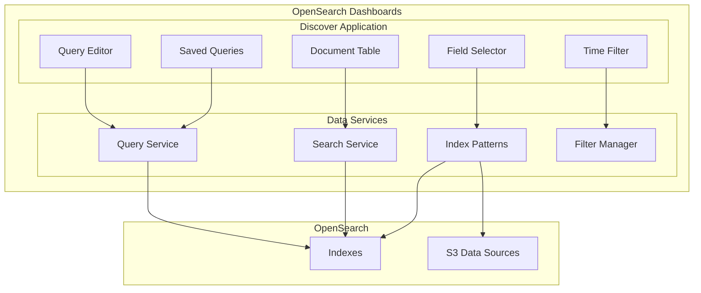
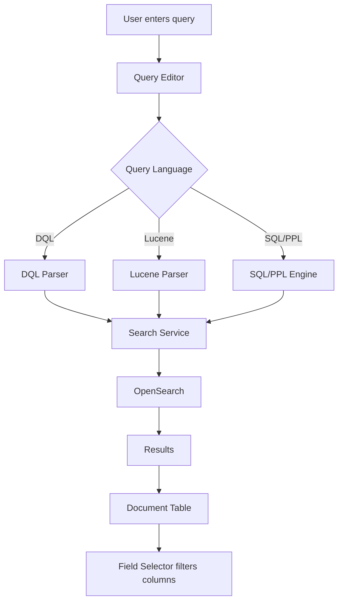

# Discover

## Summary

Discover is the data exploration application in OpenSearch Dashboards that allows users to interactively search, filter, and analyze data stored in OpenSearch indexes. It provides a powerful interface for ad-hoc data exploration with support for multiple query languages (DQL, Lucene, SQL, PPL), time-based filtering, field selection, and document inspection.

## Details

### Architecture



### Data Flow



### Components

| Component | Description |
|-----------|-------------|
| Query Editor | Input area for search queries with language selection |
| Time Filter | Controls time range for time-based indexes |
| Field Selector | Sidebar for selecting and filtering visible fields |
| Document Table | Displays search results with expandable documents |
| Saved Queries | Stores and loads frequently used queries |
| Index Pattern Selector | Selects data source for exploration |

### Configuration

| Setting | Description | Default |
|---------|-------------|---------|
| `discover:searchOnPageLoad` | Run search when Discover loads | On |
| `discover:sort:defaultOrder` | Default sort order for time-based indexes | desc |
| `discover:sampleSize` | Number of documents to show | 500 |
| `query:enhancements:enabled` | Enable query enhancements (SQL/PPL support) | Off |

### Usage Example

```
# DQL Query Example
status:error AND response.code >= 500

# Time Filter
Last 15 minutes, Last 24 hours, Custom range

# Field Selection
Select fields from sidebar to customize table columns
```

## Limitations

- Time field display may have rendering issues when switching query languages (workaround applied in v2.18.0)
- S3 field support requires query enhancements to be enabled
- Recently selected data list may show stale entries after index pattern deletion (fixed in v2.18.0)

## Related PRs

| Version | PR | Description |
|---------|-----|-------------|
| v2.18.0 | [#8609](https://github.com/opensearch-project/OpenSearch-Dashboards/pull/8609) | Add support for S3 fields in Discover |
| v2.18.0 | [#8659](https://github.com/opensearch-project/OpenSearch-Dashboards/pull/8659) | Fix UI stuck on searching after deleting index pattern |
| v2.18.0 | [#8755](https://github.com/opensearch-project/OpenSearch-Dashboards/pull/8755) | Fix time field wrapping overlap on language change |
| v2.18.0 | [#8707](https://github.com/opensearch-project/OpenSearch-Dashboards/pull/8707) | Ensure saved query loaded properly from asset |

## References

- [Analyzing data in Discover](https://docs.opensearch.org/2.18/dashboards/discover/index-discover/): Official documentation
- [Issue #8612](https://github.com/opensearch-project/OpenSearch-Dashboards/issues/8612): Bug report for deleted index pattern issue

## Change History

- **v2.18.0** (2024-11-05): Bug fixes for S3 fields support, deleted index pattern handling, time field display, and saved query loading
