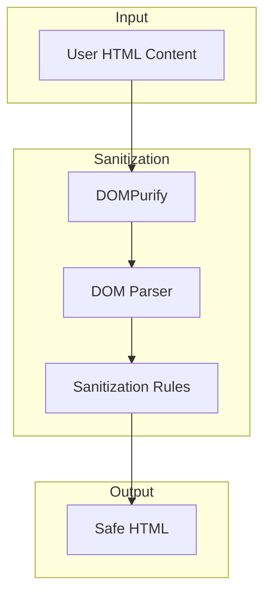

# DOMPurify Sanitization

## Summary

DOMPurify is a critical security library used in OpenSearch Dashboards to sanitize HTML, MathML, and SVG content before rendering. It protects against cross-site scripting (XSS) attacks by removing malicious code from user-provided content while preserving safe markup.

## Details

### Architecture



### Components

| Component | Description |
|-----------|-------------|
| DOMPurify | Core sanitization library from Cure53 |
| DOM Parser | Browser's native DOM parsing engine |
| Sanitization Rules | Configurable allowlists for tags and attributes |

### Usage in OpenSearch Dashboards

DOMPurify is used throughout OpenSearch Dashboards to sanitize:

- Table visualization cell content with URL formatting
- Markdown content in visualizations
- Custom HTML in dashboard panels
- User-provided labels and descriptions

### Configuration

DOMPurify can be configured with various options:

| Setting | Description | Default |
|---------|-------------|---------|
| ALLOWED_TAGS | HTML tags permitted in output | Standard safe tags |
| ALLOWED_ATTR | Attributes permitted on elements | Standard safe attributes |
| FORBID_TAGS | Tags explicitly forbidden | Script, style, etc. |
| FORBID_ATTR | Attributes explicitly forbidden | Event handlers |

### Usage Example

```typescript
import DOMPurify from 'dompurify';

// Basic sanitization
const cleanHTML = DOMPurify.sanitize(dirtyHTML);

// With custom configuration
const cleanHTML = DOMPurify.sanitize(dirtyHTML, {
  ALLOWED_TAGS: ['b', 'i', 'em', 'strong', 'a'],
  ALLOWED_ATTR: ['href', 'title']
});
```

## Limitations

- Sanitization adds processing overhead for large HTML content
- Some legitimate HTML patterns may be stripped if they resemble attack vectors
- Configuration must balance security with functionality

## Related PRs

| Version | PR | Description |
|---------|-----|-------------|
| v3.0.0 | [#9447](https://github.com/opensearch-project/OpenSearch-Dashboards/pull/9447) | Bump dompurify from 3.1.6 to 3.2.4 (CVE-2025-26791) |
| v2.17.1 | [#8346](https://github.com/opensearch-project/OpenSearch-Dashboards/pull/8346) | Bump dompurify from 3.0.11 to 3.1.6 (CVE-2024-45801) |
| v2.5.0 | [#2918](https://github.com/opensearch-project/OpenSearch-Dashboards/pull/2918) | Initial DOMPurify integration for table visualization |

## References

- [DOMPurify GitHub](https://github.com/cure53/DOMPurify): Official DOMPurify repository
- [CVE-2025-26791](https://nvd.nist.gov/vuln/detail/CVE-2025-26791): mXSS vulnerability in template literal regex
- [CVE-2024-45801](https://nvd.nist.gov/vuln/detail/CVE-2024-45801): Nesting-based mXSS vulnerability

## Change History

- **v3.0.0** (2025-05-06): Updated to 3.2.4 to fix CVE-2025-26791 (mXSS via template literal regex)
- **v2.17.1** (2024-09-25): Updated to 3.1.6 to fix CVE-2024-45801 (nesting-based mXSS)
- **v2.5.0** (2022-12-15): Initial integration for table visualization URL formatting
