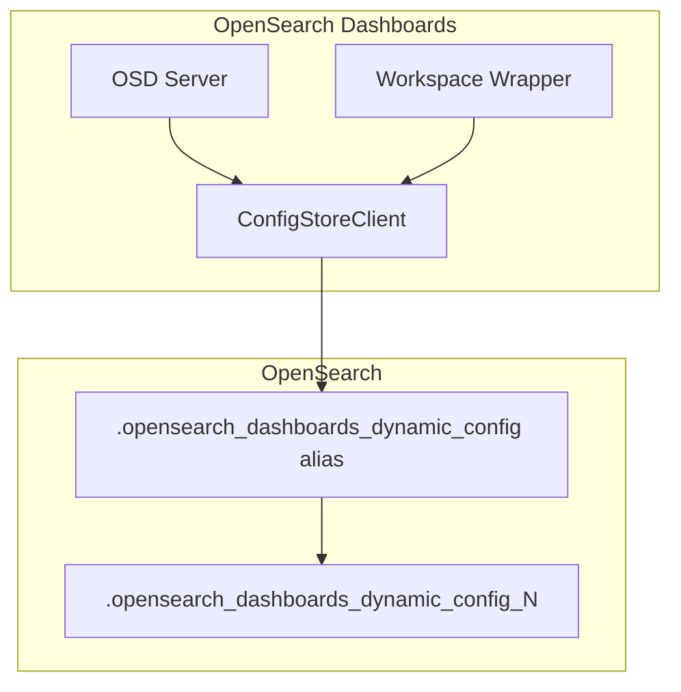
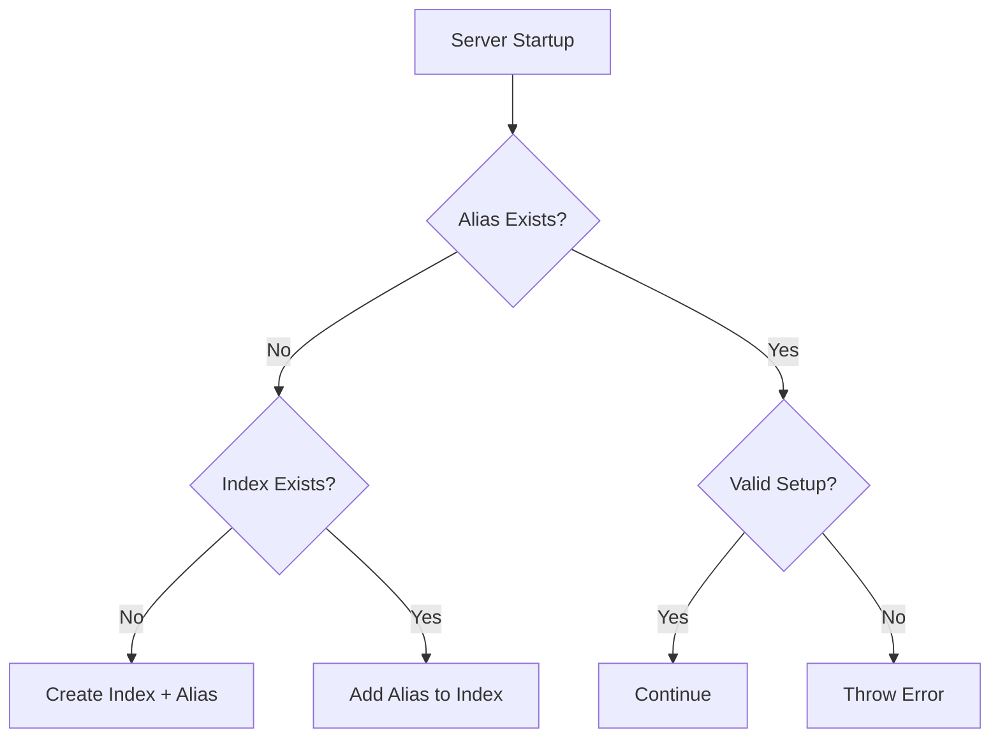

# Dynamic Config

## Summary

Dynamic Config is a feature in OpenSearch Dashboards that enables runtime configuration management through a dedicated OpenSearch index. It allows the system to store and retrieve configuration settings dynamically without requiring server restarts, supporting features like advanced settings upgrades and workspace-aware configuration.

## Details

### Architecture



### Data Flow



### Components

| Component | Description |
|-----------|-------------|
| `OpenSearchConfigStoreClient` | Client for managing dynamic config index operations |
| `WorkspaceIdConsumerWrapper` | Wrapper that handles workspace-aware saved object operations |
| `WorkspaceSavedObjectsClientWrapper` | Filters config objects based on workspace context |

### Configuration

| Setting | Description | Default |
|---------|-------------|---------|
| Index Name | Dynamic config index pattern | `.opensearch_dashboards_dynamic_config_N` |
| Alias Name | Alias pointing to active index | `.opensearch_dashboards_dynamic_config` |

### Index Naming Convention

The dynamic config system uses versioned indices with an alias:

```
.opensearch_dashboards_dynamic_config_1  (index)
.opensearch_dashboards_dynamic_config    (alias) -> points to active index
```

### Usage Example

The dynamic config system operates transparently. Configuration is stored as documents in the index:

```json
{
  "config_name": "advanced_settings",
  "config_blob": {
    "buildNum": 12345,
    "defaultIndex": "my-index-pattern"
  }
}
```

### Workspace Integration

Config saved objects are treated specially in workspace contexts:
- Global configs (with `buildNum` attribute) are accessible across all workspaces
- User-specific configs are filtered based on workspace membership
- Config creation bypasses automatic workspace ID injection

## Limitations

- The alias must point to exactly one valid dynamic config index
- Invalid alias configurations require manual cleanup before server restart
- Index names must follow the pattern `.opensearch_dashboards_dynamic_config_N` where N is a positive integer

## Change History

- **v2.18.0** (2024-11-05): Fixed config saved objects workspace handling, global config discovery during upgrades, and dynamic config index/alias validation

## References

### Documentation
- [Dynamic configuration in OpenSearch Dashboards](https://docs.opensearch.org/2.18/security/multi-tenancy/dynamic-config/): Official documentation

### Pull Requests
| Version | PR | Description | Related Issue |
|---------|-----|-------------|---------------|
| v2.18.0 | [#8160](https://github.com/opensearch-project/OpenSearch-Dashboards/pull/8160) | Fix config related issues and dedup category | [#1234](https://github.com/opensearch-project/OpenSearch-Dashboards/issues/1234) |
| v2.18.0 | [#8184](https://github.com/opensearch-project/OpenSearch-Dashboards/pull/8184) | Fix bug when dynamic config index and alias are checked | [#1234](https://github.com/opensearch-project/OpenSearch-Dashboards/issues/1234) |
