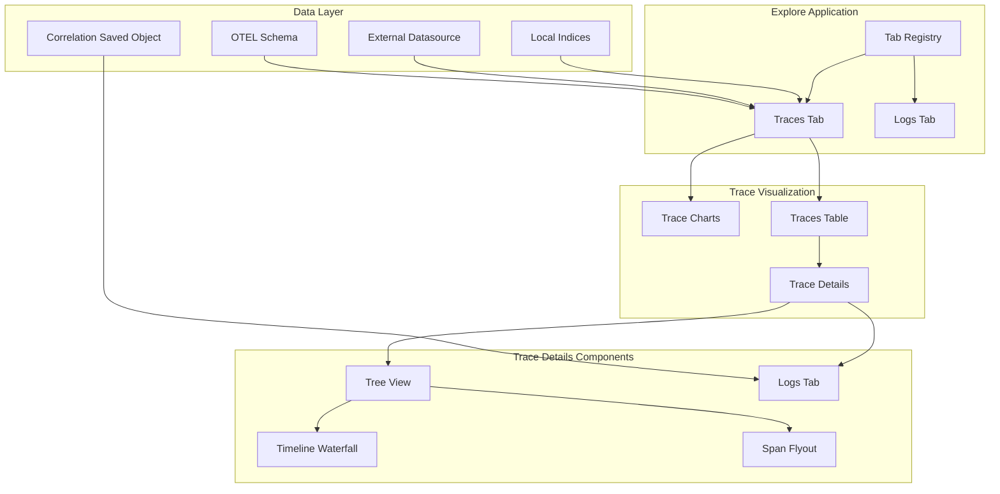
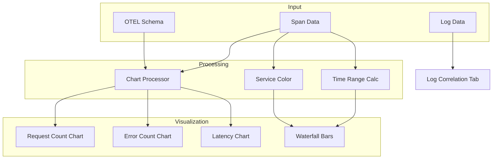

# Explore Traces

## Summary

Explore Traces is a feature in OpenSearch Dashboards that provides comprehensive trace visualization and analysis capabilities within the Explore application. It enables users to visualize distributed traces, correlate traces with logs, view timeline waterfall charts, and analyze trace metrics through interactive charts. The feature supports both local and external data sources, providing a unified experience for observability workflows.

## Details

### Architecture



### Data Flow



### Components

| Component | Description |
|-----------|-------------|
| Traces Tab | Main interface for viewing and filtering traces in Explore |
| Trace Charts | Line charts showing request count, error count, and latency over time |
| Traces Table | Paginated table with configurable default columns |
| Trace Details | Detailed view of individual traces with multiple tabs |
| Tree View | Hierarchical span table with parent-child relationships |
| Timeline Waterfall | Inline waterfall bars showing span timing relative to trace |
| Timeline Ruler | Ruler with millisecond measurements for visual comparison |
| Logs Tab | Correlated logs view with redirect to Discover |
| Span Flyout | Detailed span information panel |
| Correlation Saved Object | Stores trace-to-log correlation configuration |
| Tab Registry | Flavor-based tab registration system |
| Span Status Filter | Popover-based filter for span status (Error, OK, Unset) |
| Trace ID Badge | Clickable badge displaying trace ID with copy functionality |

### Configuration

| Setting | Description | Default |
|---------|-------------|---------|
| `explore:defaultTraceColumns` | Default columns for Explore traces tab | Experimental |
| Correlation Type | `APM-Correlation` for trace-log relationships | N/A |
| Log Service Name Field | Field mapping for service name in logs | `service.name` |
| Log Span ID Field | Field mapping for span ID in logs | `span_id` |
| Log Trace ID Field | Field mapping for trace ID in logs | `trace_id` |
| Timestamp Field | Timestamp field for log correlation | `@timestamp` |

### Usage Example

#### Viewing Traces in Explore

```
1. Navigate to Explore application
2. Select a trace dataset (local or external)
3. View trace charts showing:
   - Request count over time
   - Error count over time
   - Latency distribution
4. Click on a trace row to view details
```

#### Using Timeline Waterfall

```
1. Open Trace Details page
2. Navigate to "Tree view" tab
3. View the "Timeline" column with waterfall bars
4. Bars are color-coded by service name
5. Hover over bars to see:
   - Duration (ms)
   - Start time (relative)
   - End time (relative)
6. Drag column border to resize
```

#### Setting Up Log Correlation

```json
// Create correlation saved object
POST .kibana/_doc/correlations:trace-logs-1
{
  "type": "correlations",
  "correlations": {
    "type": "APM-Correlation",
    "entities": [
      {
        "tracesDataset": {
          "id": "trace-index-pattern-id"
        }
      },
      {
        "logsDataset": {
          "id": "logs-index-pattern-id",
          "meta": {
            "logServiceNameField": "service.name",
            "logSpanIdField": "span_id",
            "logTraceIdField": "trace_id",
            "timestamp": "@timestamp"
          }
        }
      }
    ]
  }
}
```

#### Querying External Datasource

```
1. Configure external data source in Dashboards Management
2. Navigate to Explore → Traces
3. Select external data source from dropdown
4. Query traces from external cluster
```

#### Filtering Spans by Status

```
1. Navigate to Trace Details page
2. Click "Filter by status" button in the span hierarchy table toolbar
3. Select one or more status options:
   - Error: Shows spans with error status
   - OK: Shows spans with successful status
   - Unset: Shows spans with unset/unknown status
4. Selected filters appear as badges and persist across navigation
```

#### Copying Trace ID

```
1. Open Trace Details page
2. Locate the "Trace ID: {id}" badge in the header
3. Click the badge to copy the trace ID to clipboard
4. A tooltip confirms the copy action
```

## Limitations

- Service map tab is currently disabled
- Nanosecond precision may be lost in PPL queries; fallback to `durationNano` field is implemented
- Start time rounding may occur with imprecise data
- Maximum spans displayed limited by browser performance
- Log correlation requires manual saved object configuration
- Span status filter state is stored in session storage and resets on browser close
- Root span detection falls back to earliest span if no span without parent is found

## Related PRs

| Version | PR | Description |
|---------|-----|-------------|
| v3.4.0 | [#10745](https://github.com/opensearch-project/OpenSearch-Dashboards/pull/10745) | Add span status filters to trace details |
| v3.4.0 | [#10630](https://github.com/opensearch-project/OpenSearch-Dashboards/pull/10630) | Fix trace details page header to always show root span |
| v3.4.0 | [#10651](https://github.com/opensearch-project/OpenSearch-Dashboards/pull/10651) | Traces code block scrollbar to scroll on edge |
| v3.4.0 | [#10698](https://github.com/opensearch-project/OpenSearch-Dashboards/pull/10698) | Remove service.name column from traces table |
| v3.3.0 | [#10386](https://github.com/opensearch-project/OpenSearch-Dashboards/pull/10386) | Add Correlations Saved Object Type Registration |
| v3.3.0 | [#10392](https://github.com/opensearch-project/OpenSearch-Dashboards/pull/10392) | Add traces chart (request count, error count, latency) |
| v3.3.0 | [#10393](https://github.com/opensearch-project/OpenSearch-Dashboards/pull/10393) | Trace Details: Log correlation (tabs + redirect) |
| v3.3.0 | [#10406](https://github.com/opensearch-project/OpenSearch-Dashboards/pull/10406) | Add experimental default trace columns UI setting |
| v3.3.0 | [#10418](https://github.com/opensearch-project/OpenSearch-Dashboards/pull/10418) | Trace Details: Support external datasets |
| v3.3.0 | [#10431](https://github.com/opensearch-project/OpenSearch-Dashboards/pull/10431) | Switch primary schema for trace details, disable service map |
| v3.3.0 | [#10642](https://github.com/opensearch-project/OpenSearch-Dashboards/pull/10642) | Add Timeline waterfall bars column to SpanDetailTableHierarchy |

## References

- [Trace Analytics Documentation](https://docs.opensearch.org/3.0/observing-your-data/trace/ta-dashboards/): Official trace analytics guide
- [Simple Schema for Observability](https://docs.opensearch.org/3.0/observing-your-data/ss4o/): SS4O schema definitions
- [Observability Overview](https://docs.opensearch.org/3.0/observing-your-data/): OpenSearch observability features
- [OpenTelemetry Protocol](https://opentelemetry.io/docs/specs/otel/): OTEL specification

## Change History

- **v3.4.0** (2026-03-18): Added span status filters (Error, OK, Unset), improved page header to show root span service/operation, copyable trace ID badge, scrollbar fixes, removed duplicate service.name column
- **v3.3.0** (2026-03-18): Initial implementation with trace charts, log correlation, timeline waterfall visualization, external datasource support, configurable default columns, and OTEL schema support
