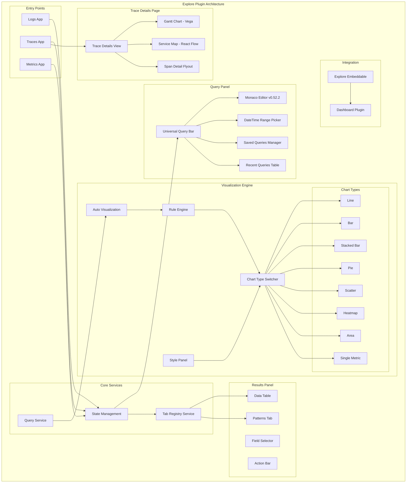
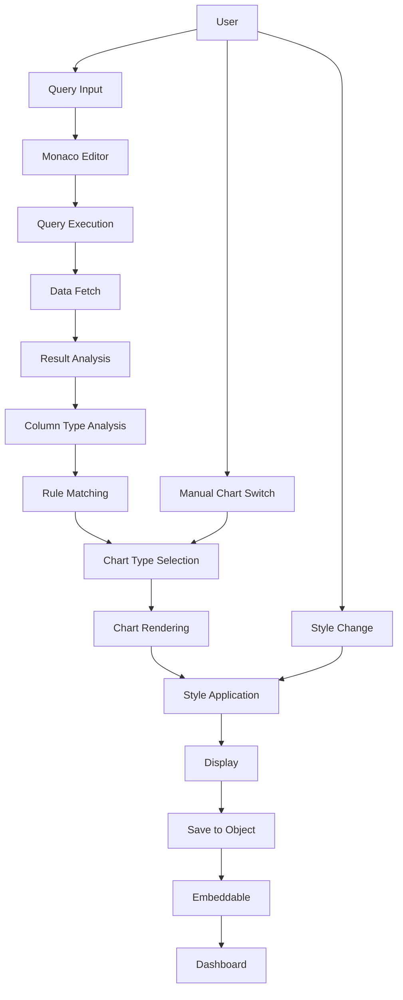

# Explore Plugin

## Summary

The Explore plugin is a next-generation data exploration experience in OpenSearch Dashboards that evolves from the Discover plugin. It provides enhanced query capabilities with a universal query bar powered by Monaco Editor, multi-dataset support with separate pages for logs, traces, and metrics, and intelligent rule-based auto-visualization that automatically selects the most appropriate chart type based on data characteristics.

Key benefits include:
- Unified query interface with Monaco Editor for improved query writing experience
- Multi-flavor support for different observability use cases (logs, traces, metrics)
- Automatic visualization selection based on data patterns
- Dashboard integration through embeddable components
- Extensible tab system for custom result views
- Trace Details page for deep investigation of distributed traces (v3.2.0)
- PPL filter support with direct query modification (v3.2.0)
- Improved fields selector with result/schema grouping (v3.2.0)
- Query editor performance optimizations (v3.2.0)
- Bidirectional URL-Redux synchronization for browser navigation (v3.2.0)
- In-editor PPL documentation with categorized suggestions (v3.2.0)
- Patterns tab flyout with detailed pattern inspection (v3.3.0)
- Search with pattern functionality for log filtering (v3.3.0)
- Calcite query engine compatibility for patterns (v3.3.0)
- Metric visualization with sparkline support (v3.3.0)
- Histogram visualization for numerical, time-series, and categorical data (v3.3.0)
- Table visualization with column alignment, filters, and statistical footers (v3.3.0)
- Dark/light theme support with new color palettes (v3.3.0)
- Gantt chart improvements for trace analysis (v3.3.0)
- Facet filtering for quick data narrowing with default observability fields (v3.3.0)
- Explore experience modal for first-time user onboarding (v3.3.0)
- Query panel actions registry for plugin extensibility (v3.3.0)
- Mouse hover states for line chart interactivity (v3.3.0)
- Intelligent date format inference for axis labels (v3.3.0)
- Auto-enable related UI settings when Explore is activated (v3.3.0)
- Tab content error guard for isolated error handling (v3.3.0)

## Details

### Architecture



### Data Flow



### Components

| Component | Description |
|-----------|-------------|
| `ExploreApp` | Main application entry point with flavor routing |
| `LogsPage` / `TracesPage` / `MetricsPage` | Flavor-specific pages (currently identical, will diverge) |
| `QueryPanel` | Universal query bar with Monaco Editor integration |
| `QueryEditor` | Monaco Editor wrapper with PPL/SQL support |
| `AutoVisualization` | Rule-based automatic chart type selection |
| `ChartTypeSwitcher` | UI for switching between available chart types |
| `StylePanel` | Collapsible panels for chart styling options |
| `ExploreEmbeddable` | Embeddable component for dashboard integration |
| `TabRegistry` | Service for managing result tabs |
| `PatternsTable` | Log patterns analysis table |
| `PatternsFlyoutProvider` | Context provider for patterns flyout state (v3.3.0) |
| `PatternsTableFlyout` | Flyout panel for detailed pattern inspection (v3.3.0) |
| `PatternsFlyoutEventTable` | Paginated events table in flyout (v3.3.0) |
| `PatternsFlyoutUpdateSearch` | Search with pattern button component (v3.3.0) |
| `Sparkline` | Inline trend visualization for metric displays (v3.3.0) |
| `Histogram` | Multi-type histogram visualization (numerical, time-series, categorical) (v3.3.0) |
| `ColumnFilter` | Excel-like filter UI for table columns (v3.3.0) |
| `TableFooter` | Statistical summary row for tables (Last, Avg, Min, Max, Total) (v3.3.0) |
| `CellCustomization` | Colored text/background cell styling (v3.3.0) |
| `FieldSelector` | Field selection sidebar |
| `DataTable` | Results data table with action bar |
| `TraceDetails` | Trace details page with span visualization |
| `GanttChart` | Vega-based Gantt chart for span timeline |
| `ServiceMap` | React Flow-based interactive service dependency graph |
| `SpanDetailPanel` | Container for span visualization with view mode switching |
| `SpanDetailTable` | Flat list view of spans with sorting and filtering |
| `SpanDetailTableHierarchy` | Tree view showing parent-child span relationships |
| `useTabResults` | Hook for managing tab results, replacing repeated code |
| `PPLFilterUtils` | Utility functions for PPL filter manipulation |
| `ColumnsFilterUI` | Column filter UI with "selected" group in fields selector |
| `URLReduxSync` | Bidirectional URL-Redux synchronization system |
| `GlobalHeaderControls` | Datepicker and run button in global header |
| `PPLDocumentation` | In-editor documentation for PPL commands |
| `FacetFilter` | UI component for facet-based filtering with default observability fields (v3.3.0) |
| `ExploreExperienceModal` | Welcome modal for first-time users with saved object tracking (v3.3.0) |
| `queryPanelActionsRegistry` | Registry service for external plugin actions (v3.3.0) |
| `buildTemporalAxisFormatting` | Utility for inferring date formats based on data granularity (v3.3.0) |
| `TabContentErrorGuard` | Error boundary for tab-specific query failures (v3.3.0) |

### Configuration

| Setting | Description | Default |
|---------|-------------|---------|
| `explore.enabled` | Enable/disable Explore plugin | `true` (experimental) |
| `explore.defaultFlavor` | Default flavor when accessing Explore | `logs` |
| `home.disableExperienceModal` | Disable the explore experience modal (v3.3.0) | `false` |

### Auto-Visualization Rules

| Rule | Data Pattern | Chart Type |
|------|--------------|------------|
| Single Metric | 1 numerical, 0 date, 0 categorical | Single Metric |
| Basic Scatter | 2 numerical, 0 date, 0 categorical | Scatter |
| Colored Scatter | 2 numerical, 0 date, 1 categorical | Scatter (color by category) |
| Sized Scatter | 3 numerical, 0 date, 1 categorical | Scatter (size by 3rd metric) |
| Category Heatmap | 1 numerical, 0 date, 2 categorical | Heatmap |
| Numeric Heatmap | 3 numerical, 0 date, 0 categorical | Heatmap |
| Simple Bar | 1 metric, 1 category | Bar |
| Stacked Bar | 1 metric, 2 categories (low cardinality) | Stacked Bar |
| High Cardinality | 1 metric, 2 categories (high cardinality) | Heatmap |
| Time Series | Time-based data | Line (default) |

### Usage Example

```ppl
# Access Explore via side navigation
# Navigate to: Logs / Traces / Metrics

# Single metric example
source = opensearch_dashboards_sample_data_ecommerce
| stats count() as total_orders

# Bar chart example
source = opensearch_dashboards_sample_data_ecommerce
| stats min(products.base_price) by manufacturer

# Stacked bar example
source = opensearch_dashboards_sample_data_ecommerce
| stats min(products.base_price) by manufacturer, customer_gender

# Scatter plot example
source = opensearch_dashboards_sample_data_ecommerce
| stats avg(products.base_price), avg(products.quantity)

# Time series line chart
source = opensearch_dashboards_sample_data_ecommerce
| stats count() by span(@timestamp, 1h)
```

### Adding Explore to Dashboard

1. Create a visualization in Explore
2. Click "Add to Dashboard" button
3. Select target dashboard or create new
4. The Explore embeddable is added to the dashboard

## Limitations

- Experimental feature - APIs and behavior may change
- PPL embeddables may conflict with other query language embeddables on the same dashboard
- Table rendering for unmatched visualization patterns is pending
- Patterns tab pagination has known issues with page number clicks
- Style options are chart-type specific and may not persist across chart type switches

## Related PRs

| Version | PR | Description |
|---------|-----|-------------|
| v3.3.0 | [#10362](https://github.com/opensearch-project/OpenSearch-Dashboards/pull/10362) | Introduce facet filter |
| v3.3.0 | [#10412](https://github.com/opensearch-project/OpenSearch-Dashboards/pull/10412) | Introduce tab content error guard |
| v3.3.0 | [#10425](https://github.com/opensearch-project/OpenSearch-Dashboards/pull/10425) | Infer axis date format |
| v3.3.0 | [#10432](https://github.com/opensearch-project/OpenSearch-Dashboards/pull/10432) | Update default columns and facets |
| v3.3.0 | [#10443](https://github.com/opensearch-project/OpenSearch-Dashboards/pull/10443) | Revert AI mode default |
| v3.3.0 | [#10450](https://github.com/opensearch-project/OpenSearch-Dashboards/pull/10450) | Add link to detail page in expanded row |
| v3.3.0 | [#10526](https://github.com/opensearch-project/OpenSearch-Dashboards/pull/10526) | Add query panel actions registry |
| v3.3.0 | [#10557](https://github.com/opensearch-project/OpenSearch-Dashboards/pull/10557) | Show query panel without datasets |
| v3.3.0 | [#10560](https://github.com/opensearch-project/OpenSearch-Dashboards/pull/10560) | Add mouse hover state for line charts |
| v3.3.0 | [#10588](https://github.com/opensearch-project/OpenSearch-Dashboards/pull/10588) | Auto-enable related flags with Explore |
| v3.3.0 | [#10607](https://github.com/opensearch-project/OpenSearch-Dashboards/pull/10607) | Add explore experience modal |
| v3.3.0 | [#10622](https://github.com/opensearch-project/OpenSearch-Dashboards/pull/10622) | Enhance explore modal UI |
| v3.3.0 | [#10369](https://github.com/opensearch-project/OpenSearch-Dashboards/pull/10369) | Fix ScopedHistory navigation error |
| v3.3.0 | [#10370](https://github.com/opensearch-project/OpenSearch-Dashboards/pull/10370) | Allow Refresh to run query |
| v3.3.0 | [#10388](https://github.com/opensearch-project/OpenSearch-Dashboards/pull/10388) | Preserve active tab on save/load |
| v3.3.0 | [#10391](https://github.com/opensearch-project/OpenSearch-Dashboards/pull/10391) | Remove Explore from Patterns tab |
| v3.3.0 | [#10464](https://github.com/opensearch-project/OpenSearch-Dashboards/pull/10464) | Patterns tab flyout |
| v3.3.0 | [#10489](https://github.com/opensearch-project/OpenSearch-Dashboards/pull/10489) | Search with pattern functionality and events table |
| v3.3.0 | [#10535](https://github.com/opensearch-project/OpenSearch-Dashboards/pull/10535) | Patterns tab Calcite compatibility workarounds |
| v3.3.0 | [#10516](https://github.com/opensearch-project/OpenSearch-Dashboards/pull/10516) | Add "Show Raw Data" toggle for non-table visualizations |
| v3.3.0 | [#10540](https://github.com/opensearch-project/OpenSearch-Dashboards/pull/10540) | Custom patterns error page and query error handling |
| v3.3.0 | [#10449](https://github.com/opensearch-project/OpenSearch-Dashboards/pull/10449) | Metric viz with sparkline support |
| v3.3.0 | [#10452](https://github.com/opensearch-project/OpenSearch-Dashboards/pull/10452) | Gantt chart improvements |
| v3.3.0 | [#10465](https://github.com/opensearch-project/OpenSearch-Dashboards/pull/10465) | Histogram visualization |
| v3.3.0 | [#10469](https://github.com/opensearch-project/OpenSearch-Dashboards/pull/10469) | Discover viz theme and defaults |
| v3.3.0 | [#10470](https://github.com/opensearch-project/OpenSearch-Dashboards/pull/10470) | Table visualization enhancement |
| v3.3.0 | [#10482](https://github.com/opensearch-project/OpenSearch-Dashboards/pull/10482) | Metric viz style update with percentage change |
| v3.2.0 | [#9874](https://github.com/opensearch-project/OpenSearch-Dashboards/pull/9874) | Add pie, scatter, heatmap, single metric auto visualization |
| v3.2.0 | [#9886](https://github.com/opensearch-project/OpenSearch-Dashboards/pull/9886) | New query editor in storybook |
| v3.2.0 | [#9901](https://github.com/opensearch-project/OpenSearch-Dashboards/pull/9901) | Tab registry service integration |
| v3.2.0 | [#9902](https://github.com/opensearch-project/OpenSearch-Dashboards/pull/9902) | Logs, traces, metrics flavor support |
| v3.2.0 | [#9908](https://github.com/opensearch-project/OpenSearch-Dashboards/pull/9908) | Explore embeddable |
| v3.2.0 | [#9920](https://github.com/opensearch-project/OpenSearch-Dashboards/pull/9920) | Bar chart with style panel |
| v3.2.0 | [#9933](https://github.com/opensearch-project/OpenSearch-Dashboards/pull/9933) | Patterns tab UI |
| v3.2.0 | [#9953](https://github.com/opensearch-project/OpenSearch-Dashboards/pull/9953) | PPL visualization filters |
| v3.2.0 | [#9961](https://github.com/opensearch-project/OpenSearch-Dashboards/pull/9961) | Chart type switcher |
| v3.2.0 | [#9964](https://github.com/opensearch-project/OpenSearch-Dashboards/pull/9964) | Style options saving |
| v3.2.0 | [#9973](https://github.com/opensearch-project/OpenSearch-Dashboards/pull/9973) | Area chart support |
| v3.2.0 | [#9978](https://github.com/opensearch-project/OpenSearch-Dashboards/pull/9978) | State loading from object |
| v3.2.0 | [#9985](https://github.com/opensearch-project/OpenSearch-Dashboards/pull/9985) | Table action bar and field selector |
| v3.2.0 | [#10020](https://github.com/opensearch-project/OpenSearch-Dashboards/pull/10020) | Optimizer worker timeout fix |
| v3.2.0 | [#10051](https://github.com/opensearch-project/OpenSearch-Dashboards/pull/10051) | Heatmap style panel UI |
| v3.2.0 | [#10055](https://github.com/opensearch-project/OpenSearch-Dashboards/pull/10055) | Add to dashboard modal naming |
| v3.2.0 | [#10061](https://github.com/opensearch-project/OpenSearch-Dashboards/pull/10061) | Add to dashboard save behavior |
| v3.2.0 | [#10072](https://github.com/opensearch-project/OpenSearch-Dashboards/pull/10072) | Chart expand reset fix |
| v3.2.0 | [#10085](https://github.com/opensearch-project/OpenSearch-Dashboards/pull/10085) | Scatter grid enablement |
| v3.2.0 | [#10093](https://github.com/opensearch-project/OpenSearch-Dashboards/pull/10093) | Aggregate function spacing fix |
| v3.2.0 | [#10096](https://github.com/opensearch-project/OpenSearch-Dashboards/pull/10096) | Viz tab scroll and resize |
| v3.2.0 | [#10101](https://github.com/opensearch-project/OpenSearch-Dashboards/pull/10101) | Axes UI fixes |
| v3.2.0 | [#10113](https://github.com/opensearch-project/OpenSearch-Dashboards/pull/10113) | Chart time range update fix |
| v3.2.0 | [#10127](https://github.com/opensearch-project/OpenSearch-Dashboards/pull/10127) | Antlr to Monaco token mappings |
| v3.2.0 | [#10158](https://github.com/opensearch-project/OpenSearch-Dashboards/pull/10158) | Saved object fetch optimization |
| v3.2.0 | [#10173](https://github.com/opensearch-project/OpenSearch-Dashboards/pull/10173) | TypeScript error fixes |
| v3.2.0 | [#10208](https://github.com/opensearch-project/OpenSearch-Dashboards/pull/10208) | Tooltip configurations |
| v3.2.0 | [#10248](https://github.com/opensearch-project/OpenSearch-Dashboards/pull/10248) | PPL histogram display fix |
| v3.2.0 | [#10255](https://github.com/opensearch-project/OpenSearch-Dashboards/pull/10255) | Axes and heatmap styles |
| v3.2.0 | [#10258](https://github.com/opensearch-project/OpenSearch-Dashboards/pull/10258) | SCSS import path fix |
| v3.2.0 | [#10260](https://github.com/opensearch-project/OpenSearch-Dashboards/pull/10260) | Show query handling |
| v3.2.0 | [#10261](https://github.com/opensearch-project/OpenSearch-Dashboards/pull/10261) | Field selector collapse UI |
| v3.3.0 | [#10516](https://github.com/opensearch-project/OpenSearch-Dashboards/pull/10516) | Add "Show Raw Data" toggle for non-table visualizations |
| v3.3.0 | [#10540](https://github.com/opensearch-project/OpenSearch-Dashboards/pull/10540) | Custom patterns error page and query error handling |
| v3.2.0 | [#10269](https://github.com/opensearch-project/OpenSearch-Dashboards/pull/10269) | Dataset select to query panel |
| v3.2.0 | [#10270](https://github.com/opensearch-project/OpenSearch-Dashboards/pull/10270) | Global banner offset |
| v3.2.0 | [#10281](https://github.com/opensearch-project/OpenSearch-Dashboards/pull/10281) | URL state time filter fix |
| v3.2.0 | [#10306](https://github.com/opensearch-project/OpenSearch-Dashboards/pull/10306) | Metric range and threshold fix |
| v3.2.0 | [#10309](https://github.com/opensearch-project/OpenSearch-Dashboards/pull/10309) | UI setting validation fix |
| v3.2.0 | [#10311](https://github.com/opensearch-project/OpenSearch-Dashboards/pull/10311) | Legend visibility logic |
| v3.2.0 | [#10318](https://github.com/opensearch-project/OpenSearch-Dashboards/pull/10318) | Cypress tests for dashboard and styles |
| v3.2.0 | [#10322](https://github.com/opensearch-project/OpenSearch-Dashboards/pull/10322) | CI group fixes |
| v3.2.0 | [#10323](https://github.com/opensearch-project/OpenSearch-Dashboards/pull/10323) | Time filter loading fix |
| v3.2.0 | [#10330](https://github.com/opensearch-project/OpenSearch-Dashboards/pull/10330) | Log table dashboard test fix |
| v3.2.0 | [#10332](https://github.com/opensearch-project/OpenSearch-Dashboards/pull/10332) | New button URL state fix |
| v3.2.0 | [#10333](https://github.com/opensearch-project/OpenSearch-Dashboards/pull/10333) | PPL millisecond precision fix |
| v3.2.0 | [#10336](https://github.com/opensearch-project/OpenSearch-Dashboards/pull/10336) | Query execution button fix |
| v3.2.0 | [#10348](https://github.com/opensearch-project/OpenSearch-Dashboards/pull/10348) | Query button color consistency |
| v3.2.0 | [#9932](https://github.com/opensearch-project/OpenSearch-Dashboards/pull/9932) | Histogram UI fix |
| v3.2.0 | [#9946](https://github.com/opensearch-project/OpenSearch-Dashboards/pull/9946) | Tab preservation and cache update |
| v3.2.0 | [#9972](https://github.com/opensearch-project/OpenSearch-Dashboards/pull/9972) | Panels layout adjustment |
| v3.2.0 | [#10253](https://github.com/opensearch-project/OpenSearch-Dashboards/pull/10253) | Trace Details page with Gantt chart and service map |
| v3.2.0 | [#10001](https://github.com/opensearch-project/OpenSearch-Dashboards/pull/10001) | Add inspection button to action bar in tabs |
| v3.2.0 | [#10045](https://github.com/opensearch-project/OpenSearch-Dashboards/pull/10045) | Support PPL filters in Explore |
| v3.2.0 | [#10048](https://github.com/opensearch-project/OpenSearch-Dashboards/pull/10048) | Update fields selector grouping (result/schema) |
| v3.2.0 | [#10092](https://github.com/opensearch-project/OpenSearch-Dashboards/pull/10092) | Update explore chart UI |
| v3.2.0 | [#10095](https://github.com/opensearch-project/OpenSearch-Dashboards/pull/10095) | Add documentation for PPL commands |
| v3.2.0 | [#10109](https://github.com/opensearch-project/OpenSearch-Dashboards/pull/10109) | Make log table columns controlled by query result |
| v3.2.0 | [#10136](https://github.com/opensearch-project/OpenSearch-Dashboards/pull/10136) | Add columns filter UI and update fields selector panel style |
| v3.2.0 | [#10140](https://github.com/opensearch-project/OpenSearch-Dashboards/pull/10140) | Change fields selector default to show missing fields |
| v3.2.0 | [#10249](https://github.com/opensearch-project/OpenSearch-Dashboards/pull/10249) | Query editor for explore layout refactor |
| v3.2.0 | [#10265](https://github.com/opensearch-project/OpenSearch-Dashboards/pull/10265) | Move datepicker and run button to global header |
| v3.2.0 | [#10274](https://github.com/opensearch-project/OpenSearch-Dashboards/pull/10274) | Segregate keywords into Commands, Operators, Functions |
| v3.2.0 | [#10285](https://github.com/opensearch-project/OpenSearch-Dashboards/pull/10285) | Improve query editor performance |
| v3.2.0 | [#10321](https://github.com/opensearch-project/OpenSearch-Dashboards/pull/10321) | Implement bidirectional URL-Redux synchronization |
| v3.2.0 | [#10334](https://github.com/opensearch-project/OpenSearch-Dashboards/pull/10334) | Change query panel UI around editor language |
| v3.2.0 | [#10347](https://github.com/opensearch-project/OpenSearch-Dashboards/pull/10347) | Add tooltip for language reference in explore |

## References

- [OpenSearch Dashboards Repository](https://github.com/opensearch-project/OpenSearch-Dashboards)
- [Issue #9898](https://github.com/opensearch-project/OpenSearch-Dashboards/issues/9898): RFC for React Flow library introduction
- [React Flow Documentation](https://reactflow.dev/): Interactive node-based visualization library

## Change History

- **v3.3.0** (2026-01-14): Added facet filtering with default observability fields (serviceName, http status code, status.code), explore experience modal for first-time user onboarding with saved object tracking, query panel actions registry for plugin extensibility, mouse hover states for line chart interactivity, intelligent date format inference for axis labels based on data granularity, auto-enable related UI settings when Explore is activated (theme v9, new home page, query enhancements), tab content error guard for isolated error handling, query panel display without datasets, link to detail page in expanded row, Patterns tab flyout with detailed pattern inspection, "search with pattern" functionality for log filtering, events table with pagination, Calcite query engine compatibility, "Show Raw Data" toggle for non-table visualizations, improved Patterns tab error handling with custom error page, metric visualization with sparkline support, histogram visualization (numerical, time-series, categorical), table visualization enhancements (column alignment, Excel-like filters, statistical footers, cell customization), dark/light theme support with new color palettes, hover highlighting for bar/pie charts, Gantt chart improvements (service name display, span selection, error indicators), metric style updates with percentage change option. Bug fixes: ScopedHistory navigation error, Refresh button query execution, active tab preservation on save/load, removed Explore from Patterns tab
- **v3.2.0** (2026-01-10): Initial implementation with query panel, auto-visualization, multi-flavor support, dashboard embeddable, patterns tab, chart type switcher, Trace Details page with Gantt chart and service map visualization, PPL filter support, improved fields selector with result/schema grouping, query editor performance optimizations, bidirectional URL-Redux synchronization, global header controls, and in-editor PPL documentation
