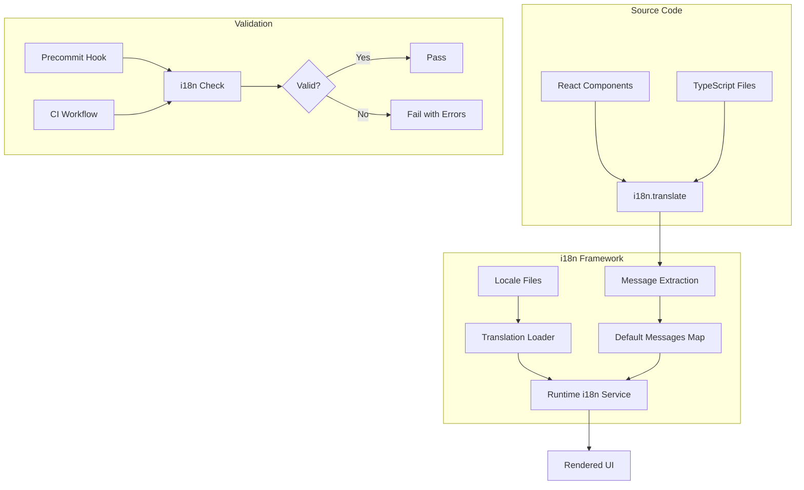
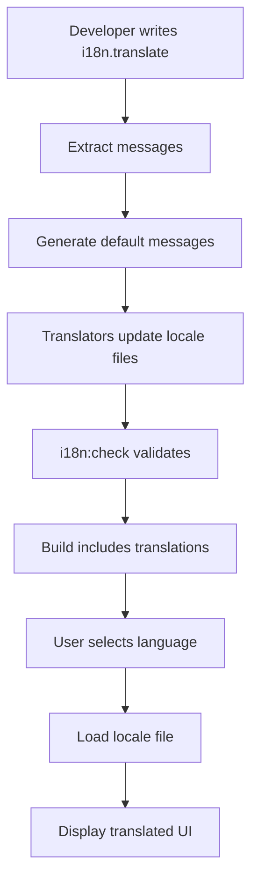

# i18n & Localization

## Summary

OpenSearch Dashboards provides internationalization (i18n) support enabling the UI to be displayed in multiple languages. The i18n framework includes translation file management, ICU message format support, and developer tooling for maintaining translation quality.

## Details

### Architecture



### Data Flow



### Components

| Component | Description |
|-----------|-------------|
| `@osd/i18n` | Core i18n package providing translation functions |
| `i18n.translate()` | Function to mark strings for translation |
| `FormattedMessage` | React component for translated strings |
| `i18n:check` | CLI tool to validate i18n usage |
| `i18n:extract` | CLI tool to extract messages from source |
| Precommit Hook | Git hook for local i18n validation |
| CI Workflow | GitHub Actions job for PR validation |

### Configuration

| Setting | Description | Default |
|---------|-------------|---------|
| `i18n.locale` | Default locale for the application | `en` |
| `--ignore-incompatible` | Ignore mismatched keys in translations | `false` |
| `--ignore-malformed` | Ignore malformed ICU format | `false` |
| `--ignore-missing` | Ignore missing translations | `false` |
| `--ignore-unused` | Ignore unused translations | `false` |
| `--ignore-missing-formats` | Ignore missing formats object | `true` |

### Supported Locales

| Locale Code | Language |
|-------------|----------|
| `en` | English (default) |
| `de-DE` | German (Germany) |
| `es-419` | Spanish (Latin America) |
| `es-ES` | Spanish (Spain) |
| `fr-CA` | French (Canada) |
| `fr-FR` | French (France) |
| `id-ID` | Indonesian |
| `it-IT` | Italian |
| `ja-JP` | Japanese |
| `ko-KR` | Korean |
| `pt-BR` | Portuguese (Brazil) |
| `pt-PT` | Portuguese (Portugal) |
| `tr-TR` | Turkish |
| `zh-CN` | Chinese (Simplified) |
| `zh-TW` | Chinese (Traditional) |

### Usage Example

Using i18n in React components:

```typescript
import { i18n } from '@osd/i18n';
import { FormattedMessage } from '@osd/i18n/react';

// Using i18n.translate
const title = i18n.translate('myPlugin.title', {
  defaultMessage: 'My Plugin Title',
});

// Using FormattedMessage component
<FormattedMessage
  id="myPlugin.description"
  defaultMessage="Welcome to {name}"
  values={{ name: 'OpenSearch' }}
/>
```

Running validation:

```bash
# Validate all i18n usage
yarn i18n:check

# Extract messages for translation
yarn i18n:extract
```

### i18n Key Naming Convention

Keys must be prefixed with the plugin name:

```typescript
// Correct
i18n.translate('workspace.title', { defaultMessage: 'Workspace' });

// Incorrect - will fail validation
i18n.translate('title', { defaultMessage: 'Workspace' });
```

## Limitations

- Translation files must include a `formats` object (can be ignored with `--ignore-missing-formats`)
- Dynamic i18n key construction is not supported and will fail validation
- ICU message format variables must use consistent casing between source and translations
- Translations are preliminary and may need community refinement

## Related PRs

| Version | PR | Description |
|---------|-----|-------------|
| v2.18.0 | [#8411](https://github.com/opensearch-project/OpenSearch-Dashboards/pull/8411) | Add i18n checks to PR workflows |
| v2.18.0 | [#8424](https://github.com/opensearch-project/OpenSearch-Dashboards/pull/8424) | Add preliminary translations for 14 locales |
| v2.18.0 | [#8392](https://github.com/opensearch-project/OpenSearch-Dashboards/pull/8392) | Fix dynamic i18n in core |
| v2.18.0 | [#8393](https://github.com/opensearch-project/OpenSearch-Dashboards/pull/8393) | Fix dynamic i18n in console plugin |
| v2.18.0 | [#8394](https://github.com/opensearch-project/OpenSearch-Dashboards/pull/8394) | Fix dynamic i18n in dataSourceManagement |
| v2.18.0 | [#8516](https://github.com/opensearch-project/OpenSearch-Dashboards/pull/8516) | Backport #8394 to 2.x branch |
| v2.18.0 | [#8396](https://github.com/opensearch-project/OpenSearch-Dashboards/pull/8396) | Fix dynamic i18n in discover plugin |
| v2.18.0 | [#8397](https://github.com/opensearch-project/OpenSearch-Dashboards/pull/8397) | Fix dynamic i18n in queryEnhancements |
| v2.18.0 | [#8398](https://github.com/opensearch-project/OpenSearch-Dashboards/pull/8398) | Fix dynamic i18n in indexPatternManagement |
| v2.18.0 | [#8401](https://github.com/opensearch-project/OpenSearch-Dashboards/pull/8401) | Fix unprefixed identifiers in dashboard |
| v2.18.0 | [#8402](https://github.com/opensearch-project/OpenSearch-Dashboards/pull/8402) | Fix TopNavControlDescriptionData in dataSource |
| v2.18.0 | [#8403](https://github.com/opensearch-project/OpenSearch-Dashboards/pull/8403) | Fix dynamic i18n in home plugin |
| v2.18.0 | [#8404](https://github.com/opensearch-project/OpenSearch-Dashboards/pull/8404) | Fix dynamic i18n in opensearchDashboardsReact |
| v2.18.0 | [#8406](https://github.com/opensearch-project/OpenSearch-Dashboards/pull/8406) | Fix unprefixed identifiers in visTypeVega |
| v2.18.0 | [#8407](https://github.com/opensearch-project/OpenSearch-Dashboards/pull/8407) | Fix duplicate identifiers in visualize |
| v2.18.0 | [#8408](https://github.com/opensearch-project/OpenSearch-Dashboards/pull/8408) | Fix unprefixed identifiers in management |
| v2.18.0 | [#8409](https://github.com/opensearch-project/OpenSearch-Dashboards/pull/8409) | Fix identifiers in visAugmenter |
| v2.18.0 | [#8412](https://github.com/opensearch-project/OpenSearch-Dashboards/pull/8412) | Fix unprefixed i18n identifiers in examples |
| v2.18.0 | [#8423](https://github.com/opensearch-project/OpenSearch-Dashboards/pull/8423) | Add precommit hook to validate i18n |
| v2.18.0 | [#8483](https://github.com/opensearch-project/OpenSearch-Dashboards/pull/8483) | Fix inconsistent i18n key names |
| v2.18.0 | [#8399](https://github.com/opensearch-project/OpenSearch-Dashboards/pull/8399) | Fix dynamic i18n in visBuilder plugin |
| v2.18.0 | [#8674](https://github.com/opensearch-project/OpenSearch-Dashboards/pull/8674) | Fix unsupported language from localStorage |

## References

- [OpenSearch Dashboards Repository](https://github.com/opensearch-project/OpenSearch-Dashboards)

## Change History

- **v2.18.0** (2024-10-22): Added preliminary translations for 14 locales, i18n validation to CI/CD workflows, precommit hook, fixed dynamic i18n usage across 12+ plugins
