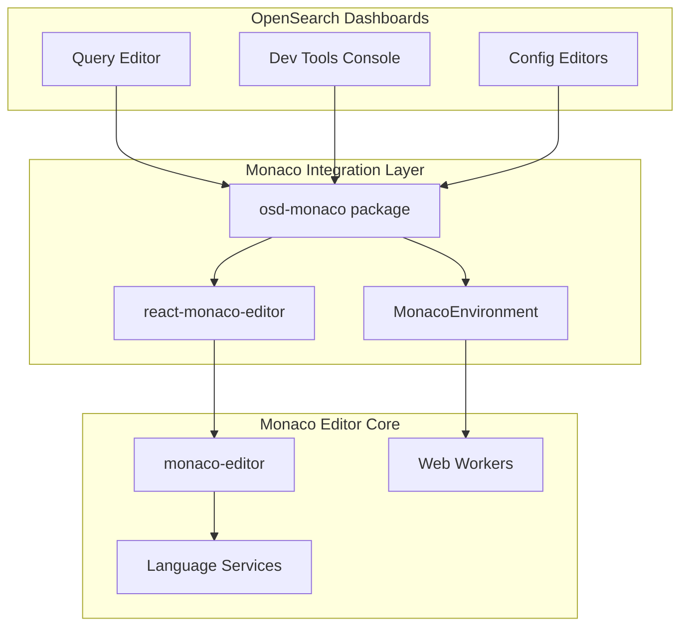
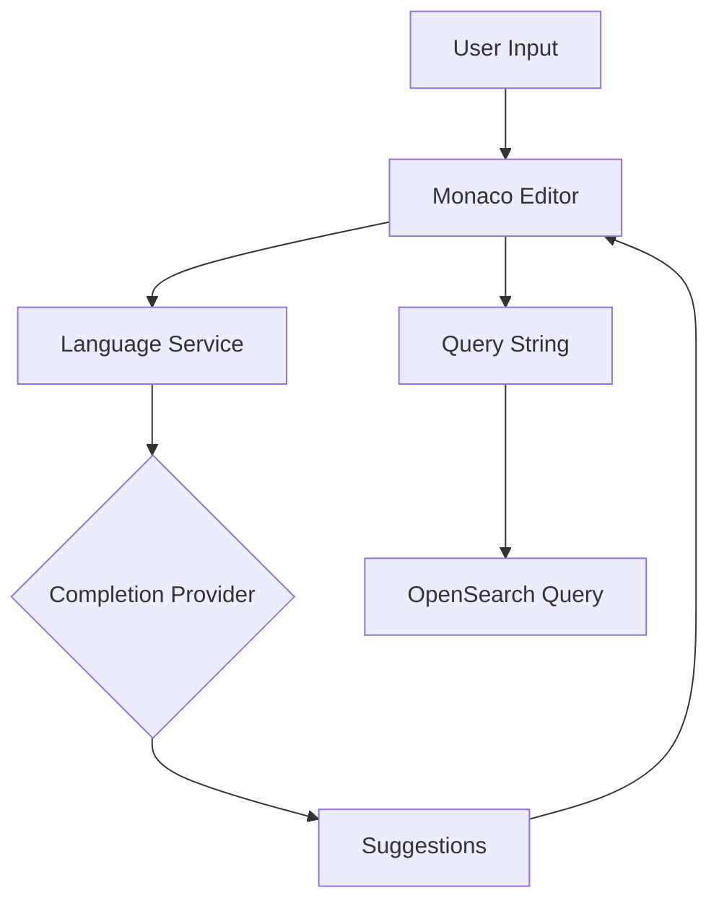

---
tags:
  - dashboards
  - search
  - sql
---

# Monaco Editor

## Summary

Monaco Editor is the code editor component that powers OpenSearch Dashboards' query editors, Dev Tools console, and various configuration interfaces. It provides syntax highlighting, autocomplete, error detection, and a rich editing experience for users writing queries in DQL, SQL, PPL, and JSON formats.

## Details

### Architecture



### Data Flow



### Components

| Component | Description |
|-----------|-------------|
| `@osd/monaco` | OpenSearch Dashboards Monaco wrapper package |
| `react-monaco-editor` | React component wrapper for Monaco |
| `MonacoEnvironment` | Worker configuration and initialization |
| `CodeEditor` | Reusable code editor component |
| `SingleLineInput` | Single-line query input component |
| `DefaultInput` | Multi-line query editor component |

### Configuration

| Setting | Description | Default |
|---------|-------------|---------|
| `minimap.enabled` | Show code minimap | `false` |
| `scrollBeyondLastLine` | Allow scrolling past last line | `false` |
| `suggest.showWords` | Enable word-based suggestions | `false` |
| `suggest.showStatusBar` | Show suggestion status bar | `true` |
| `acceptSuggestionOnEnter` | Accept suggestion on Enter key | `'off'` |
| `wordWrap` | Enable word wrapping | `'on'` |
| `lineNumbers` | Show line numbers | `'on'` |

### Supported Languages

| Language ID | Description | Use Case |
|-------------|-------------|----------|
| `dql` | Dashboards Query Language | Discover search bar |
| `sql` | OpenSearch SQL | Query Workbench |
| `ppl` | Piped Processing Language | Query Workbench |
| `json` | JSON | Dev Tools, configurations |
| `xjson` | Extended JSON | Console requests |

### Usage Example

```tsx
import { CodeEditor } from '@osd/monaco';

const MyEditor = () => {
  const [value, setValue] = useState('');
  
  return (
    <CodeEditor
      languageId="sql"
      value={value}
      onChange={setValue}
      options={{
        minimap: { enabled: false },
        suggest: {
          showWords: false,
          showStatusBar: true,
        },
      }}
      suggestionProvider={{
        triggerCharacters: [' ', '.'],
        provideCompletionItems: async (model, position, context, token) => {
          // Return completion suggestions
          return { suggestions: [] };
        },
      }}
    />
  );
};
```

### Worker Configuration

```typescript
// MonacoEnvironment setup
window.MonacoEnvironment = {
  getWorker: (workerId: string, label: string) => {
    const workerSrc = getWorker(label);
    if (workerSrc) {
      const blob = new Blob([workerSrc], { type: 'application/javascript' });
      return new Worker(URL.createObjectURL(blob));
    }
    // Fallback worker
    return new Worker(URL.createObjectURL(new Blob([''], { type: 'application/javascript' })));
  },
};
```

## Limitations

- Monaco Editor adds significant bundle size to the application
- Web Workers require proper CORS configuration in some deployment scenarios
- Custom language support requires implementing full language service
- Some advanced Monaco features may not be exposed through the OSD wrapper

## Change History

- **v3.0.0** (2025-05-06): Major upgrade from 0.17.0 to 0.52.0
  - Switched from image sprite icons to Codicon font system
  - Updated API from `getModeId()` to `getLanguageId()`
  - Redesigned worker architecture
  - Added built-in suggestion status bar
  - Updated completion provider signatures with context and token parameters
  - Added babel plugins for modern JavaScript syntax support

## References

### Documentation
- [Monaco Editor Documentation](https://microsoft.github.io/monaco-editor/): Official Monaco documentation
- [Monaco Editor GitHub](https://github.com/microsoft/monaco-editor): Source repository

### Pull Requests
| Version | PR | Description | Related Issue |
|---------|-----|-------------|---------------|
| v3.0.0 | [#9618](https://github.com/opensearch-project/OpenSearch-Dashboards/pull/9618) | Bump monaco-editor from 0.30.1 to 0.52.0 | [#9573](https://github.com/opensearch-project/OpenSearch-Dashboards/issues/9573) |
| v3.0.0 | [#9497](https://github.com/opensearch-project/OpenSearch-Dashboards/pull/9497) | Bump monaco-editor from 0.17.0 to 0.30.1 |   |

### Issues (Design / RFC)
- [Issue #9573](https://github.com/opensearch-project/OpenSearch-Dashboards/issues/9573): Monaco upgrade implementation notes
