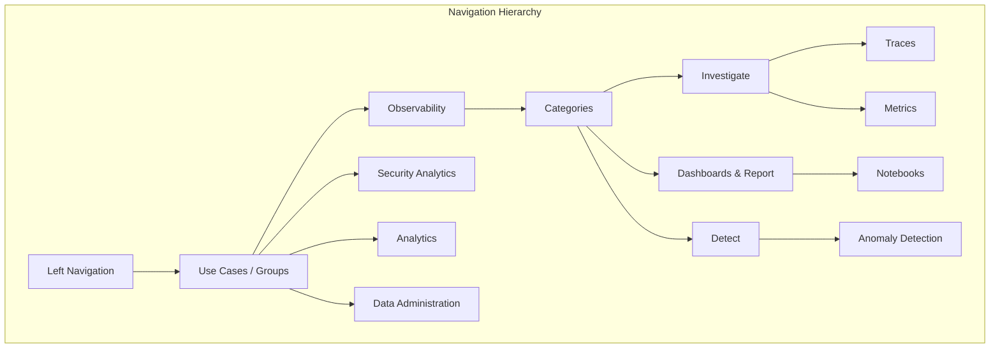

---
tags:
  - opensearch-dashboards
---
# Navigation & NavGroups

## Summary

NavGroups is a navigation architecture in OpenSearch Dashboards that provides hierarchical grouping of applications into use cases (groups) and categories. It addresses the challenge of managing an increasingly crowded left navigation menu as the number of plugins grows.

## Details

### Architecture



### Components

| Component | Description |
|-----------|-------------|
| NavGroup | Top-level grouping representing a use case (e.g., Observability, Security Analytics) |
| NavCategory | Second-level grouping within a NavGroup (e.g., Investigate, Dashboards & Report) |
| NavLink | Individual application link registered to one or more NavGroups |
| Chrome Service | Core service providing `navGroup.addNavLinksToGroup()` API |

### Configuration

Plugins register their applications to NavGroups during setup:

```typescript
// In plugin setup
public setup(core: CoreSetup) {
    // Standard application registration
    core.application.register({
        id: 'myPlugin',
        title: 'My Plugin',
        category: DEFAULT_APP_CATEGORIES.opensearchDashboards,
    });

    // Register to NavGroups
    core.chrome.navGroup.addNavLinksToGroup(
        DEFAULT_USE_CASES.observability,
        [{
            id: 'myPlugin',
            order: 100,
            category: DEFAULT_APP_CATEGORIES.investigate
        }]
    );

    // Can register to multiple groups
    core.chrome.navGroup.addNavLinksToGroup(
        DEFAULT_USE_CASES.securityAnalytics,
        [{
            id: 'myPlugin',
            order: 200,
            category: DEFAULT_APP_CATEGORIES.dashboardAndReport
        }]
    );
}
```

### Default Use Cases

| Use Case | Description |
|----------|-------------|
| `observability` | Log analysis, metrics, traces, and application monitoring |
| `securityAnalytics` | Security event detection, alerts, and threat intelligence |
| `analytics` | Data visualization, dashboards, and reporting |
| `dataAdministration` | Index management, security configuration, and system settings |

### Default Categories

| Category | Typical Use |
|----------|-------------|
| `investigate` | Tools for exploring and analyzing data (Traces, Metrics) |
| `dashboardAndReport` | Visualization and reporting tools (Notebooks, Dashboards) |
| `detect` | Alerting and anomaly detection tools |
| `machineLearning` | ML models and AI-related features |
| `dataManagement` | Index and data lifecycle management |

## Limitations

- Applications can appear in multiple NavGroups, which may cause initial user confusion
- Feature flag must be enabled to use the new navigation
- Legacy deep links continue to work but may not reflect the new navigation structure
- Custom plugins must be updated to register with NavGroups for proper placement

## Change History

- **v2.16.0** (2024-08-06): Initial implementation of NavGroups across all major dashboard plugins

## References

### Documentation

- OpenSearch Dashboards quickstart guide

### Pull Requests

| Version | PR | Description |
|---------|-----|-------------|
| v2.16.0 | [dashboards-observability#1926](https://github.com/opensearch-project/dashboards-observability/pull/1926) | Register all plugins to NavGroups |
| v2.16.0 | [dashboards-observability#1950](https://github.com/opensearch-project/dashboards-observability/pull/1950) | Remove integrations from new NavGroups |
| v2.16.0 | [alerting-dashboards-plugin#1007](https://github.com/opensearch-project/alerting-dashboards-plugin/pull/1007) | Side nav changes for alerting |
| v2.16.0 | [anomaly-detection-dashboards-plugin#810](https://github.com/opensearch-project/anomaly-detection-dashboards-plugin/pull/810) | AD side navigation redesign |
| v2.16.0 | [ml-commons-dashboards#343](https://github.com/opensearch-project/ml-commons-dashboards/pull/343) | Update category to Machine learning |
| v2.16.0 | [dashboards-notifications#222](https://github.com/opensearch-project/dashboards-notifications/pull/222) | Side navigation changes for notifications |
| v2.16.0 | [index-management-dashboards-plugin#1085](https://github.com/opensearch-project/index-management-dashboards-plugin/pull/1085) | New Navigation UX change |
| v2.16.0 | [security-dashboards-plugin#2022](https://github.com/opensearch-project/security-dashboards-plugin/pull/2022) | Conform to Navigation changes from OSD core |

### Related Issues

| Issue | Description |
|-------|-------------|
| [OpenSearch-Dashboards#7029](https://github.com/opensearch-project/OpenSearch-Dashboards/issues/7029) | RFC: Introduce `group` in chrome service to group applications and categories |
