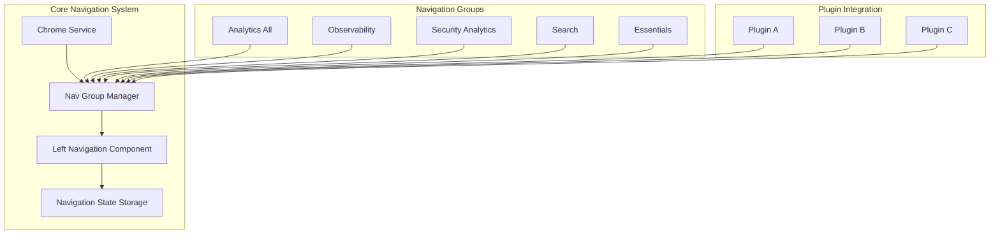
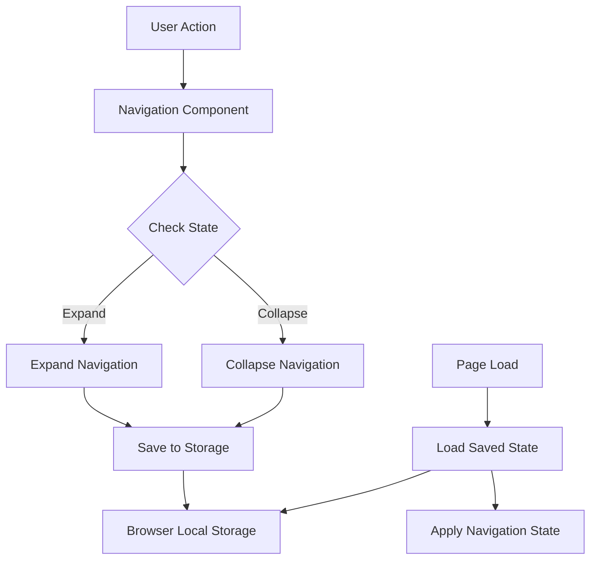

---
tags:
  - dashboards
  - observability
  - search
  - security
---

# Navigation

## Summary

OpenSearch Dashboards provides a configurable left navigation system that allows users to access various applications and features. The navigation supports multiple use cases (Analytics, Observability, Security Analytics, Search, Essentials) with customizable menu structures. Key features include collapsible navigation, persistent state, responsive design for different screen sizes, and docking/undocking capabilities.

## Details

### Architecture



### Data Flow



### Components

| Component | Description |
|-----------|-------------|
| Chrome Service | Core service managing browser chrome including navigation |
| Nav Group Manager | Manages navigation groups and their associated links |
| Left Navigation Component | UI component rendering the collapsible left navigation |
| Navigation State Storage | Persists navigation expand/collapse state |
| Responsive Handler | Manages navigation behavior across screen sizes |

### Configuration

| Setting | Description | Default |
|---------|-------------|---------|
| `navGroupEnabled` | Enable the new navigation group system | `false` |
| `showInAllNavGroup` | Show link in Analytics(all) nav group | `false` |
| Navigation dock state | Docked or undocked navigation | Docked |

### Usage Example

#### Docking/Undocking Navigation

Users can dock or undock the navigation menu:
1. Select the menu icon on the upper-left toolbar
2. Select "Dock navigation" or "Undock navigation" at the bottom of the menu

#### Plugin Navigation Registration

```typescript
// Register navigation links for a plugin
public setup(core: CoreSetup) {
  core.chrome.navGroup.addNavLinksToGroup(
    DEFAULT_NAV_GROUPS.all,
    [{
      id: 'myPlugin',
      title: 'My Plugin',
      category: AppCategory.detect,
      showInAllNavGroup: true,
      order: 100
    }]
  );
}
```

#### Responsive Navigation

The navigation automatically adapts to screen size:
- **Large screens**: Full navigation with expand/collapse
- **Small screens**: Collapsed by default, overlay when expanded

## Limitations

- Navigation state is stored in browser local storage (not synced across devices)
- Custom navigation configurations require plugin code changes
- Some legacy plugins may not fully support the new navigation system

## Change History

- **v3.4.0** (2025-10-08): Fixed disabled prop propagation for navigation links - `isDisabled` state now correctly passed to `EuiSideNavItem` components
- **v2.18.0** (2024-10-22): Flattened navigation in Analytics(all) use case, persistent expand/collapse state, small screen compatibility, border style updates, sample data menu restored

## Related Features
- [OpenSearch Core](../opensearch/actionplugin-rest-handler-wrapper.md)

## References

### Documentation
- [OpenSearch Dashboards Quickstart Guide](https://docs.opensearch.org/2.18/dashboards/quickstart/): Official documentation on navigation

### Pull Requests
| Version | PR | Description | Related Issue |
|---------|-----|-------------|---------------|
| v3.4.0 | [#10678](https://github.com/opensearch-project/OpenSearch-Dashboards/pull/10678) | Fix disabled prop propagation for EuiSideNavItem |   |
| v2.18.0 | [#8332](https://github.com/opensearch-project/OpenSearch-Dashboards/pull/8332) | Flatten left nav in Analytics(all) use case | [#1234](https://github.com/opensearch-project/OpenSearch-Dashboards/issues/1234) |
| v2.18.0 | [#8286](https://github.com/opensearch-project/OpenSearch-Dashboards/pull/8286) | Remember state when expand/collapse left nav | [#1234](https://github.com/opensearch-project/OpenSearch-Dashboards/issues/1234) |
| v2.18.0 | [#8489](https://github.com/opensearch-project/OpenSearch-Dashboards/pull/8489) | Update border style when new left nav expanded | [#1234](https://github.com/opensearch-project/OpenSearch-Dashboards/issues/1234) |
| v2.18.0 | [#8076](https://github.com/opensearch-project/OpenSearch-Dashboards/pull/8076) | Add sample data menu back | [#1234](https://github.com/opensearch-project/OpenSearch-Dashboards/issues/1234) |
| v2.18.0 | [#7962](https://github.com/opensearch-project/OpenSearch-Dashboards/pull/7962) | Make left nav compatible with small screen | [#1234](https://github.com/opensearch-project/OpenSearch-Dashboards/issues/1234) |
