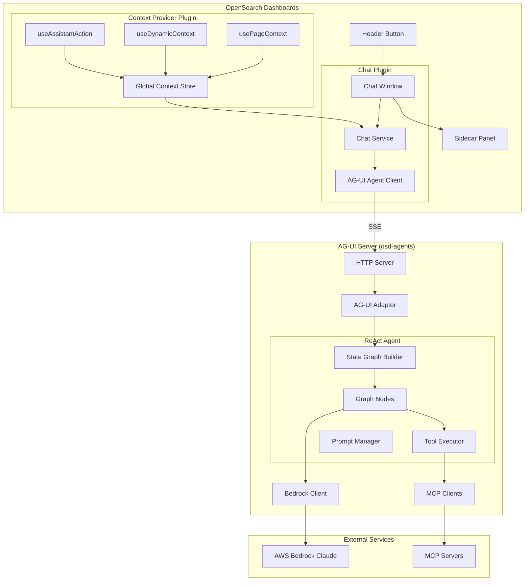
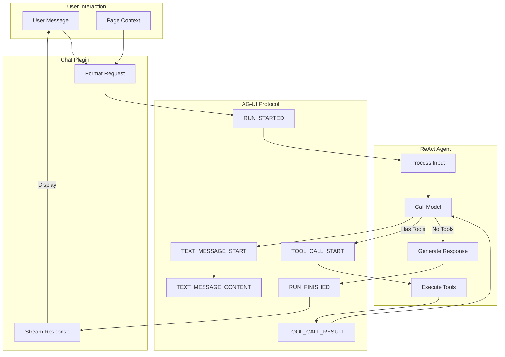

---
tags:
  - dashboards
  - ml
  - search
---

# OpenSearch Dashboards AI Chat

## Summary

OpenSearch Dashboards AI Chat is an experimental AI-powered conversational interface that enables users to interact with their data using natural language. The feature consists of three main components: a Chat plugin providing the UI, a Context Provider plugin for automatic context capture, and an osd-agents package implementing an AG-UI compliant ReAct agent with AWS Bedrock integration.

The AI assistant framework supports open standards like AG-UI protocol and Model Context Protocol (MCP), allowing external plugins to leverage intelligent assistance with customizable tools. Users can query data, execute actions, and receive context-aware responses without learning complex query syntax.

## Details

### Architecture



### Data Flow



### Components

| Component | Location | Description |
|-----------|----------|-------------|
| Chat Plugin | `src/plugins/chat` | Main chat interface with streaming support |
| Context Provider | `src/plugins/context_provider` | React hooks for context capture |
| osd-agents | `packages/osd-agents` | AG-UI compliant ReAct agent server |
| AG-UI Adapter | `src/ag_ui/base_ag_ui_adapter.ts` | Protocol translation layer |
| ReAct Agent | `src/agents/langgraph/react_agent.ts` | LangGraph-based reasoning agent |
| Bedrock Client | `src/agents/langgraph/bedrock_client.ts` | AWS Bedrock API integration |
| MCP Clients | `src/mcp/` | Local and HTTP MCP server clients |
| SuggestedActionsService | `src/plugins/chat` | Registry for suggestion providers (v3.4.0) |
| ChatSuggestions | `src/plugins/chat` | UI for contextual suggestions (v3.4.0) |
| LogActionRegistry | `src/plugins/explore` | Registry for log entry actions (v3.4.0) |
| LogActionMenu | `src/plugins/explore` | Dropdown for log actions (v3.4.0) |

### Configuration

| Setting | Description | Default |
|---------|-------------|---------|
| `chat.enabled` | Enable the Chat plugin in Dashboards | `false` |
| `AG_UI_PORT` | Port for the AG-UI HTTP server | `3000` |
| `AG_UI_HOST` | Host for the AG-UI server | `localhost` |
| `AG_UI_CORS_ORIGINS` | Allowed CORS origins | `http://localhost:5601` |
| `AWS_REGION` | AWS region for Bedrock | `us-west-2` |
| `AWS_PROFILE` | AWS profile for authentication | `default` |
| `SYSTEM_PROMPT` | Path to custom system prompt file | - |

### Developer Hooks

#### usePageContext
Auto-captures URL state with zero configuration:
```typescript
import { usePageContext } from '@osd/context-provider';

export function MyApp() {
  usePageContext(); // Automatically captures URL parameters
  return <div>Your App</div>;
}
```

#### useDynamicContext
Captures React state for AI awareness:
```typescript
import { useDynamicContext } from '@osd/context-provider';

export function DataTable() {
  const [selectedRows, setSelectedRows] = useState([]);
  
  useDynamicContext({
    description: "Currently selected table rows",
    value: selectedRows,
    label: "@selected-rows" // Enables @mention in chat
  });
  
  return <table>...</table>;
}
```

#### useAssistantAction
Registers tools the AI can execute:
```typescript
import { useAssistantAction } from '@osd/context-provider';

useAssistantAction({
  name: 'execute_ppl_query',
  description: 'Execute a PPL query',
  parameters: {
    type: 'object',
    properties: {
      query: { type: 'string', description: 'The PPL query' }
    },
    required: ['query']
  },
  handler: async (args) => {
    const result = await executeQuery(args.query);
    return { success: true, result };
  },
  render: ({ status, args, result }) => (
    <QueryResultPanel status={status} query={args?.query} result={result} />
  )
});
```

### AG-UI Event Types

| Event | Description |
|-------|-------------|
| `RUN_STARTED` | Agent execution began |
| `TEXT_MESSAGE_START` | New text message started |
| `TEXT_MESSAGE_CONTENT` | Streaming text chunk |
| `TEXT_MESSAGE_END` | Text message completed |
| `TOOL_CALL_START` | Tool execution started |
| `TOOL_CALL_ARGS` | Tool arguments streamed |
| `TOOL_CALL_END` | Tool call definition complete |
| `TOOL_CALL_RESULT` | Tool execution result |
| `RUN_FINISHED` | Agent completed successfully |
| `RUN_ERROR` | Error during execution |

### Usage Example

```yaml
# opensearch_dashboards.yml
chat.enabled: true
```

```bash
# Start the AG-UI agent server
cd packages/osd-agents
npm install
export AWS_REGION=us-west-2
export AWS_PROFILE=default
npm run start:ag-ui
```

```json
// configuration/mcp_config.json
{
  "mcpServers": {
    "opensearch-mcp-server": {
      "command": "uvx",
      "args": ["opensearch-mcp-server-py", "--mode", "multi"],
      "disabled": false
    }
  }
}
```

## Limitations

- **Experimental**: Not production-ready, API may change
- **AWS Bedrock Required**: Requires AWS credentials with Claude model access
- **Single-threaded**: One conversation at a time per agent instance
- **MCP Configuration**: Servers must be pre-configured before agent starts
- **Limited Testing**: Comprehensive test coverage is ongoing
- **Session-based Persistence**: Conversation history persists within browser session only (v3.4.0+)

## Change History

- **v3.4.0** (2025-11): Global search integration, suggestion system, state persistence, session storage, Explore integration, UI improvements
- **v3.3.0** (2025-10): Initial implementation with Chat plugin, Context Provider plugin, and osd-agents ReAct agent

## Related Features
- [OpenSearch Core](../opensearch/opensearch-actionplugin-rest-handler-wrapper.md)

## References

### Documentation
- [OpenSearch Assistant Documentation](https://docs.opensearch.org/3.4/dashboards/dashboards-assistant/index/)
- [AG-UI Protocol Documentation](https://docs.ag-ui.com/introduction)
- [LangGraph Documentation](https://langchain-ai.github.io/langgraph/)
- [AWS Bedrock Documentation](https://docs.aws.amazon.com/bedrock/)
- [Model Context Protocol](https://modelcontextprotocol.io/)

### Pull Requests
| Version | PR | Description | Related Issue |
|---------|-----|-------------|---------------|
| v3.4.0 | [#10824](https://github.com/opensearch-project/OpenSearch-Dashboards/pull/10824) | Register chat as the global search command |   |
| v3.4.0 | [#10834](https://github.com/opensearch-project/OpenSearch-Dashboards/pull/10834) | Add AI related actions in Explore | [#1234](https://github.com/opensearch-project/OpenSearch-Dashboards/issues/1234) |
| v3.4.0 | [#10863](https://github.com/opensearch-project/OpenSearch-Dashboards/pull/10863) | Add suggestion system for chat |   |
| v3.4.0 | [#10895](https://github.com/opensearch-project/OpenSearch-Dashboards/pull/10895) | Persist chatbot state in localStorage |   |
| v3.4.0 | [#10916](https://github.com/opensearch-project/OpenSearch-Dashboards/pull/10916) | Add session storage persistence for chat history |   |
| v3.4.0 | [#10924](https://github.com/opensearch-project/OpenSearch-Dashboards/pull/10924) | Add close button for chatbot header |   |
| v3.4.0 | [#10934](https://github.com/opensearch-project/OpenSearch-Dashboards/pull/10934) | Add getThreadId$ observable in chat service |   |
| v3.3.0 | [#10600](https://github.com/opensearch-project/OpenSearch-Dashboards/pull/10600) | Add experimental AI Chat and Context Provider plugins | [#10571](https://github.com/opensearch-project/OpenSearch-Dashboards/issues/10571) |
| v3.3.0 | [#10612](https://github.com/opensearch-project/OpenSearch-Dashboards/pull/10612) | AG-UI compliant LangGraph ReAct agent implementation |   |
| v3.3.0 | [#10624](https://github.com/opensearch-project/OpenSearch-Dashboards/pull/10624) | Mark context provider and chat as experimental |   |

### Issues (Design / RFC)
- [RFC #10585](https://github.com/opensearch-project/OpenSearch-Dashboards/issues/10585): AI Assistant Framework for OpenSearch Dashboards
- [RFC #10571](https://github.com/opensearch-project/OpenSearch-Dashboards/issues/10571): Context Design and Page Tools Architecture
