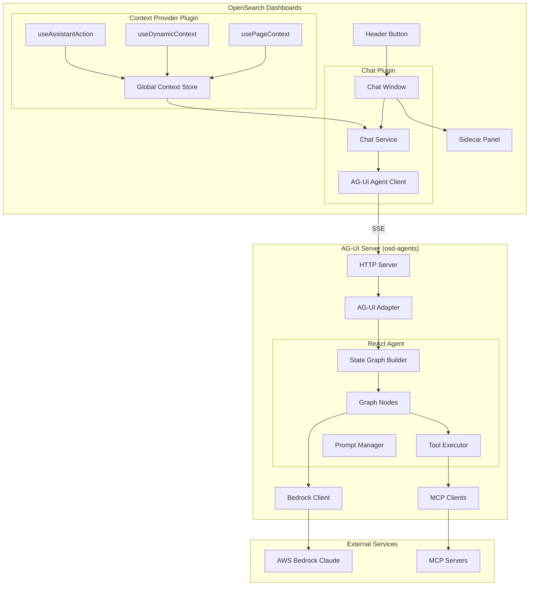
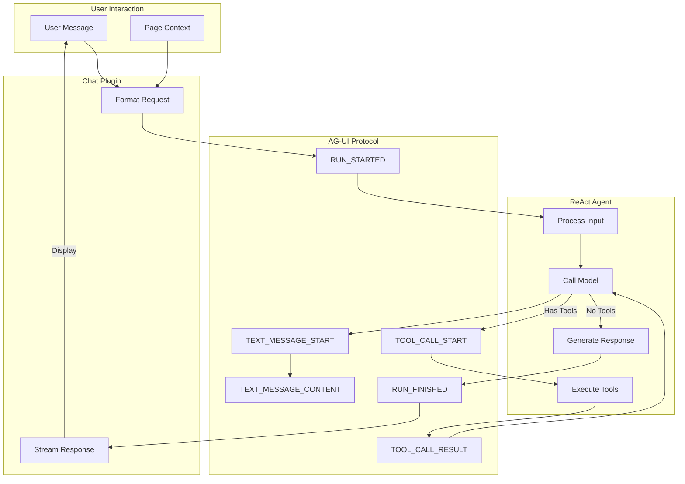

---
tags:
  - opensearch-dashboards
---
# OpenSearch Dashboards AI Chat

## Summary

OpenSearch Dashboards AI Chat is an experimental AI-powered conversational interface that enables users to interact with their data using natural language. The feature consists of three main components: a Chat plugin providing the UI, a Context Provider plugin for automatic context capture, and an osd-agents package implementing an AG-UI compliant ReAct agent with AWS Bedrock integration.

The AI assistant framework supports open standards like AG-UI protocol and Model Context Protocol (MCP), allowing external plugins to leverage intelligent assistance with customizable tools. Users can query data, execute actions, and receive context-aware responses without learning complex query syntax.

## Details

### Architecture


```mermaid
graph TB
    subgraph "OpenSearch Dashboards"
        subgraph "Chat Plugin"
            ChatUI[Chat Window]
            ChatService[Chat Service]
            AgUIAgent[AG-UI Agent Client]
        end
        
        subgraph "Context Provider Plugin"
            PageContext[usePageContext]
            DynamicContext[useDynamicContext]
            AssistantAction[useAssistantAction]
            GlobalStore[Global Context Store]
        end
        
        Header[Header Button]
        Sidecar[Sidecar Panel]
    end
    
    subgraph "AG-UI Server (osd-agents)"
        HTTPServer[HTTP Server]
        AGUIAdapter[AG-UI Adapter]
        
        subgraph "ReAct Agent"
            GraphBuilder[State Graph Builder]
            GraphNodes[Graph Nodes]
            ToolExecutor[Tool Executor]
            PromptManager[Prompt Manager]
        end
        
        BedrockClient[Bedrock Client]
        MCPClients[MCP Clients]
    end
    
    subgraph "External Services"
        Bedrock[AWS Bedrock Claude]
        MCPServers[MCP Servers]
    end
    
    Header --> ChatUI
    ChatUI --> Sidecar
    ChatUI --> ChatService
    ChatService --> AgUIAgent
    
    PageContext --> GlobalStore
    DynamicContext --> GlobalStore
    AssistantAction --> GlobalStore
    GlobalStore --> ChatService
    
    AgUIAgent -->|SSE| HTTPServer
    HTTPServer --> AGUIAdapter
    AGUIAdapter --> GraphBuilder
    GraphBuilder --> GraphNodes
    GraphNodes --> ToolExecutor
    GraphNodes --> BedrockClient
    ToolExecutor --> MCPClients
    
    BedrockClient --> Bedrock
    MCPClients --> MCPServers
```

### Data Flow


```mermaid
flowchart TB
    subgraph "User Interaction"
        Input[User Message]
        Context[Page Context]
    end
    
    subgraph "Chat Plugin"
        Format[Format Request]
        Stream[Stream Response]
    end
    
    subgraph "AG-UI Protocol"
        RunStart[RUN_STARTED]
        TextStart[TEXT_MESSAGE_START]
        TextContent[TEXT_MESSAGE_CONTENT]
        ToolStart[TOOL_CALL_START]
        ToolResult[TOOL_CALL_RESULT]
        RunEnd[RUN_FINISHED]
    end
    
    subgraph "ReAct Agent"
        Process[Process Input]
        CallModel[Call Model]
        ExecuteTools[Execute Tools]
        Generate[Generate Response]
    end
    
    Input --> Format
    Context --> Format
    Format --> RunStart
    RunStart --> Process
    Process --> CallModel
    CallModel --> TextStart
    TextStart --> TextContent
    CallModel -->|Has Tools| ToolStart
    ToolStart --> ExecuteTools
    ExecuteTools --> ToolResult
    ToolResult --> CallModel
    CallModel -->|No Tools| Generate
    Generate --> RunEnd
    RunEnd --> Stream
    Stream -->|Display| Input
```

### Components

| Component | Location | Description |
|-----------|----------|-------------|
| Chat Plugin | `src/plugins/chat` | Main chat interface with streaming support |
| Context Provider | `src/plugins/context_provider` | React hooks for context capture |
| osd-agents | `packages/osd-agents` | AG-UI compliant ReAct agent server |
| AG-UI Adapter | `src/ag_ui/base_ag_ui_adapter.ts` | Protocol translation layer |
| ReAct Agent | `src/agents/langgraph/react_agent.ts` | LangGraph-based reasoning agent |
| Bedrock Client | `src/agents/langgraph/bedrock_client.ts` | AWS Bedrock API integration |
| MCP Clients | `src/mcp/` | Local and HTTP MCP server clients |
| SuggestedActionsService | `src/plugins/chat` | Registry for suggestion providers (v3.4.0) |
| ChatSuggestions | `src/plugins/chat` | UI for contextual suggestions (v3.4.0) |
| LogActionRegistry | `src/plugins/explore` | Registry for log entry actions (v3.4.0) |
| LogActionMenu | `src/plugins/explore` | Dropdown for log actions (v3.4.0) |
| SlashCommandRegistry | `src/plugins/chat` | Extensible slash command registry with autocomplete (v3.5.0) |
| ConfirmationService | `src/plugins/chat` | User confirmation workflow for tool executions (v3.5.0) |
| AskAIAction | `src/plugins/explore` | "Ask AI" context menu for visualizations (v3.5.0) |
| ChatMountService | `src/plugins/chat` | Centralized sidecar lifecycle management with chrome visibility integration (v3.6.0) |
| ChatMount | `src/plugins/chat` | Renders chat window content inside the sidecar (v3.6.0) |
| AgenticMemoryProvider | `src/plugins/chat` | Conversation memory via ML Commons Agent Memory APIs (v3.6.0) |
| ConversationHistoryList | `src/plugins/chat` | Pluggable conversation history list panel (v3.6.0) |
| usePageContainerCapture | `src/plugins/chat` | React hook for dashboard screenshot capture using html2canvas-pro (v3.6.0) |
| TimeRangeTool | `src/plugins/chat` | Frontend tool for natural language time range updates (v3.6.0) |
| AskAIEmbeddableAction | `src/plugins/visualizations` | "Ask AI" action for legacy visualizations (v3.6.0) |

### Configuration

| Setting | Description | Default |
|---------|-------------|---------|
| `chat.enabled` | Enable the Chat plugin in Dashboards | `false` |
| `AG_UI_PORT` | Port for the AG-UI HTTP server | `3000` |
| `AG_UI_HOST` | Host for the AG-UI server | `localhost` |
| `AG_UI_CORS_ORIGINS` | Allowed CORS origins | `http://localhost:5601` |
| `AWS_REGION` | AWS region for Bedrock | `us-west-2` |
| `AWS_PROFILE` | AWS profile for authentication | `default` |
| `SYSTEM_PROMPT` | Path to custom system prompt file | - |
| `chat.forwardCredentials` | Forward OBO bearer token to AG-UI agent server | `false` |
| `chat.agUiUrl` | URL for the AG-UI agent server runs endpoint | - |

### Developer Hooks

#### usePageContext
Auto-captures URL state with zero configuration:
```typescript
import { usePageContext } from '@osd/context-provider';

export function MyApp() {
  usePageContext(); // Automatically captures URL parameters
  return <div>Your App</div>;
}
```

#### useDynamicContext
Captures React state for AI awareness:
```typescript
import { useDynamicContext } from '@osd/context-provider';

export function DataTable() {
  const [selectedRows, setSelectedRows] = useState([]);
  
  useDynamicContext({
    description: "Currently selected table rows",
    value: selectedRows,
    label: "@selected-rows" // Enables @mention in chat
  });
  
  return <table>...</table>;
}
```

#### useAssistantAction
Registers tools the AI can execute:
```typescript
import { useAssistantAction } from '@osd/context-provider';

useAssistantAction({
  name: 'execute_ppl_query',
  description: 'Execute a PPL query',
  parameters: {
    type: 'object',
    properties: {
      query: { type: 'string', description: 'The PPL query' }
    },
    required: ['query']
  },
  handler: async (args) => {
    const result = await executeQuery(args.query);
    return { success: true, result };
  },
  render: ({ status, args, result }) => (
    <QueryResultPanel status={status} query={args?.query} result={result} />
  )
});
```

### AG-UI Event Types

| Event | Description |
|-------|-------------|
| `RUN_STARTED` | Agent execution began |
| `TEXT_MESSAGE_START` | New text message started |
| `TEXT_MESSAGE_CONTENT` | Streaming text chunk |
| `TEXT_MESSAGE_END` | Text message completed |
| `TOOL_CALL_START` | Tool execution started |
| `TOOL_CALL_ARGS` | Tool arguments streamed |
| `TOOL_CALL_END` | Tool call definition complete |
| `TOOL_CALL_RESULT` | Tool execution result |
| `RUN_FINISHED` | Agent completed successfully |
| `RUN_ERROR` | Error during execution |

### Usage Example

```yaml
# opensearch_dashboards.yml
chat.enabled: true
```

```bash
# Start the AG-UI agent server
cd packages/osd-agents
npm install
export AWS_REGION=us-west-2
export AWS_PROFILE=default
npm run start:ag-ui
```

```json
// configuration/mcp_config.json
{
  "mcpServers": {
    "opensearch-mcp-server": {
      "command": "uvx",
      "args": ["opensearch-mcp-server-py", "--mode", "multi"],
      "disabled": false
    }
  }
}
```

## Limitations

- **Experimental**: Not production-ready, API may change
- **AWS Bedrock Required**: Requires AWS credentials with Claude model access (or external AG-UI server via `chat.agUiUrl`)
- **Single-threaded**: One conversation at a time per agent instance
- **MCP Configuration**: Servers must be pre-configured before agent starts
- **Limited Testing**: Comprehensive test coverage is ongoing
- **Agentic Memory**: Conversation deletion not supported when using agentic memory provider (agent manages its own memory lifecycle)
- **Screenshot Capture**: Screenshots scaled to 8k pixel limit; capture option hidden on non-dashboard pages

## Change History

- **v3.6.0** (2026-04): Conversation history with agentic memory provider (ML Commons Agent Memory APIs), dashboard screenshot capture (html2canvas-pro with 8k pixel scaling), "Ask AI" for legacy visualizations, time range tool for natural language time updates, default page context for all pages, chat interaction metrics, OBO bearer token integration for AG-UI authorization, single window architecture refactor with ChatMountService, grouped tool calls display, tool call parameter display, extensive bug fixes (conversation restore, streaming, thread management, input race conditions, error handling)
- **v3.5.0** (2026-02): Slash command system with autocomplete/confirmations, "Thinking..." loading indicator, "Ask AI" context menu for Explore visualizations, plugin action registration API, enhanced PPL query tool, gradient chat button, multiple bug fixes (stale error cleanup, page context, mlClient, tool call timeline)
- **v3.4.0** (2025-11): Global search integration, suggestion system, state persistence, session storage, Explore integration, UI improvements
- **v3.3.0** (2025-10): Initial implementation with Chat plugin, Context Provider plugin, and osd-agents ReAct agent
- **v2.16.0** (2024-06): Fixed Sidecar z-index to render above mask overlays (z-index 1000 → 1001)


## References

### Documentation
- [OpenSearch Assistant Documentation](https://docs.opensearch.org/3.4/dashboards/dashboards-assistant/index/)
- [AG-UI Protocol Documentation](https://docs.ag-ui.com/introduction)
- [LangGraph Documentation](https://langchain-ai.github.io/langgraph/)
- [AWS Bedrock Documentation](https://docs.aws.amazon.com/bedrock/)
- [Model Context Protocol](https://modelcontextprotocol.io/)

### Pull Requests
| Version | PR | Description | Related Issue |
|---------|-----|-------------|---------------|
| v3.6.0 | [#11348](https://github.com/opensearch-project/OpenSearch-Dashboards/pull/11348) | Add conversation history list support | |
| v3.6.0 | [#11380](https://github.com/opensearch-project/OpenSearch-Dashboards/pull/11380) | Add agentic memory provider | |
| v3.6.0 | [#11338](https://github.com/opensearch-project/OpenSearch-Dashboards/pull/11338) | Add "Ask AI" for legacy visualizations | |
| v3.6.0 | [#11287](https://github.com/opensearch-project/OpenSearch-Dashboards/pull/11287) | Add screenshot capture for dashboard pages | |
| v3.6.0 | [#11575](https://github.com/opensearch-project/OpenSearch-Dashboards/pull/11575) | Add metrics tracking for chat interactions | |
| v3.6.0 | [#11332](https://github.com/opensearch-project/OpenSearch-Dashboards/pull/11332) | Group consecutive completed tool calls | |
| v3.6.0 | [#11331](https://github.com/opensearch-project/OpenSearch-Dashboards/pull/11331) | Add time range tool to chatbot | |
| v3.6.0 | [#11502](https://github.com/opensearch-project/OpenSearch-Dashboards/pull/11502) | Add default page context | |
| v3.6.0 | [#11329](https://github.com/opensearch-project/OpenSearch-Dashboards/pull/11329) | Use html2canvas-pro for CSP nonce support | |
| v3.6.0 | [#11483](https://github.com/opensearch-project/OpenSearch-Dashboards/pull/11483) | Refactor to single window architecture | |
| v3.6.0 | [#11524](https://github.com/opensearch-project/OpenSearch-Dashboards/pull/11524) | Integrate OBO bearer token with AG-UI | |
| v3.6.0 | [#11569](https://github.com/opensearch-project/OpenSearch-Dashboards/pull/11569) | Support ag-ui error function invocation | |
| v3.6.0 | [#11585](https://github.com/opensearch-project/OpenSearch-Dashboards/pull/11585) | Scale screenshots to 8k pixel limit | |
| v3.6.0 | [#11576](https://github.com/opensearch-project/OpenSearch-Dashboards/pull/11576) | Fix conversation restore with unfinished tool calls | |
| v3.6.0 | [#11459](https://github.com/opensearch-project/OpenSearch-Dashboards/pull/11459) | Fix "Thinking..." message disappearing | |
| v3.6.0 | [#11510](https://github.com/opensearch-project/OpenSearch-Dashboards/pull/11510) | Disable input during tool result sending | |
| v3.6.0 | [#11529](https://github.com/opensearch-project/OpenSearch-Dashboards/pull/11529) | Pass data source ID to agentic memory provider | |
| v3.6.0 | [#11526](https://github.com/opensearch-project/OpenSearch-Dashboards/pull/11526) | Fix conversation restore after unmount | |
| v3.6.0 | [#11467](https://github.com/opensearch-project/OpenSearch-Dashboards/pull/11467) | Fix typing triggering re-renders | |
| v3.6.0 | [#11473](https://github.com/opensearch-project/OpenSearch-Dashboards/pull/11473) | Handle array-type assistant message content | |
| v3.5.0 | [#11194](https://github.com/opensearch-project/OpenSearch-Dashboards/pull/11194) | Add slash command system with autocomplete and confirmations | |
| v3.5.0 | [#11157](https://github.com/opensearch-project/OpenSearch-Dashboards/pull/11157) | Add thinking message in chat conversation | |
| v3.5.0 | [#11134](https://github.com/opensearch-project/OpenSearch-Dashboards/pull/11134) | Add "Ask AI" Context Menu Action to explore visualizations | |
| v3.5.0 | [#11131](https://github.com/opensearch-project/OpenSearch-Dashboards/pull/11131) | Expose action register method for permanent actions | |
| v3.5.0 | [#11066](https://github.com/opensearch-project/OpenSearch-Dashboards/pull/11066) | Add gradient icon and styling to chat header button | |
| v3.5.0 | [#11023](https://github.com/opensearch-project/OpenSearch-Dashboards/pull/11023) | Enhance execute_ppl_query tool execution result | |
| v3.5.0 | [#11025](https://github.com/opensearch-project/OpenSearch-Dashboards/pull/11025) | Remove stale network error messages after page refresh | |
| v3.5.0 | [#11027](https://github.com/opensearch-project/OpenSearch-Dashboards/pull/11027) | Fix page context replacement and dataSourceId extraction | |
| v3.5.0 | [#11029](https://github.com/opensearch-project/OpenSearch-Dashboards/pull/11029) | Fix suggested actions service undefined | |
| v3.5.0 | [#11036](https://github.com/opensearch-project/OpenSearch-Dashboards/pull/11036) | Fix page context cleanup on navigation | |
| v3.5.0 | [#11064](https://github.com/opensearch-project/OpenSearch-Dashboards/pull/11064) | Fix mlClient undefined for chatbot | |
| v3.5.0 | [#11103](https://github.com/opensearch-project/OpenSearch-Dashboards/pull/11103) | Fix ML router error response format | |
| v3.5.0 | [#11112](https://github.com/opensearch-project/OpenSearch-Dashboards/pull/11112) | Fix PPL execution tool incorrect status | |
| v3.5.0 | [#11115](https://github.com/opensearch-project/OpenSearch-Dashboards/pull/11115) | Fix tool call positioning in conversation timeline | |
| v3.5.0 | [#11214](https://github.com/opensearch-project/OpenSearch-Dashboards/pull/11214) | Hide "Ask AI" in explore visualization | |
| v3.5.0 | [#10977](https://github.com/opensearch-project/OpenSearch-Dashboards/pull/10977) | Add auto scroll when new line is added | |
| v3.4.0 | [#10824](https://github.com/opensearch-project/OpenSearch-Dashboards/pull/10824) | Register chat as the global search command |   |
| v3.4.0 | [#10834](https://github.com/opensearch-project/OpenSearch-Dashboards/pull/10834) | Add AI related actions in Explore | [#1234](https://github.com/opensearch-project/OpenSearch-Dashboards/issues/1234) |
| v3.4.0 | [#10863](https://github.com/opensearch-project/OpenSearch-Dashboards/pull/10863) | Add suggestion system for chat |   |
| v3.4.0 | [#10895](https://github.com/opensearch-project/OpenSearch-Dashboards/pull/10895) | Persist chatbot state in localStorage |   |
| v3.4.0 | [#10916](https://github.com/opensearch-project/OpenSearch-Dashboards/pull/10916) | Add session storage persistence for chat history |   |
| v3.4.0 | [#10924](https://github.com/opensearch-project/OpenSearch-Dashboards/pull/10924) | Add close button for chatbot header |   |
| v3.4.0 | [#10934](https://github.com/opensearch-project/OpenSearch-Dashboards/pull/10934) | Add getThreadId$ observable in chat service |   |
| v3.3.0 | [#10600](https://github.com/opensearch-project/OpenSearch-Dashboards/pull/10600) | Add experimental AI Chat and Context Provider plugins | [#10571](https://github.com/opensearch-project/OpenSearch-Dashboards/issues/10571) |
| v3.3.0 | [#10612](https://github.com/opensearch-project/OpenSearch-Dashboards/pull/10612) | AG-UI compliant LangGraph ReAct agent implementation |   |
| v3.3.0 | [#10624](https://github.com/opensearch-project/OpenSearch-Dashboards/pull/10624) | Mark context provider and chat as experimental |   |
| v2.16.0 | [#6964](https://github.com/opensearch-project/OpenSearch-Dashboards/pull/6964) | Fix Sidecar z-index to render above mask overlays |   |

### Issues (Design / RFC)
- [RFC #10585](https://github.com/opensearch-project/OpenSearch-Dashboards/issues/10585): AI Assistant Framework for OpenSearch Dashboards
- [RFC #10571](https://github.com/opensearch-project/OpenSearch-Dashboards/issues/10571): Context Design and Page Tools Architecture
