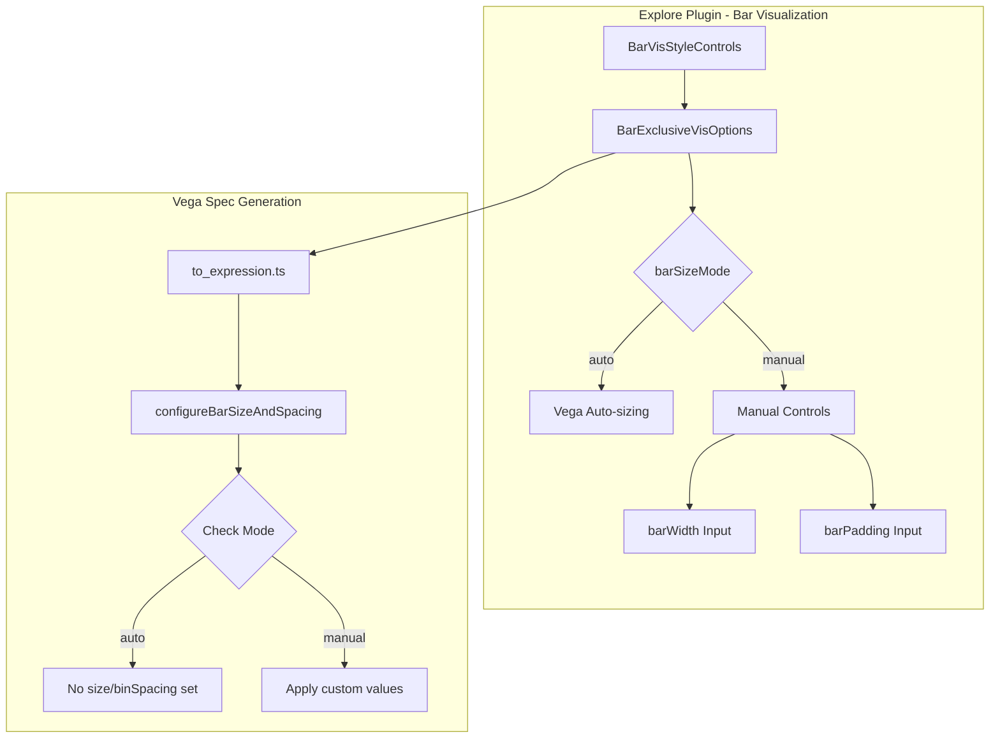
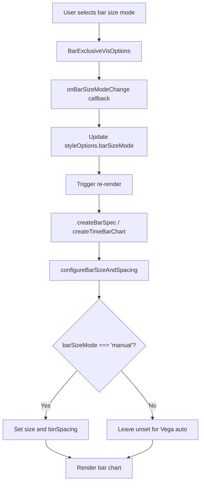

---
tags:
  - opensearch-dashboards
---
# Bar Chart Enhancements

## Summary

Bar chart enhancements in OpenSearch Dashboards provide users with flexible control over bar chart appearance. The feature introduces a bar size mode toggle that allows switching between automatic sizing (where Vega optimizes bar dimensions) and manual mode (where users can specify custom bar width and padding values).

## Details

### Architecture



### Data Flow



### Components

| Component | File | Description |
|-----------|------|-------------|
| `BarExclusiveVisOptions` | `bar_exclusive_vis_options.tsx` | UI component with bar size mode toggle and manual inputs |
| `BarVisStyleControls` | `bar_vis_options.tsx` | Parent component that passes style options |
| `BarChartStyleControls` | `bar_vis_config.ts` | TypeScript interface defining style properties |
| `configureBarSizeAndSpacing` | `to_expression.ts` | Utility function for conditional size application |

### Configuration

| Setting | Type | Description | Default | Range |
|---------|------|-------------|---------|-------|
| `barSizeMode` | `'auto' \| 'manual'` | Controls bar sizing behavior | `'auto'` | - |
| `barWidth` | `number` | Bar width multiplier (manual mode only) | `0.7` | 0.1 - 1.0 |
| `barPadding` | `number` | Bar padding multiplier (manual mode only) | `0.1` | 0 - 0.5 |
| `showBarBorder` | `boolean` | Whether to show bar borders | `false` | - |
| `barBorderWidth` | `number` | Border width in pixels | `1` | 1 - 10 |
| `barBorderColor` | `string` | Border color | - | - |

### Usage Example

```typescript
// Default configuration (auto mode)
const defaultBarChartStyles: BarChartStyleControls = {
  barSizeMode: 'auto',
  barWidth: 0.7,
  barPadding: 0.1,
  showBarBorder: false,
  barBorderWidth: 1,
  barBorderColor: '#000000',
  // ... other properties
};

// Manual mode with custom values
const customStyles: Partial<BarChartStyleControls> = {
  barSizeMode: 'manual',
  barWidth: 0.5,    // Narrower bars
  barPadding: 0.2,  // More spacing
};
```

### User Interface

The bar size controls appear in the "Bar Settings" accordion within the style options panel:

1. **Bar Size Mode Toggle**: Button group with "Auto" and "Manual" options
2. **Bar Width Input** (manual mode only): Numeric input with range 0.1-1.0, step 0.1
3. **Bar Padding Input** (manual mode only): Numeric input with range 0-0.5, step 0.05

## Limitations

- Bar size controls are specific to the Explore plugin's bar chart visualization
- Width and padding values are multipliers, not direct pixel values
- Auto mode relies on Vega's default sizing algorithm

## Change History

- **v3.2.0**: Initial implementation - Added bar size mode toggle with auto/manual options


## References

### Documentation
- [Building data visualizations](https://docs.opensearch.org/3.0/dashboards/visualize/viz-index/): OpenSearch visualization documentation
- [Vega](https://docs.opensearch.org/3.0/dashboards/visualize/vega/): Vega visualization documentation
- [PR #10152](https://github.com/opensearch-project/OpenSearch-Dashboards/pull/10152): Initial implementation

### Pull Requests
| Version | PR | Description | Related Issue |
|---------|-----|-------------|---------------|
| v3.2.0 | [#10152](https://github.com/opensearch-project/OpenSearch-Dashboards/pull/10152) | Add Bar Size Control Switch for auto/manual bar sizing |   |
