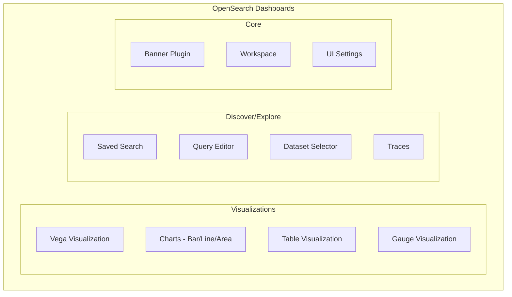

# OpenSearch Dashboards Bug Fixes

## Summary

This document tracks bug fixes and stability improvements for OpenSearch Dashboards across releases. These fixes address issues in visualizations, Discover/Explore, workspaces, and various UI components to improve user experience and reliability.

## Details

### Architecture

### Components

| Component | Description |
|-----------|-------------|
| Vega Visualization | Custom visualization using Vega/Vega-Lite grammar |
| Charts | Bar, line, and area chart visualizations |
| Table Visualization | Tabular data display with pagination |
| Gauge Visualization | Gauge and metric visualizations |
| Saved Search | Persisted search queries and configurations |
| Query Editor | PPL/SQL/DQL query editing interface |
| Dataset Selector | Data source and index pattern selection |
| Banner Plugin | Global notification banner system |
| Workspace | Multi-tenant workspace management |

### Bug Fix Categories

#### Visualization Fixes
- Vega data URL with signal expressions
- Vega tooltip flashing on mouse movement
- Chart axis title updates after field switching
- Dynamic tooltip date format inference
- Table visualization pagination in dashboards
- Gauge visualization support

#### Discover/Explore Fixes
- Saved search state synchronization
- Query editor error highlighting
- Dataset selector language configuration
- Legacy state management
- Value suggestions for special characters
- Traces span redirection and hover behavior

#### UI/UX Fixes
- Banner dismissal persistence using sessionStorage
- Workspace URL handling with client base paths
- UI settings consistency
- Editor spacing and scroll behavior

## Limitations

- Banner dismissal persists only for the current browser session
- Some fixes are specific to the new Explore interface

## Related PRs

| Version | PR | Description |
|---------|-----|-------------|
| v3.3.0 | [#10316](https://github.com/opensearch-project/OpenSearch-Dashboards/pull/10316) | Standardize axis title behavior |
| v3.3.0 | [#10325](https://github.com/opensearch-project/OpenSearch-Dashboards/pull/10325) | Banner dismissal persistence |
| v3.3.0 | [#10339](https://github.com/opensearch-project/OpenSearch-Dashboards/pull/10339) | Vega data URL with signal |
| v3.3.0 | [#10357](https://github.com/opensearch-project/OpenSearch-Dashboards/pull/10357) | Saved search state sync |
| v3.3.0 | [#10358](https://github.com/opensearch-project/OpenSearch-Dashboards/pull/10358) | Dynamic tooltip date format |
| v3.3.0 | [#10363](https://github.com/opensearch-project/OpenSearch-Dashboards/pull/10363) | Error highlighting after language switch |
| v3.3.0 | [#10414](https://github.com/opensearch-project/OpenSearch-Dashboards/pull/10414) | Global search URL in workspace |
| v3.3.0 | [#10420](https://github.com/opensearch-project/OpenSearch-Dashboards/pull/10420) | Table viz max row per page |
| v3.3.0 | [#10451](https://github.com/opensearch-project/OpenSearch-Dashboards/pull/10451) | Add gauge visualization |
| v3.3.0 | [#10467](https://github.com/opensearch-project/OpenSearch-Dashboards/pull/10467) | Vega tooltip flashing |
| v3.3.0 | [#10479](https://github.com/opensearch-project/OpenSearch-Dashboards/pull/10479) | Traces span redirection and hover |

## References

- [OpenSearch Dashboards Repository](https://github.com/opensearch-project/OpenSearch-Dashboards)

## Change History

- **v3.3.0**: 25 bug fixes across visualizations, Discover/Explore, workspaces, and UI components
