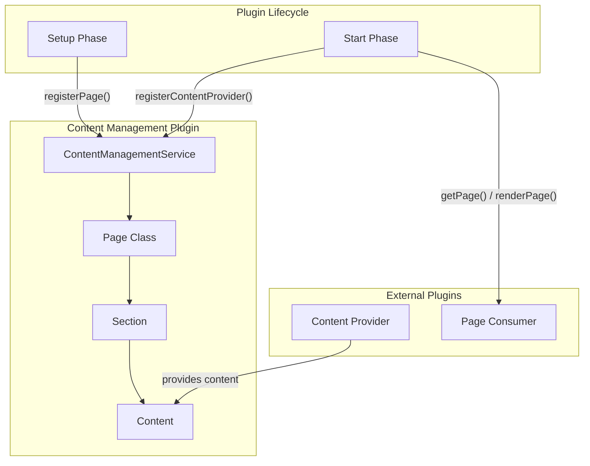
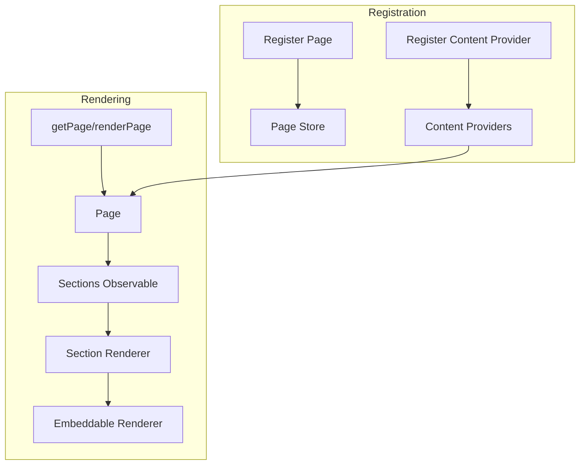

---
tags:
  - dashboards
---

# Content Management

## Summary

The Content Management plugin is a core OpenSearch Dashboards plugin that provides a framework for dynamically rendering pages with customizable sections. It enables plugins to register content providers and create flexible, composable page layouts using sections that can contain dashboards, cards, or custom content. The plugin is particularly useful for building overview pages and workspace-specific landing pages.

## Details

### Architecture



### Data Flow



### Components

| Component | Description |
|-----------|-------------|
| `ContentManagementService` | Core service managing pages and content providers |
| `Page` | Represents a renderable page with sections |
| `Section` | A container for content (dashboard, card, or custom) |
| `Content` | Individual content items within sections |
| `PageRender` | React component for rendering pages |
| `SectionRender` | React component for rendering sections |

### Section Types

| Type | Description | Use Case |
|------|-------------|----------|
| `dashboard` | Embeds a saved dashboard | Overview pages with visualizations |
| `card` | Displays card-based content | Quick links, summaries |
| `custom` | Custom React component | Specialized UI elements |

### Configuration

| Setting | Description | Default |
|---------|-------------|---------|
| `section.id` | Unique identifier for the section | Required |
| `section.kind` | Type of section (dashboard/card/custom) | Required |
| `section.order` | Display order (lower = higher priority) | Required |
| `section.title` | Optional section title | `undefined` |
| `section.input` | Section-specific configuration | Varies by kind |

### API Reference

#### Setup Phase

```typescript
interface ContentManagementPluginSetup {
  registerPage: (pageConfig: PageConfig) => void;
}
```

#### Start Phase

```typescript
interface ContentManagementPluginStart {
  registerContentProvider: (provider: ContentProvider) => void;
  updatePageSection: (
    targetArea: string,
    callback: (section: Section | null, err?: Error) => Section | null
  ) => void;
  getPage: (id: string) => Page | undefined;  // Added in v2.18.0
  renderPage: (id: string, options?: RenderOptions) => React.ReactNode;
}
```

#### Page Class Methods

```typescript
class Page {
  createSection(section: Section): void;
  removeSection(id: string): void;  // Added in v2.18.0
  getSections(): Section[];
  getSections$(): BehaviorSubject<Section[]>;
  updateSectionInput(sectionId: string, callback: Function): void;
  addContent(sectionId: string, content: Content): void;
  getContents(sectionId: string): Content[];
  getContents$(sectionId: string): BehaviorSubject<Content[]>;
}
```

### Usage Example

```typescript
// Setup phase: Register a page
class MyPlugin {
  setup(core, { contentManagement }) {
    contentManagement.registerPage({ id: 'my-overview' });
  }

  start(core, { contentManagement }) {
    // Register a content provider
    contentManagement.registerContentProvider({
      id: 'my-provider',
      getContent: () => ({
        id: 'my-content',
        kind: 'card',
        order: 100,
        title: 'Quick Actions',
        // ... card configuration
      }),
      getTargetArea: () => 'my-overview/section1',
    });

    // Get page and manipulate sections
    const page = contentManagement.getPage('my-overview');
    if (page) {
      page.removeSection('unwanted-section');
    }

    // Render the page
    return contentManagement.renderPage('my-overview');
  }
}
```

## Limitations

- The `getPage` API is marked as experimental and may change in future releases
- Dashboard sections are exclusive - one section can only hold one dashboard
- Content providers must be registered during the start phase

## Change History

- **v2.18.0** (2024-11-05): Added `getPage` API and `removeSection` method; UI fix for card section spacing
- **v2.17.0** (2024-09-17): Added `updatePageSection` API for dynamic section input updates
- **v2.16.0** (2024-08-06): Initial implementation with page registration, content providers, and section rendering

## Related Features
- [OpenSearch Core](../opensearch/opensearch-actionplugin-rest-handler-wrapper.md)

## References

### Documentation
- [Source Code](https://github.com/opensearch-project/OpenSearch-Dashboards/tree/main/src/plugins/content_management): Plugin implementation

### Pull Requests
| Version | PR | Description | Related Issue |
|---------|-----|-------------|---------------|
| v2.18.0 | [#8624](https://github.com/opensearch-project/OpenSearch-Dashboards/pull/8624) | Add Page API to allow remove section | [#1234](https://github.com/opensearch-project/OpenSearch-Dashboards/issues/1234) |
| v2.17.0 | [#7651](https://github.com/opensearch-project/OpenSearch-Dashboards/pull/7651) | Allow updating section input after page rendered | [#1234](https://github.com/opensearch-project/OpenSearch-Dashboards/issues/1234) |
| v2.17.0 | [#7633](https://github.com/opensearch-project/OpenSearch-Dashboards/pull/7633) | Fix content provider ID exception handling | [#1234](https://github.com/opensearch-project/OpenSearch-Dashboards/issues/1234) |
| v2.16.0 | [#7201](https://github.com/opensearch-project/OpenSearch-Dashboards/pull/7201) | Initial implementation - new core plugin for dynamic content rendering | [#1234](https://github.com/opensearch-project/OpenSearch-Dashboards/issues/1234) |

### Issues (Design / RFC)
- [PR #7228](https://github.com/opensearch-project/OpenSearch-Dashboards/issues/7228): RFC for Content Management plugin
