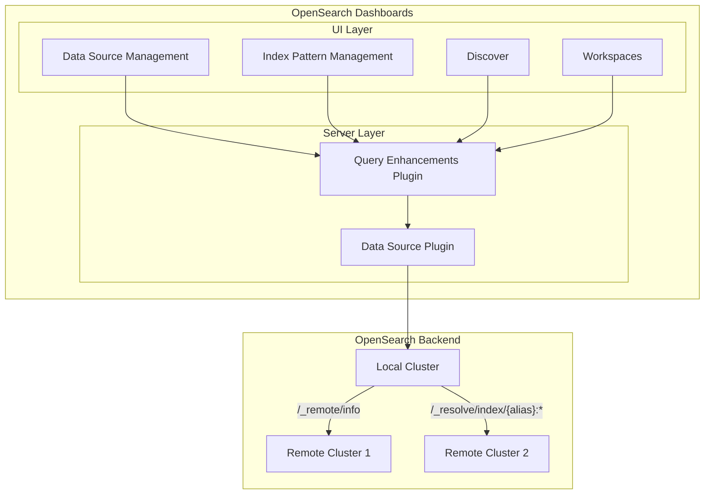
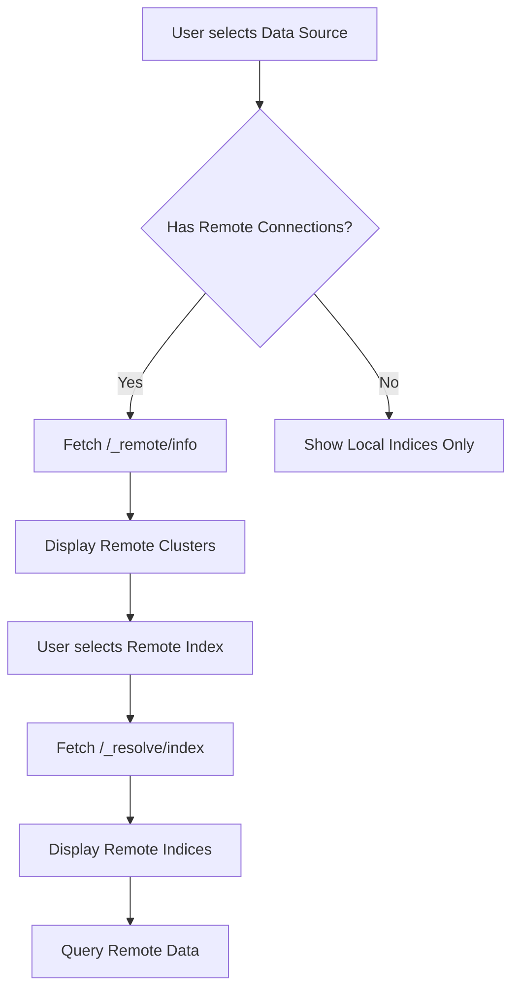

---
tags:
  - opensearch-dashboards
---
# Cross-Cluster Search in OpenSearch Dashboards

## Summary

Cross-Cluster Search (CCS) in OpenSearch Dashboards provides native UI support for discovering, visualizing, and querying data across multiple OpenSearch clusters. This feature enables users to work with remote cluster connections directly from the Dashboards interface, eliminating the need to use APIs for cross-cluster operations.

Key benefits:
- **Unified Data Access**: Query and visualize data from multiple clusters in a single interface
- **Simplified Discovery**: Easily identify which data sources have remote cluster connections
- **Seamless Integration**: Remote indices appear alongside local indices in familiar workflows

## Details

### Architecture



### Data Flow



### Components

| Component | Location | Description |
|-----------|----------|-------------|
| `DataSourceEngineType.OpenSearchCrossCluster` | `data_source/common` | Engine type identifier for cross-cluster connections |
| Remote Cluster Routes | `query_enhancements/server/routes` | Server-side API endpoints |
| `getRemoteClusterConnections` | `data_source_management/public` | Fetches remote cluster list |
| `getRemoteClusterIndices` | `data/public` | Fetches indices from remote clusters |
| Cross-Cluster UI Components | Multiple plugins | UI elements for displaying remote connections |

### Configuration

| Setting | Description | Default |
|---------|-------------|---------|
| Remote cluster configuration | Configured at OpenSearch level via `/_cluster/settings` | N/A |
| `data_source.enabled` | Must be enabled for MDS support | `false` |
| `workspace.enabled` | Required for workspace CCS features | `false` |

### API Endpoints

| Endpoint | Method | Parameters | Description |
|----------|--------|------------|-------------|
| `/api/enhancements/remote_cluster/list` | GET | `dataSourceId` | Lists remote cluster connections |
| `/api/enhancements/remote_cluster/indexes` | GET | `dataSourceId`, `connectionAlias` | Lists indices in a remote cluster |

### Usage Example

**Setting up Cross-Cluster Search:**

1. Configure remote cluster connections in OpenSearch:
```json
PUT /_cluster/settings
{
  "persistent": {
    "cluster.remote": {
      "remote-cluster-alias": {
        "seeds": ["remote-host:9300"]
      }
    }
  }
}
```

2. In OpenSearch Dashboards, navigate to Data Sources
3. Data sources with remote connections display an expand arrow
4. Click to view connected remote clusters

**Creating an Index Pattern with Remote Indices:**

1. Navigate to Index Patterns → Create index pattern
2. Select a data source with remote connections
3. Remote indices appear as `cluster_alias:index_name`
4. Enter pattern like `remote-cluster:logs-*` to match remote indices

**Querying Remote Data:**

```sql
-- Note: SQL has limited support for CCS
SELECT * FROM "remote-cluster:logs-2024.01.*" LIMIT 10
```

```
-- PPL query (limited support)
source = remote-cluster:logs-2024.01.01 | head 10
```

## Limitations

- **SQL Support**: SQL queries are not supported for cross-cluster indexes/index patterns
- **PPL Support**: PPL queries only work for remote indexes that have their mapping stored in the local cluster
- **Authentication**: Remote cluster authentication must be configured at the OpenSearch cluster level
- **Network Requirements**: Local cluster must have network access to remote clusters on transport port (default 9300)

## Change History

- **v3.0.0** (2025-05-06): Initial implementation of Cross-Cluster Search UI support in OpenSearch Dashboards


## References

### Documentation
- [Cross-cluster search documentation](https://docs.opensearch.org/3.0/search-plugins/cross-cluster-search/): Official OpenSearch CCS documentation

### Blog Posts
- [Cross-cluster replication intro blog](https://opensearch.org/blog/cross-cluster-replication-intro/): Related blog post on cross-cluster features

### Pull Requests
| Version | PR | Description | Related Issue |
|---------|-----|-------------|---------------|
| v3.0.0 | [#9566](https://github.com/opensearch-project/OpenSearch-Dashboards/pull/9566) | Show cross cluster connections in Data Sources and Workspaces page | [#1234](https://github.com/opensearch-project/OpenSearch-Dashboards/issues/1234) |
| v3.0.0 | [#9660](https://github.com/opensearch-project/OpenSearch-Dashboards/pull/9660) | Show cross cluster connections in Index Pattern and Discover Page | [#1234](https://github.com/opensearch-project/OpenSearch-Dashboards/issues/1234) |

### Issues (Design / RFC)
- [Issue #9578](https://github.com/opensearch-project/OpenSearch-Dashboards/issues/9578): Original enhancement request
