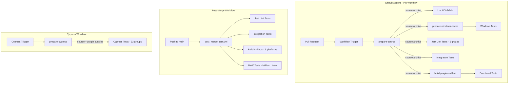

---
tags:
  - opensearch-dashboards
---
# Dashboards CI/Tests

## Summary

OpenSearch Dashboards CI/Tests encompasses the continuous integration and testing infrastructure that ensures code quality and reliability across all supported branches. The CI system runs automated unit tests, integration tests, Cypress end-to-end tests, Lighthouse performance checks, and other quality checks on pull requests and branch pushes. The infrastructure includes shared source archives, cache-warming jobs, and separated PR/post-merge workflows for optimal CI cost and reliability.

## Details

### Architecture



### Components

| Component | Description |
|-----------|-------------|
| prepare-source | Single checkout + source archive creation, eliminates per-job git checkout |
| prepare-windows-cache | Windows-specific yarn cache warming job |
| prepare-cypress | Single checkout + bootstrap + plugin build for Cypress workflow |
| build-plugins-artifact | Pre-builds plugin bundles once for all functional test jobs |
| Jest Unit Tests | 5 groups of Jest unit tests with rebalanced plugin distribution |
| Integration Tests | Dedicated job with Linux + Windows matrix, Java 21 |
| Functional Tests | FTR ciGroups with pre-built plugin bundles |
| Cypress Tests | 33 groups of Cypress E2E tests with sub-20-minute target |
| post_merge_test.yml | Post-merge focused test subset with auto-issue creation on failure |
| Lighthouse Testing | Performance metrics with warn-vs-fail distinction |
| Code Diff Analyzer | Automated code analysis on PRs |

### Configuration

| Setting | Description | Default |
|---------|-------------|---------|
| Branch patterns | Glob patterns for triggering CI | `main`, `2.*`, `3.*` |
| OSD_OPTIMIZER_THEMES | Theme to build during CI tests | `v8light` |
| OSD_OPTIMIZER_MAX_WORKERS | Worker count override for CI | Unset for integration tests |
| videoCompression | Cypress video compression | `false` (disabled) |
| Jest groups | Number of parallel Jest unit test groups | 5 |
| Cypress groups | Number of parallel Cypress test groups | 33 |
| Timeout | Maximum workflow execution time | 60 minutes |

### Usage Example

```yaml
# .github/workflows/build_and_test_workflow.yml (PR checks only)
name: Build and Test

on:
  pull_request:
    branches:
      - main
      - 2.*
      - 3.*

jobs:
  prepare-source:
    runs-on: ubuntu-latest
    steps:
      - uses: actions/checkout@v4
        with:
          fetch-depth: 1
          filter: blob:none
      - name: Create source archive
        run: tar czf source.tar.gz --exclude='.git/' --exclude='./node_modules/' .
      - uses: actions/upload-artifact@v4
        with:
          name: source-archive
          path: source.tar.gz

  unit-tests:
    needs: [prepare-source]
    runs-on: ubuntu-latest
    strategy:
      matrix:
        group: [1, 2, 3, 4, 5]
    steps:
      - uses: actions/download-artifact@v4
      - name: Run unit tests
        run: yarn test:jest --ci --group ${{ matrix.group }}
        env:
          OSD_OPTIMIZER_THEMES: v8light
```

## Limitations

- CI execution time depends on GitHub Actions runner availability
- Some tests may be flaky due to timing-sensitive operations
- Resource-intensive tests may timeout on shared runners
- `prepare-source` archive excludes `cypress/test_data/` (652 MB), so BWC tests still use `actions/checkout`
- `lint-and-validate` requires real git history and cannot use the source archive
- macOS jobs still use full `cache` (restore + auto-save) with no cache-warming job

## Change History

- **v3.6.0**: Major CI overhaul — shared source archive replacing per-job checkouts, Cypress groups rebalanced from 23→33 (sub-20-min target), Jest groups rebalanced with ciGroup5 added, separated PR/post-merge workflows, fixed Windows `use_node.bat` exit code bug masking test failures, fixed mocha regex for Windows paths, disabled Cypress video compression, fixed Lighthouse warn-vs-fail logic, removed `paths-ignore` for required tests, fixed S3 Cypress navigation, onboarded code diff analyzer, updated test snapshots, fixed internal doc links, platform plugin build optimized (16 min→4 min via single-theme build)
- **v3.4.0**: Added 3.* branch support to unit test workflow


## References

### Documentation
- [GitHub Actions Documentation](https://docs.github.com/en/actions)
- [OpenSearch Dashboards Repository](https://github.com/opensearch-project/OpenSearch-Dashboards)
- [Jest Testing Framework](https://jestjs.io/)

### Pull Requests
| Version | PR | Description | Related Issue |
|---------|-----|-------------|---------------|
| v3.6.0 | [#11560](https://github.com/opensearch-project/OpenSearch-Dashboards/pull/11560) | Add `prepare-source` and `prepare-cypress` jobs for CI reliability |  |
| v3.6.0 | [#11546](https://github.com/opensearch-project/OpenSearch-Dashboards/pull/11546) | Improve "Build and test" CI test groups with integration test split and plugin pre-build |  |
| v3.6.0 | [#11565](https://github.com/opensearch-project/OpenSearch-Dashboards/pull/11565) | Split oversized Cypress CI groups for sub-20-minute target |  |
| v3.6.0 | [#11176](https://github.com/opensearch-project/OpenSearch-Dashboards/pull/11176) | Optimize GitHub CI workflow by reducing platform plugin build time |  |
| v3.6.0 | [#11324](https://github.com/opensearch-project/OpenSearch-Dashboards/pull/11324) | Remove ignore paths for required CI tests |  |
| v3.6.0 | [#11326](https://github.com/opensearch-project/OpenSearch-Dashboards/pull/11326) | Fix S3 Cypress tests not navigating to workspace page |  |
| v3.6.0 | [#11357](https://github.com/opensearch-project/OpenSearch-Dashboards/pull/11357) | Update Lighthouse metrics and remove bundler CI script |  |
| v3.6.0 | [#11388](https://github.com/opensearch-project/OpenSearch-Dashboards/pull/11388) | Onboard code diff analyzer and reviewer for OSD | [opensearch-build#5912](https://github.com/opensearch-project/opensearch-build/issues/5912) |
| v3.6.0 | [#11472](https://github.com/opensearch-project/OpenSearch-Dashboards/pull/11472) | Fix internal documentation links for developers on GitHub |  |
| v3.6.0 | [#11578](https://github.com/opensearch-project/OpenSearch-Dashboards/pull/11578) | Update data connection table test snapshots |  |
| v3.6.0 | [#11539](https://github.com/opensearch-project/observability/pull/11539) | CI performance and observability improvements |  |
| v3.4.0 | [#780](https://github.com/opensearch-project/OpenSearch-Dashboards/pull/780) | Update unit test workflow to include 3.* branch |   |
