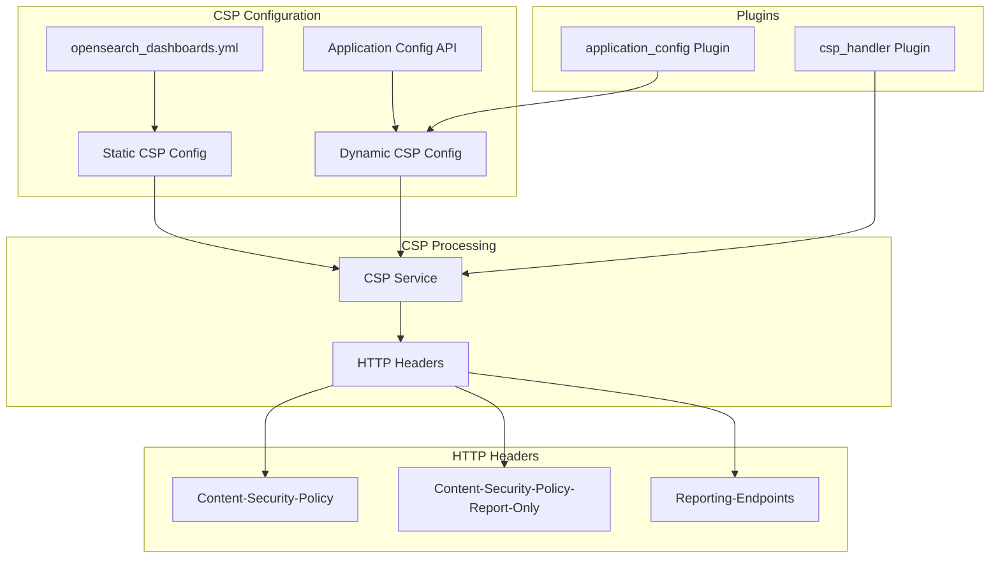
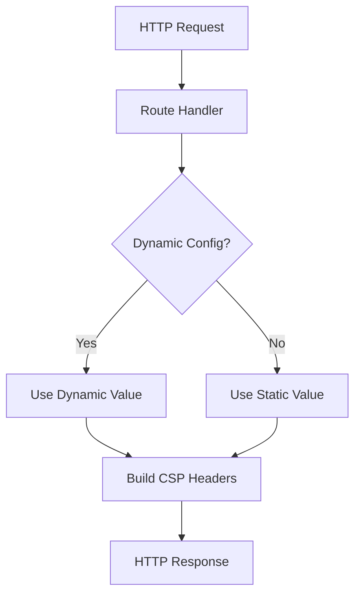

---
tags:
  - domain/core
  - component/dashboards
  - dashboards
  - security
---
# Dashboards Content Security Policy (CSP)

## Summary

Content Security Policy (CSP) is a security standard in OpenSearch Dashboards that helps prevent cross-site scripting (XSS), clickjacking, and other code injection attacks. OpenSearch Dashboards supports both enforced CSP rules and a report-only mode for testing policies without blocking content. The CSP configuration can be managed both statically through YAML configuration and dynamically through the Application Config API.

## Details

### Architecture



### Data Flow



### Components

| Component | Description |
|-----------|-------------|
| `csp_handler` Plugin | Registers pre-response handler to manage CSP headers |
| `application_config` Plugin | Provides read/write APIs for dynamic configuration |
| `HttpResourcesService` | Applies CSP headers to rendered resources |
| `CoreRouteHandlerContext` | Provides access to dynamic config from request handlers |

### Configuration

#### Static Configuration (opensearch_dashboards.yml)

| Setting | Description | Default |
|---------|-------------|---------|
| `csp.rules` | Array of CSP directives | Default secure policy |
| `csp.strict` | Enable strict CSP mode | `true` |
| `csp.warnLegacyBrowsers` | Warn users on legacy browsers | `true` |
| `csp_handler.enabled` | Enable CSP handler plugin | `false` |
| `application_config.enabled` | Enable application config plugin | `false` |

#### Dynamic Configuration

| Setting | Description | API Path |
|---------|-------------|----------|
| `frame-ancestors` | Controls which sites can embed Dashboards | `/api/appconfig/csp.rules.frame-ancestors` |
| `csp-report-only.isEmitting` | Enable/disable CSP-Report-Only header | `/api/appconfig/csp-report-only` |

### Usage Example

#### Enable Dynamic CSP Configuration

```yaml
# opensearch_dashboards.yml
application_config.enabled: true
csp_handler.enabled: true
```

#### Manage frame-ancestors Dynamically

```bash
# Enable site embedding
curl '{osd-endpoint}/api/appconfig/csp.rules.frame-ancestors' \
  -X POST \
  -H 'Content-Type: application/json' \
  -H 'osd-xsrf: osd-fetch' \
  --data-raw '{"newValue":"https://example.com"}'

# Get current frame-ancestors
curl '{osd-endpoint}/api/appconfig/csp.rules.frame-ancestors'

# Delete frame-ancestors (revert to default)
curl '{osd-endpoint}/api/appconfig/csp.rules.frame-ancestors' \
  -X DELETE \
  -H 'osd-xsrf: osd-fetch'
```

#### Manage CSP Report-Only Mode

```bash
# Enable CSP report-only mode
curl '{osd-endpoint}/api/appconfig/csp-report-only' \
  -X POST \
  -H 'Content-Type: application/json' \
  -H 'osd-xsrf: osd-fetch' \
  --data-raw '{"newValue":{"isEmitting": true}}'
```

## Limitations

- Dynamic configuration only supports `frame-ancestors` directive and `csp-report-only.isEmitting`
- Other CSP directives must be configured statically in YAML
- Requires Security plugin permissions to modify `.opensearch_dashboards_config` index
- Dynamic configurations override YAML configurations (except for empty CSP rules)

## Change History

- **v3.4.0** (2026-01): Added dynamic configuration support for CSP-Report-Only `isEmitting` setting
- **v2.13.0**: Initial implementation of dynamic CSP configuration for `frame-ancestors` directive

## Related Features
- [OpenSearch Core](../opensearch/opensearch-actionplugin-rest-handler-wrapper.md)

## References

### Documentation
- [CSP Dynamic Configuration Documentation](https://docs.opensearch.org/3.0/dashboards/csp/csp-dynamic-configuration/)
- [applicationConfig Plugin README](https://github.com/opensearch-project/OpenSearch-Dashboards/blob/main/src/plugins/application_config/README.md)
- [cspHandler Plugin README](https://github.com/opensearch-project/OpenSearch-Dashboards/blob/main/src/plugins/csp_handler/README.md)
- [MDN: Content Security Policy](https://developer.mozilla.org/en-US/docs/Web/HTTP/CSP)

### Pull Requests
| Version | PR | Description | Related Issue |
|---------|-----|-------------|---------------|
| v2.13.0 | - | Initial CSP dynamic configuration for frame-ancestors |   |
| v3.4.0 | [#10877](https://github.com/opensearch-project/OpenSearch-Dashboards/pull/10877) | Add dynamic config support to CSP report only |   |
