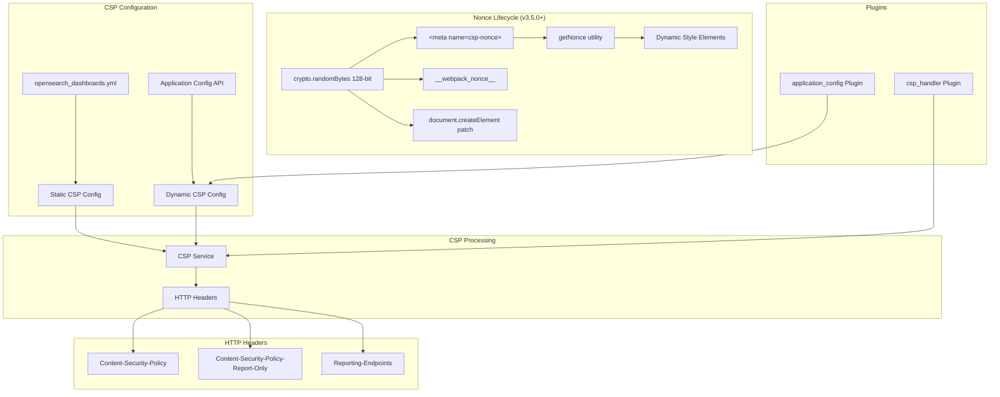
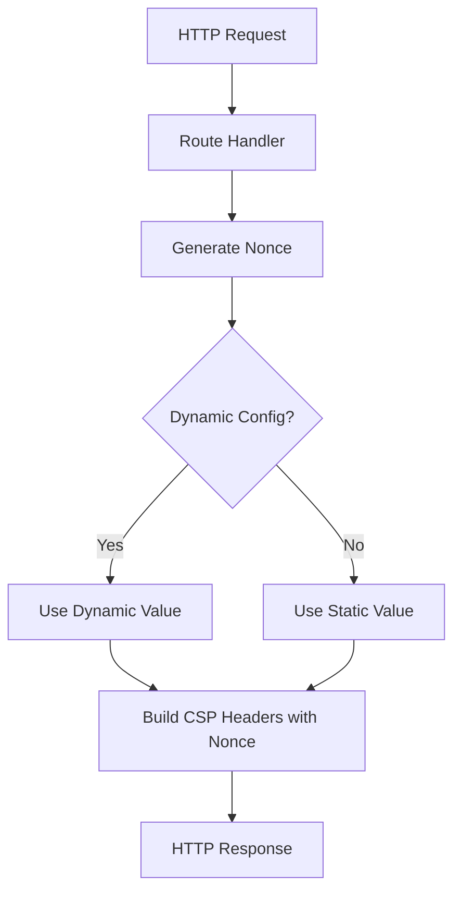

---
tags:
  - opensearch-dashboards
---
# Dashboards Content Security Policy (CSP)

## Summary

Content Security Policy (CSP) is a security standard in OpenSearch Dashboards that helps prevent cross-site scripting (XSS), clickjacking, and other code injection attacks. OpenSearch Dashboards supports both enforced CSP rules and a report-only mode for testing policies without blocking content. The CSP configuration can be managed both statically through YAML configuration and dynamically through the Application Config API. As of v3.6.0, strict CSP enforcement is available for the main `Content-Security-Policy` header (controlled by `csp.enable`), with nonce injection, per-directive relaxation via `loosenCspDirectives`, and configurable allowed sources for `connect-src`, `img-src`, and `frame-ancestors`.

## Details

### Architecture


```mermaid
graph TB
    subgraph "CSP Configuration"
        YAML[opensearch_dashboards.yml] --> StaticCSP[Static CSP Config]
        AppConfig[Application Config API] --> DynamicCSP[Dynamic CSP Config]
    end
    
    subgraph "CSP Processing"
        StaticCSP --> CSPService[CSP Service]
        DynamicCSP --> CSPService
        CSPService --> Headers[HTTP Headers]
    end
    
    subgraph "HTTP Headers"
        Headers --> CSPHeader[Content-Security-Policy]
        Headers --> CSPROHeader[Content-Security-Policy-Report-Only]
        Headers --> ReportingEndpoints[Reporting-Endpoints]
    end
    
    subgraph "Nonce Lifecycle (v3.5.0+)"
        NonceGen[crypto.randomBytes 128-bit] --> MetaTag["&lt;meta name=csp-nonce&gt;"]
        MetaTag --> ClientNonce[getNonce utility]
        ClientNonce --> DynStyles[Dynamic Style Elements]
        NonceGen --> WebpackNonce[__webpack_nonce__]
        NonceGen --> DOMPatch[document.createElement patch]
    end
    
    subgraph "Plugins"
        cspHandler[csp_handler Plugin] --> CSPService
        appConfig[application_config Plugin] --> DynamicCSP
    end
```

### Data Flow


```mermaid
flowchart TB
    Request[HTTP Request] --> Handler[Route Handler]
    Handler --> NonceGen[Generate Nonce]
    NonceGen --> DynamicCheck{Dynamic Config?}
    DynamicCheck -->|Yes| DynamicValue[Use Dynamic Value]
    DynamicCheck -->|No| StaticValue[Use Static Value]
    DynamicValue --> BuildHeaders[Build CSP Headers with Nonce]
    StaticValue --> BuildHeaders
    BuildHeaders --> Response[HTTP Response]
```

### Components

| Component | Description |
|-----------|-------------|
| `csp_handler` Plugin | Registers pre-response handler to manage CSP headers |
| `application_config` Plugin | Provides read/write APIs for dynamic configuration |
| `HttpResourcesService` | Applies CSP headers to rendered resources; injects nonces in strict mode |
| `CoreRouteHandlerContext` | Provides access to dynamic config from request handlers |
| `CspConfig` | Manages enforced CSP header construction with strict mode, nonce support, and directive relaxation |
| `CspReportOnlyConfig` | Manages CSP-Report-Only header construction with nonce support |

### Configuration

#### Static Configuration (opensearch_dashboards.yml)

| Setting | Description | Default |
|---------|-------------|---------|
| `csp.rules` | Array of CSP directives | Default loose policy |
| `csp.enable` | Enable strict CSP enforcement mode (v3.6.0+) | `false` |
| `csp.strict` | (Deprecated) Alias for `csp.enable`; will be removed in a future release | `false` |
| `csp.warnLegacyBrowsers` | Warn users on legacy browsers | `true` |
| `csp.nonceDirectives` | Directives that receive nonce values in strict mode | `['style-src-elem']` |
| `csp.allowedFrameAncestorSources` | Additional sources for `frame-ancestors` in strict mode | (none) |
| `csp.allowedConnectSources` | Additional sources for `connect-src` in strict mode | (none) |
| `csp.allowedImgSources` | Additional sources for `img-src` in strict mode | (none) |
| `csp.loosenCspDirectives` | Directives to relax back to loose defaults in strict mode | (none) |
| `csp_handler.enabled` | Enable CSP handler plugin | `false` |
| `application_config.enabled` | Enable application config plugin | `false` |

#### Dynamic Configuration

| Setting | Description | API Path |
|---------|-------------|----------|
| `frame-ancestors` | Controls which sites can embed Dashboards | `/api/appconfig/csp.rules.frame-ancestors` |
| `csp-report-only.isEmitting` | Enable/disable CSP-Report-Only header | `/api/appconfig/csp-report-only` |
| CSP directive modifications | Add/remove/set CSP directives dynamically | `/api/appconfig/csp.*` |

### Usage Example

#### Enable Dynamic CSP Configuration

```yaml
# opensearch_dashboards.yml
application_config.enabled: true
csp_handler.enabled: true
```

#### Manage frame-ancestors Dynamically

```bash
# Enable site embedding
curl '{osd-endpoint}/api/appconfig/csp.rules.frame-ancestors' \
  -X POST \
  -H 'Content-Type: application/json' \
  -H 'osd-xsrf: osd-fetch' \
  --data-raw '{"newValue":"https://example.com"}'

# Get current frame-ancestors
curl '{osd-endpoint}/api/appconfig/csp.rules.frame-ancestors'

# Delete frame-ancestors (revert to default)
curl '{osd-endpoint}/api/appconfig/csp.rules.frame-ancestors' \
  -X DELETE \
  -H 'osd-xsrf: osd-fetch'
```

#### Manage CSP Report-Only Mode

```bash
# Enable CSP report-only mode
curl '{osd-endpoint}/api/appconfig/csp-report-only' \
  -X POST \
  -H 'Content-Type: application/json' \
  -H 'osd-xsrf: osd-fetch' \
  --data-raw '{"newValue":{"isEmitting": true}}'
```

## Limitations

- Dynamic configuration only supports `frame-ancestors` directive and `csp-report-only.isEmitting` (plus general CSP directive modifications as of v3.5.0)
- Other CSP directives must be configured statically in YAML
- Requires Security plugin permissions to modify `.opensearch_dashboards_config` index
- Dynamic configurations override YAML configurations (except for empty CSP rules)
- `style-src-attr` must allow `'unsafe-inline'` due to Monaco editor's reliance on inline style attributes (see [microsoft/monaco-editor#271](https://github.com/microsoft/monaco-editor/issues/271))
- Nonces are applied in strict enforcement mode and CSP-Report-Only mode
- The `csp.strict` config key is deprecated as of v3.6.0; migrate to `csp.enable`
- `loosenCspDirectives` only takes effect when `csp.enable` is `true`

## Change History

- **v3.6.0** (2026-04): Added strict CSP enforcement mode for main `Content-Security-Policy` header via `csp.enable`; added `buildHeaderWithNonce()` for nonce injection in strict mode; added `loosenCspDirectives` to selectively relax directives; added `allowedFrameAncestorSources`, `allowedConnectSources`, `allowedImgSources` config options; fixed Console plugin CSP violation by switching Ace editor worker from blob URL to file-loader URL; renamed `csp.strict` to `csp.enable` with backward compatibility for the deprecated key
- **v3.5.0** (2026-02): Added nonce-based style protection for `style-src-elem` in CSP-Report-Only mode; added dynamic CSP directive modification via Application Config API; added stricter sanitization on visualization axis labels/names and DOMPurify-based URL/imageLabel sanitization; removed legacy intentional CSP violation detection mechanism
- **v3.4.0** (2026-01): Added dynamic configuration support for CSP-Report-Only `isEmitting` setting
- **v2.13.0**: Initial implementation of dynamic CSP configuration for `frame-ancestors` directive


## References

### Documentation
- [CSP Dynamic Configuration Documentation](https://docs.opensearch.org/3.0/dashboards/csp/csp-dynamic-configuration/)
- [applicationConfig Plugin README](https://github.com/opensearch-project/OpenSearch-Dashboards/blob/main/src/plugins/application_config/README.md)
- [cspHandler Plugin README](https://github.com/opensearch-project/OpenSearch-Dashboards/blob/main/src/plugins/csp_handler/README.md)
- [MDN: Content Security Policy](https://developer.mozilla.org/en-US/docs/Web/HTTP/CSP)

### Pull Requests
| Version | PR | Description | Related Issue |
|---------|-----|-------------|---------------|
| v2.13.0 | - | Initial CSP dynamic configuration for frame-ancestors |   |
| v3.4.0 | [#10877](https://github.com/opensearch-project/OpenSearch-Dashboards/pull/10877) | Add dynamic config support to CSP report only |   |
| v3.6.0 | [#11353](https://github.com/opensearch-project/OpenSearch-Dashboards/pull/11353) | Fix CSP violation for Console worker by loading from URL instead of blob |   |
| v3.6.0 | [#11536](https://github.com/opensearch-project/OpenSearch-Dashboards/pull/11536) | Update CSP configuration to support strict enforcement mode |   |
| v3.6.0 | [#11572](https://github.com/opensearch-project/OpenSearch-Dashboards/pull/11572) | Rename CSP strict config flag to `csp.enable` |   |
| v3.6.0 | [#11594](https://github.com/opensearch-project/OpenSearch-Dashboards/pull/11594) | Add deprecated `csp.strict` config key back for backward compatibility |   |
| v3.5.0 | [#11074](https://github.com/opensearch-project/OpenSearch-Dashboards/pull/11074) | Style-src-elem nonces for CSP report-only |   |
| v3.5.0 | [#11168](https://github.com/opensearch-project/OpenSearch-Dashboards/pull/11168) | Add CSP modifications using dynamic config |   |
| v3.5.0 | [#11251](https://github.com/opensearch-project/OpenSearch-Dashboards/pull/11251) | Add stricter sanitization on axis label and name |   |
| v3.5.0 | [#11252](https://github.com/opensearch-project/OpenSearch-Dashboards/pull/11252) | Use dompurify to sanitize URL and imageLabel |   |
| v3.5.0 | [#11060](https://github.com/opensearch-project/OpenSearch-Dashboards/pull/11060) | Remove Intentional CSP Violation Detection Mechanism |   |
