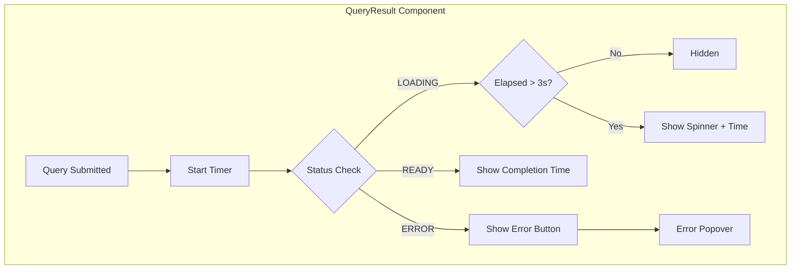
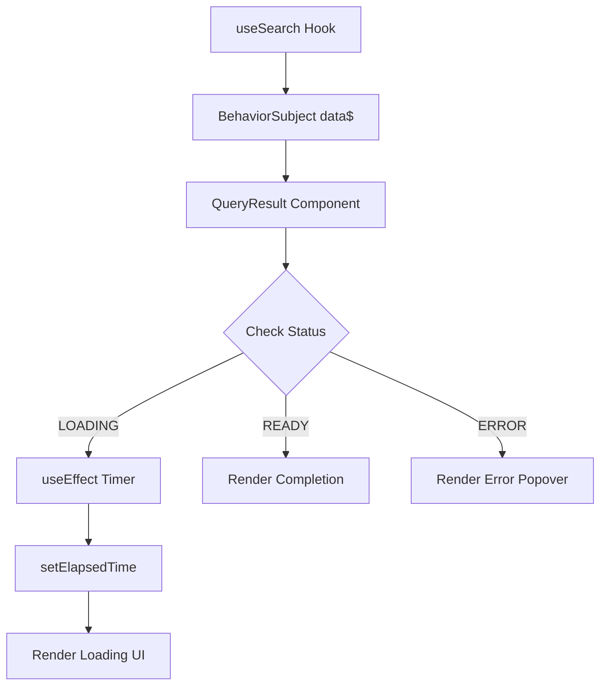

---
tags:
  - domain/core
  - component/dashboards
  - dashboards
  - search
---
# Dashboards Improvements

## Summary

The Dashboards Improvements feature enhances the query execution experience in OpenSearch Dashboards by providing visual feedback during long-running queries. Users see a loading indicator with elapsed time counter when queries take longer than 3 seconds, and completion time is displayed when queries finish.

## Details

### Architecture



### Data Flow



### Components

| Component | Description |
|-----------|-------------|
| `QueryResult` | React component displaying query execution status |
| `ResultStatus` | Enum defining query states (UNINITIALIZED, LOADING, READY, NO_RESULTS, ERROR) |
| `QueryStatus` | Interface for query status with timing information |

### Configuration

| Setting | Description | Default |
|---------|-------------|---------|
| `BUFFER_TIME` | Milliseconds before showing loading indicator | 3000 |

### Usage Example

```typescript
import { QueryResult, QueryStatus, ResultStatus } from './query_result';

// Example usage in a component
const queryStatus: QueryStatus = {
  status: ResultStatus.LOADING,
  startTime: Date.now(),
};

<QueryResult queryStatus={queryStatus} />
```

### Display States

| State | Condition | Display |
|-------|-----------|---------|
| Hidden | Loading < 3s | Nothing shown |
| Loading | Loading ≥ 3s | Spinner + "Loading X s" |
| Complete (fast) | Finished < 1s | Check icon + "Completed in X ms" |
| Complete (slow) | Finished ≥ 1s | Check icon + "Completed in X.X s" |
| Error | Query failed | Alert icon + "Error" (clickable for details) |

## Limitations

- Loading indicator has a 3-second buffer before appearing
- Timer updates at 1-second intervals
- Only available in query-enabled views (Discover, Query Workbench)

## Change History

- **v2.18.0** (2024-11-05): Added loading indicator with time counter for query results

## Related Features
- [OpenSearch Core](../opensearch/opensearch-actionplugin-rest-handler-wrapper.md)

## References

### Documentation
- [PR #8212](https://github.com/opensearch-project/OpenSearch-Dashboards/pull/8212): Initial implementation

### Pull Requests
| Version | PR | Description | Related Issue |
|---------|-----|-------------|---------------|
| v2.18.0 | [#8212](https://github.com/opensearch-project/OpenSearch-Dashboards/pull/8212) | Add loading indicator and counter to query result | [#1234](https://github.com/opensearch-project/OpenSearch-Dashboards/issues/1234) |
