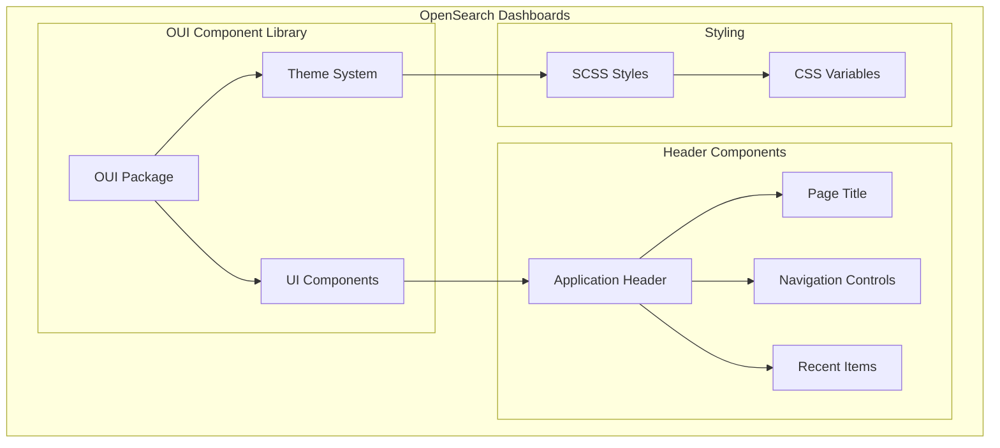

---
tags:
  - opensearch-dashboards
---
# Dashboards UI Updates (OUI)

## Summary

OpenSearch Dashboards uses the OpenSearch UI (OUI) component library for consistent visual design. This feature tracks OUI library upgrades and associated header/navigation styling improvements that enhance the look and feel of the application.

## Details

### Architecture



### Components

| Component | Description |
|-----------|-------------|
| OUI Package | OpenSearch UI component library (`@opensearch-project/oui`) |
| Theme System | Light/dark theme support with CSS variables |
| Application Header | Top navigation bar with title, breadcrumbs, and controls |
| Page Title | Application/page title display using `EuiTitle` |
| Recent Items | Quick access to recently viewed items |
| Navigation Controls | Action buttons and menu items in header |

### Configuration

| Setting | Description | Default |
|---------|-------------|---------|
| `home:useNewHomePage` | Enable new home page with updated header | `false` |
| Theme selection | Light/dark theme via Advanced Settings | System default |

### Usage Example

The OUI components are used throughout the application:

```typescript
import { EuiTitle, EuiButtonIcon, EuiToolTip } from '@elastic/eui';

// Page title in header
<EuiTitle size="l" className="newTopNavHeaderTitle">
  <h1>{pageTitle}</h1>
</EuiTitle>

// Recent items button with tooltip
<EuiToolTip content="Recents" delay="long" position="bottom">
  <EuiButtonIcon
    iconType="recent"
    color="text"
    size="xs"
    aria-label="View recents"
    onClick={handleClick}
  />
</EuiToolTip>
```

### CSS Classes

| Class | Purpose |
|-------|---------|
| `.newTopNavHeader` | Main header container with updated spacing |
| `.newTopNavHeaderTitle` | Page title styling (font-size: 2rem) |
| `.headerAppActionMenu` | Action menu container with gap spacing |
| `.headerRecentItemsButton` | Recent items button styling |
| `.primaryApplicationHeader` | Application-specific header with border |

## Limitations

- OUI upgrades may require snapshot test updates
- CSS `:has()` selector used in some styles may not work in older browsers
- Custom themes may need adjustment for new header styling

## Change History

- **v2.17.0** (2024-09-17): OUI upgrades from 1.9.0 to 1.12.0, header spacing improvements, recent items button refactoring
- **v2.16.0** (2024-08-06): Look & Feel initiative - semantic headers for page/modal/flyout, consistent plus icons, OUI tooltips replacing browser tooltips, small popover padding, small tab sizing, Discover/query bar density improvements, VisBuilder guidance, recent items icon fixes for dark mode


## References

### Documentation
- [OUI Repository](https://github.com/opensearch-project/oui)
- [OpenSearch Dashboards Repository](https://github.com/opensearch-project/OpenSearch-Dashboards)

### Pull Requests
| Version | PR | Description | Related Issue |
|---------|-----|-------------|---------------|
| v2.17.0 | [#7741](https://github.com/opensearch-project/OpenSearch-Dashboards/pull/7741) | Revisit updated header spacing, bump OUI to 1.10.0 |   |
| v2.17.0 | [#7799](https://github.com/opensearch-project/OpenSearch-Dashboards/pull/7799) | Add iconGap to TopNavControl, bump OUI to 1.11.0 |   |
| v2.17.0 | [#7865](https://github.com/opensearch-project/OpenSearch-Dashboards/pull/7865) | Update OUI to 1.12 |   |
| v2.17.0 | [#7637](https://github.com/opensearch-project/OpenSearch-Dashboards/pull/7637) | Introduce redesign page and application headers, update OUI to 1.9.0 |   |
| v2.16.0 | [#7192](https://github.com/opensearch-project/OpenSearch-Dashboards/pull/7192) | Refactor to use semantic headers for page, modal & flyout |   |
| v2.16.0 | [#7195](https://github.com/opensearch-project/OpenSearch-Dashboards/pull/7195) | Consistency of Plus Icons |   |
| v2.16.0 | [#7200](https://github.com/opensearch-project/OpenSearch-Dashboards/pull/7200) | Update Popover Padding Size |   |
| v2.16.0 | [#7231](https://github.com/opensearch-project/OpenSearch-Dashboards/pull/7231) | Replace browser tooltip usage with OUI tooltip |   |
| v2.16.0 | [#7232](https://github.com/opensearch-project/OpenSearch-Dashboards/pull/7232) | Use small EuiTabs and EuiTabbedContent across the board |   |
| v2.16.0 | [#7299](https://github.com/opensearch-project/OpenSearch-Dashboards/pull/7299) | Density and consistency changes for discover and query bar |   |
| v2.16.0 | [#7327](https://github.com/opensearch-project/OpenSearch-Dashboards/pull/7327) | Fix wrapping of labels in filter by type popover |   |
| v2.16.0 | [#7341](https://github.com/opensearch-project/OpenSearch-Dashboards/pull/7341) | Apply missing guidance for visBuilder |   |
| v2.16.0 | [#7478](https://github.com/opensearch-project/OpenSearch-Dashboards/pull/7478) | Update recent items icon from SVG to react component |   |
| v2.16.0 | [#7508](https://github.com/opensearch-project/OpenSearch-Dashboards/pull/7508) | Update icon of recent items from OUI library to enable dark mode |   |
| v2.16.0 | [#7523](https://github.com/opensearch-project/OpenSearch-Dashboards/pull/7523) | Apply small popover padding and add OUI tooltips |   |
| v2.16.0 | [#7530](https://github.com/opensearch-project/OpenSearch-Dashboards/pull/7530) | Discover and Query Management fix |   |
