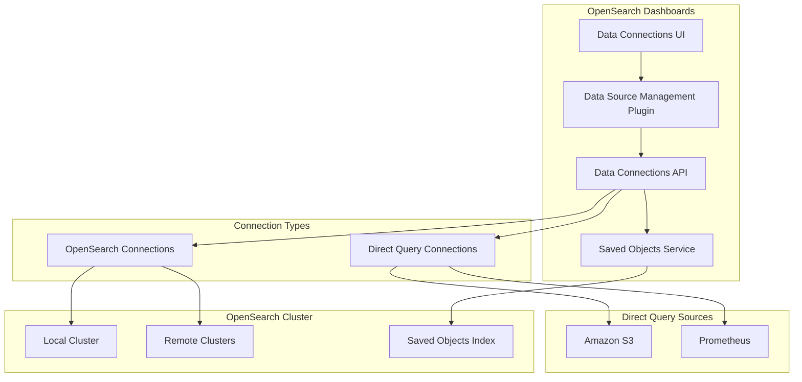
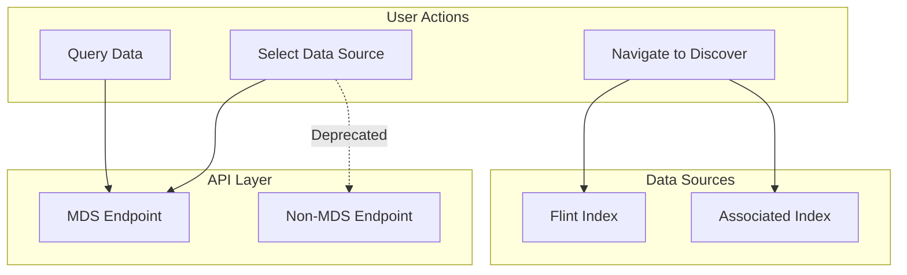

---
tags:
  - domain/core
  - component/dashboards
  - dashboards
  - indexing
  - search
---
# Data Connections

## Summary

Data Connections in OpenSearch Dashboards provides a unified interface for managing connections to various data sources, including OpenSearch clusters and direct query data sources like Amazon S3 and Prometheus. The feature supports Multi-Data Source (MDS) environments, enabling users to query and visualize data from multiple sources within a single Dashboards instance.

## Details

### Architecture



### Data Flow



### Components

| Component | Description |
|-----------|-------------|
| Data Source Management Plugin | Core plugin for managing data source connections |
| Data Connections UI | Tabbed interface for OpenSearch and Direct Query connections |
| Data Connections API | REST API for CRUD operations on data connections |
| Value Suggestion API | Auto-complete API with MDS support |

### Configuration

| Setting | Description | Default |
|---------|-------------|---------|
| `data_source.enabled` | Enable Multi-Data Source feature | `false` |
| `data_source.hideLocalCluster` | Hide local cluster from data source selection | `false` |
| `data_source.clientPool.size` | Client pool size for data source connections | `10` |
| `query:enhancements:enabled` | Enable query enhancements for redirection | `true` |

### API Endpoints

| Endpoint | Description |
|----------|-------------|
| `/api/directquery/dataconnections/dataSourceMDSId={id}` | MDS-aware data connections endpoint |
| `/api/directquery/dataconnections` | Legacy non-MDS endpoint (deprecated when MDS enabled) |
| `DELETE /api/enhancements/jobs?id={dataSourceId}&queryId={queryId}` | Cancel async query jobs |

### Usage Example

Accessing data connections in OpenSearch Dashboards:

1. Navigate to **Management > Dashboards Management > Data sources**
2. Use tabs to switch between:
   - **OpenSearch Connections**: Manage OpenSearch cluster connections
   - **Direct Query Connections**: Manage S3 and Prometheus connections

```yaml
# Example: Enabling MDS in opensearch_dashboards.yml
data_source:
  enabled: true
  hideLocalCluster: false
```

## Limitations

- When `query:enhancements:enabled` is disabled, redirection from data connections to Discover is disabled
- Direct query connections require the Observability plugin for full functionality
- The "Query data" card redirects to Discover without pre-selecting the datasource
- If more than 10 data sources are loaded on a single page, server crashes may occur due to deprecated `parseUrl` function in elasticsearch legacy library

## Change History

- **v3.0.0** (2025-05-13): S3 query cancellation, extended numeric type mappings (tinyint, smallint, bigint), memory leak fix for Node.js 20 compatibility, increased client pool size to 10
- **v3.4.0** (2025-03-11): Prometheus saved object support - Prometheus connections now stored as `data-connection` saved objects with MDS support, added "No Auth" authentication option
- **v2.18.0** (2024-10-22): Dataset picker data connections support (multi-select table, pagination, search), UI improvements (tabs navigation, type display), MDS endpoint unification, auto-complete MDS support, fit and finish fixes
- **v2.17.0** (2024-09-17): Added data-connection saved object type for external connections (CloudWatch, Security Lake)
- **v2.16.0**: Initial migration of direct query data source to data source management plugin

## Related Features
- [OpenSearch Core](../opensearch/opensearch-actionplugin-rest-handler-wrapper.md)

## References

### Documentation
- [Data Sources Documentation](https://docs.opensearch.org/3.0/dashboards/management/data-sources/): Official documentation
- [Multi-Data Sources Documentation](https://docs.opensearch.org/3.0/dashboards/management/multi-data-sources/): Configuring multiple data sources
- [Connecting Amazon S3 to OpenSearch](https://docs.opensearch.org/3.0/dashboards/management/S3-data-source/): S3 data source documentation

### Pull Requests
| Version | PR | Description | Related Issue |
|---------|-----|-------------|---------------|
| v3.0.0 | [#9355](https://github.com/opensearch-project/OpenSearch-Dashboards/pull/9355) | Deletes S3 Jobs in Backend when Original Query is Canceled | [#1234](https://github.com/opensearch-project/OpenSearch-Dashboards/issues/1234) |
| v3.0.0 | [#9430](https://github.com/opensearch-project/OpenSearch-Dashboards/pull/9430) | Add mappings for tinyint, smallint, and bigint in S3 dataset type | [#1234](https://github.com/opensearch-project/OpenSearch-Dashboards/issues/1234) |
| v3.0.0 | [#9575](https://github.com/opensearch-project/OpenSearch-Dashboards/pull/9575) | Fix potential memory leak in getDirectQueryConnections | [#1234](https://github.com/opensearch-project/OpenSearch-Dashboards/issues/1234) |
| v3.4.0 | [#10968](https://github.com/opensearch-project/OpenSearch-Dashboards/pull/10968) | Create saved object for prometheus data-connection | [#1234](https://github.com/opensearch-project/OpenSearch-Dashboards/issues/1234) |
| v2.18.0 | [#8255](https://github.com/opensearch-project/OpenSearch-Dashboards/pull/8255) | Support data connections and multi-select table in dataset picker | [#1234](https://github.com/opensearch-project/OpenSearch-Dashboards/issues/1234) |
| v2.18.0 | [#8460](https://github.com/opensearch-project/OpenSearch-Dashboards/pull/8460) | Replace segmented button with tabs | [#1234](https://github.com/opensearch-project/OpenSearch-Dashboards/issues/1234) |
| v2.18.0 | [#8492](https://github.com/opensearch-project/OpenSearch-Dashboards/pull/8492) | Add DataSource type display and Discover redirection | [#1234](https://github.com/opensearch-project/OpenSearch-Dashboards/issues/1234) |
| v2.18.0 | [#8503](https://github.com/opensearch-project/OpenSearch-Dashboards/pull/8503) | Fix hide local cluster flag in sample data page | [#1234](https://github.com/opensearch-project/OpenSearch-Dashboards/issues/1234) |
| v2.18.0 | [#8537](https://github.com/opensearch-project/OpenSearch-Dashboards/pull/8537) | Mute non-MDS endpoints when MDS enabled | [#8536](https://github.com/opensearch-project/OpenSearch-Dashboards/issues/8536) |
| v2.18.0 | [#8544](https://github.com/opensearch-project/OpenSearch-Dashboards/pull/8544) | Direct query connections fit and finish fixes |   |
| v2.18.0 | [#8713](https://github.com/opensearch-project/OpenSearch-Dashboards/pull/8713) | Add MDS support to auto-complete API | [#1234](https://github.com/opensearch-project/OpenSearch-Dashboards/issues/1234) |
| v2.17.0 | [#7925](https://github.com/opensearch-project/OpenSearch-Dashboards/pull/7925) | Add data-connection saved object type for external connections | [#1234](https://github.com/opensearch-project/OpenSearch-Dashboards/issues/1234) |
| v2.16.0 | [#7143](https://github.com/opensearch-project/OpenSearch-Dashboards/pull/7143) | Initial migration of direct query data source to data source management | [#1234](https://github.com/opensearch-project/OpenSearch-Dashboards/issues/1234) |

### Issues (Design / RFC)
- [Issue #8256](https://github.com/opensearch-project/OpenSearch-Dashboards/issues/8256): Redirection issue for direct query datasource
- [Issue #8536](https://github.com/opensearch-project/OpenSearch-Dashboards/issues/8536): Deprecate non-MDS data connection endpoint
- [Issue #9459](https://github.com/opensearch-project/OpenSearch-Dashboards/issues/9459): Node.js v20 Plugin Verification Meta Issue
- [RFC #9535](https://github.com/opensearch-project/OpenSearch-Dashboards/issues/9535): Prometheus as first-class datasource proposal
