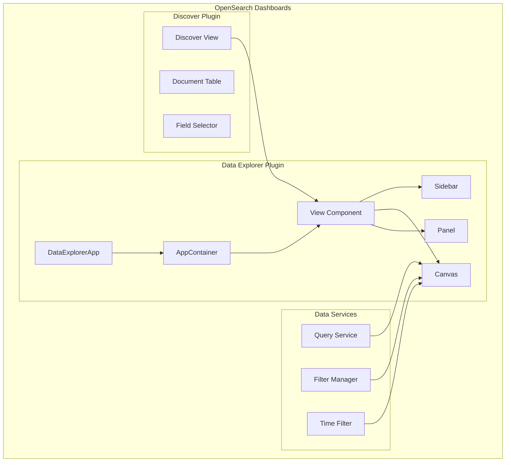

---
tags:
  - opensearch-dashboards
---
# Data Explorer

## Summary

Data Explorer is the container application framework in OpenSearch Dashboards that hosts the Discover plugin and provides the infrastructure for data exploration experiences. It manages the application shell, routing, state management, and coordination between various data exploration components including the sidebar, canvas, and panel areas.

## Details

### Architecture

### Components

| Component | Description |
|-----------|-------------|
| DataExplorerApp | Main application entry point that initializes the explorer |
| AppContainer | Container component managing layout and routing |
| View | Pluggable view component that hosts specific exploration experiences |
| Sidebar | Left panel for field selection and navigation |
| Canvas | Main content area for displaying data and visualizations |
| Panel | Bottom or side panel for additional information |

### State Management

Data Explorer uses Redux for state management with the following slices:
- `metadata` - Index pattern and view metadata
- `preload` - Preloaded data and default configurations

### Configuration

| Setting | Description | Default |
|---------|-------------|---------|
| `data_explorer.enabled` | Enable Data Explorer plugin | true |

## Limitations

- Data Explorer is tightly coupled with the Discover plugin
- Custom views require implementing the View interface
- State synchronization with URL can cause performance issues if not optimized

## Change History

- **v2.16.0** (2024-08-06): Performance optimization - View components now render directly based on data service updates instead of history object changes, reducing unnecessary AppContainer re-renders
- **v2.15.0** (2024-06-04): Initial stable release with Discover integration

## References

### Pull Requests
| Version | PR | Description |
|---------|-----|-------------|
| v2.16.0 | [#6167](https://github.com/opensearch-project/OpenSearch-Dashboards/pull/6167) | Allow render from View directly, not from Data Explorer |
