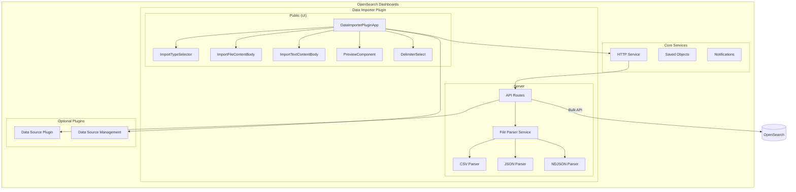
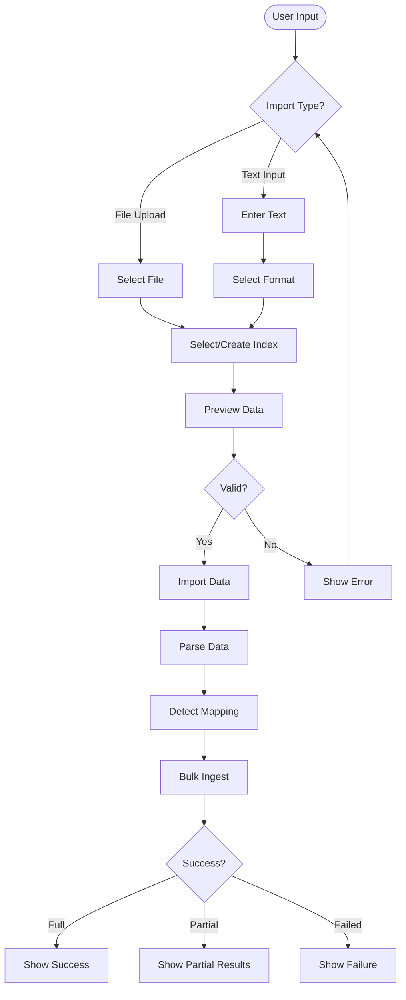

---
tags:
  - domain/core
  - component/dashboards
  - dashboards
  - indexing
---
# Data Importer

## Summary

The Data Importer is an OpenSearch Dashboards plugin that enables users to import static data files directly into OpenSearch indexes through the Dashboards UI. It supports CSV, JSON, and NDJSON file formats, with options for both file upload and text input. The plugin is Multiple Data Source (MDS) compatible, allowing users to select target data sources when MDS is enabled.

This feature addresses a common user need: the ability to quickly ingest custom data into OpenSearch without writing scripts or using external tools. It's particularly useful for:
- Users wanting to try out Dashboards with their own data
- Developers testing features with relevant datasets
- Quick data exploration and prototyping

## Details

### Architecture



### Data Flow



### Components

| Component | Description |
|-----------|-------------|
| `DataImporterPlugin` | Main plugin class that registers routes and UI application |
| `DataImporterPluginApp` | Root React component managing state and rendering |
| `ImportTypeSelector` | Radio button group for choosing file upload vs text input |
| `ImportFileContentBody` | EuiFilePicker wrapper for file selection |
| `ImportTextContentBody` | Code editor with format selection for text input |
| `PreviewComponent` | Table displaying parsed data with mapping conflict indicators |
| `DelimiterSelect` | Dropdown for CSV delimiter selection |
| `FileParserService` | Server-side service managing file parsers |
| `CSVParser` | Parser for CSV files using fast-csv library |
| `JSONParser` | Parser for single JSON documents |
| `NDJSONParser` | Parser for newline-delimited JSON using ndjson library |

### Configuration

| Setting | Description | Default |
|---------|-------------|---------|
| `data_importer.enabled` | Enable/disable the Data Importer plugin | `false` |
| `data_importer.enabledFileTypes` | Array of supported file types | `['csv', 'json', 'ndjson']` |
| `data_importer.maxFileSizeBytes` | Maximum allowed file size in bytes | `100000000` (100MB) |
| `data_importer.maxTextCount` | Maximum character count for text input | `10000` |
| `data_importer.filePreviewDocumentsCount` | Number of documents shown in preview | `10` |

### Usage Example

#### Configuration
```yaml
# opensearch_dashboards.yml
data_importer.enabled: true
data_importer.enabledFileTypes: ['csv', 'json', 'ndjson']
data_importer.maxFileSizeBytes: 100000000
data_importer.maxTextCount: 10000
data_importer.filePreviewDocumentsCount: 10
```

#### Sample NDJSON Input
```json
{"product": "Widget A", "price": 29.99, "quantity": 100}
{"product": "Widget B", "price": 49.99, "quantity": 50}
{"product": "Widget C", "price": 19.99, "quantity": 200}
```

#### Sample CSV Input
```csv
product,price,quantity
Widget A,29.99,100
Widget B,49.99,50
Widget C,19.99,200
```

### API Reference

| Endpoint | Method | Description |
|----------|--------|-------------|
| `/api/data_importer/_import_file` | POST | Import data from an uploaded file |
| `/api/data_importer/_import_text` | POST | Import data from text input |
| `/api/data_importer/_preview` | POST | Preview parsed file data and predicted mapping |
| `/api/data_importer/_cat_indices` | GET | List available indexes for selection |

### Supported Delimiters (CSV)

| Delimiter | Character |
|-----------|-----------|
| Comma | `,` |
| Semicolon | `;` |
| Tab | `\t` |
| Pipe | `\|` |

## Limitations

- **File Size**: Maximum file size is configurable but defaults to 100MB; larger datasets should use direct OpenSearch ingestion
- **Single File**: Only one file can be imported at a time
- **No Data Editing**: Cannot edit data before import (planned for future releases)
- **Text Limit**: Text input limited to 10,000 characters by default
- **Disabled by Default**: Plugin must be explicitly enabled in configuration
- **No Index Creation UI**: Index settings and mappings cannot be customized through the UI

## Change History

- **v3.0.0** (2025): Initial implementation with CSV, JSON, and NDJSON support; MDS compatibility; file upload and text input modes

## Related Features
- [OpenSearch Core](../opensearch/opensearch-actionplugin-rest-handler-wrapper.md)

## References

### Documentation
- [OpenSearch Dashboards Repository](https://github.com/opensearch-project/OpenSearch-Dashboards)
- [Plugin README](https://github.com/opensearch-project/OpenSearch-Dashboards/blob/main/src/plugins/data_importer/README.md)

### Pull Requests
| Version | PR | Description | Related Issue |
|---------|-----|-------------|---------------|
| v3.0.0 | [#9602](https://github.com/opensearch-project/OpenSearch-Dashboards/pull/9602) | Add a new Data Importer Plugin to OSD Core | [#9199](https://github.com/opensearch-project/OpenSearch-Dashboards/issues/9199) |
| v3.0.0 | [#9408](https://github.com/opensearch-project/OpenSearch-Dashboards/pull/9408) | Data importer P0 release (feature branch) |   |
| v3.0.0 | [#10478](https://github.com/opensearch-project/OpenSearch-Dashboards/pull/10478) | Move Data Importer to Data Administration under settings | [#1234](https://github.com/opensearch-project/OpenSearch-Dashboards/issues/1234) |
| v3.0.0 | [#10961](https://github.com/opensearch-project/OpenSearch-Dashboards/pull/10961) | Data importer UI fixes |   |

### Issues (Design / RFC)
- [Issue #9199](https://github.com/opensearch-project/OpenSearch-Dashboards/issues/9199): RFC - Integrate a Data Importer Plugin into Dashboards
- [Issue #1791](https://github.com/opensearch-project/OpenSearch-Dashboards/issues/1791): Original feature request
