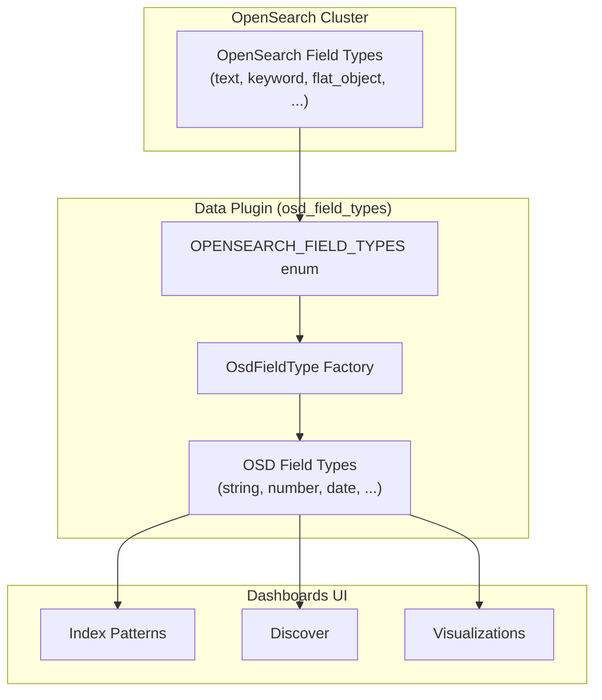

---
tags:
  - opensearch-dashboards
---
# Dashboards Data Plugin

## Summary

The OpenSearch Dashboards Data plugin provides core data access functionality including index pattern management, field type mapping, search, and query capabilities. It serves as the foundation for how Dashboards understands and interacts with OpenSearch field types, translating OpenSearch-native types into OSD field types used throughout the UI.

## Details

### Architecture

### Field Type Mapping

The Data plugin maps OpenSearch field types to a smaller set of OSD field types. Each OSD type defines sortability and filterability.

| OSD Type | OpenSearch Types | Sortable | Filterable |
|----------|-----------------|----------|------------|
| `string` | `string`, `text`, `match_only_text`, `wildcard`, `keyword`, `flat_object`, `_type`, `_id` | Yes | Yes |
| `number` | `float`, `half_float`, `scaled_float`, `double`, `integer`, `long`, `unsigned_long`, `short`, `byte`, `token_count` | Yes | Yes |
| `date` | `date`, `date_nanos` | Yes | Yes |
| `ip` | `ip` | Yes | Yes |
| `boolean` | `boolean` | Yes | Yes |
| `object` | `object` | No | No |
| `nested` | `nested` | No | No |
| `geo_point` | `geo_point` | No | No |
| `geo_shape` | `geo_shape` | No | No |
| `histogram` | `histogram` | No | Yes |

### Key Components

| Component | Path | Description |
|-----------|------|-------------|
| `OPENSEARCH_FIELD_TYPES` | `src/plugins/data/common/osd_field_types/types.ts` | Enum of all recognized OpenSearch field types |
| `OSD_FIELD_TYPES` | `src/plugins/data/common/osd_field_types/types.ts` | Enum of OSD-level field types |
| `createOsdFieldTypes` | `src/plugins/data/common/osd_field_types/osd_field_types_factory.ts` | Factory that creates the mapping between OpenSearch and OSD types |

## Limitations

- `flat_object` fields appear as `string` type in Dashboards; individual subfields are not surfaced as separate fields in index patterns
- Aggregations on `flat_object` subfields via dot notation are not supported by the OpenSearch engine

## Change History

- **v3.5.0**: Added `flat_object` field type support, mapping it to OSD `string` type

## References

### Documentation
- [Flat object field type](https://docs.opensearch.org/latest/mappings/supported-field-types/flat-object/)

### Pull Requests
| Version | PR | Description |
|---------|----|-------------|
| v3.5.0 | [#11085](https://github.com/opensearch-project/OpenSearch-Dashboards/pull/11085) | Support flat_object field type |

### Related Issues
| Issue | Description |
|-------|-------------|
| [#9348](https://github.com/opensearch-project/OpenSearch-Dashboards/issues/9348) | RFC: Add support for new field types flat_object, match_only_text, wildcard |
